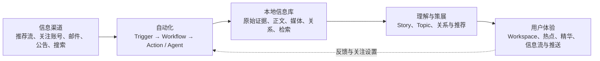

# Cosmos

Cosmos 是一个面向单个本地用户、可编排的信息聚合与个人情报工作台。它持续从用户配置的渠道收集信息，把已录入的正文、图片、附件和来源关系保存在本地，再通过可配置看板、Agent 深入研究和后续消息推送，把“到处浏览”变成“集中理解和行动”。

`origin/master` 已完成 Phase 1 最小服务器闭环，并建立 Web、API、Worker、公共包
和服务器部署入口。当前未合并的 Task 04 worktree 另有一套固定 Ingest Workflow
Runtime Spike；它提供恢复、lease、Outbox、Ingest parity、Node 和浏览器证据，
但不是目标规范 Kernel，也尚不建议合并。

目标架构使用 `nb-workflow` 作为唯一规范脚本 Kernel、Cosmos 作为 Durable Host。
后续先独立稳定 `nb-workflow`，再参考 Task 04 Spike 和 `docs/api/` Draft v0.2
实现 Cosmos 本地 Worker/Host。Product Service、Worker Admin、Worker Gateway
和 DTO 草案已完成五路只读审查，但仍是待实现合同，不是当前路由清单。

Cosmos 按 [GNU Affero General Public License v3.0 only](LICENSE) 发布；贡献流程见 [CONTRIBUTING.md](CONTRIBUTING.md)。

## 为什么做 Cosmos

用户关注的信息分散在社交平台、视频网站、群聊、邮件、公告网站、搜索结果和各类推荐流中。逐个平台浏览会反复消耗时间，而且重要事件常被拆散成多条不完整的信息。

Cosmos 希望承担这部分机械工作：

- 比用户手动浏览更多渠道和候选信息，同时受关注领域、权限、存储和成本预算约束。
- 把已经录入的信息保存到本地，断网后仍能搜索和阅读已保存内容。
- 保留不同来源的原始证据，不用一段摘要替代全部原文。
- 把同一事件的多种信源组织在一起，让用户看到时间线、差异和相关内容。
- 让 Agent 对值得深入的主题产出批注、报告、课程或可视化页面。
- 通过高度可配置的看板呈现热点、精华和普通信息流，后续再支持定时摘要和紧急推送。

## 产品如何工作



一次典型的信息处理过程是：

1. 用户手动、定时任务、轮询变化、Webhook 或内部事件触发一个 Workflow。
2. Workflow 调用 Connector、清洗、去重、信息库、Agent 或渲染 Action。
3. 外部内容先作为不可变采集证据保存，再形成可查询的信息条目和版本。
4. 系统通过全文、结构化、实体和关系检索组织内容，并区分“是否录入”与“是否展示”。
5. 看板按用户配置展示热点、Agent 精选体验和普通推荐信息流。
6. 后续可把某个时点的看板冻结为摘要，通过 QQ、Telegram 或 Email 投递。

## 核心能力

### 可编排的信息采集

`Source`、`Trigger`、`Workflow` 和 `Action` 相互独立。相同来源既可以手动抓取，
也可以定时运行；自定义 Trigger 可以检测邮箱或网站变化；Action 可以运行
Connector、自定义代码或受控 Agent。当前 API 手动触发与 schedule 已统一运行
固定 `cosmos.ingest@1` Workflow，底层具备持久 Run/StepRun/Action Job、租约、
重试和恢复；Probe 暂时保留旧持久 Job。插件安装、用户自定义 Definition/Action、
管理 API 和 Graph 编辑器尚未完成，因此当前不是完整的 Workflow 产品平台。

后续脚本语义由 `nb-workflow` 统一提供：Activity fingerprint/replay、`map/all`、
等待和 Child Workflow 不在 Cosmos 中维护第二套实现。Cosmos 继续负责持久
Run/Journal、TaskStore、Job/Attempt/Lease、Outbox、Worker 和领域事务。当前
固定 Ingest Runtime 是收敛时的 parity/回滚基线，不代表新组装已经落地。

### 不依赖 URL 的本地信息库

网页链接只是可选属性。Telegram 消息、群聊、邮件和公众号内容使用结构化来源定位，并拥有稳定的 Cosmos 内部地址。原始记录保持不可变，来源编辑通过新版本追加。

### 信息条目、事件、话题与相关内容

- 信息条目（Entry）是一篇文章、帖子、视频、邮件或消息等可独立阅读的来源内容。
- 每个信息条目默认拥有一个主 Story；Story 通过 event、document、media、thread 等稳定核心 kind 区分形态，并用受管理 subtype 注册表细分漫画、动漫、视频等内容。允许一个 Story 只有一个 Entry。
- Story 的当前标题、摘要、关键事实和时间范围使用不可变 Revision；历史报告固定引用当时的 Revision，不会随当前摘要更新而改变。
- 话题（Topic）围绕一个问题或目标持续组织多个 Story，不直接收录 Entry，例如“为什么 Jeff Dean 离职引起轰动？”。v1 不建立 Topic 父子层级；Topic 间联系使用关系、标签或 Workspace/Board。
- 共享人物只表示“相关”，不代表同一 Story。第一版相关推荐使用 BM25、Entity、时间、引用和关系等混合信号，暂不使用 embedding。
- 分类按开发、硬件、娱乐等用户维度组织内容，便于分区浏览。

### Agent、持续工作区与产物

Agent 是 Workflow 的可选 Extension/Action。`wf.agents.invoke` 将映射到版本化
`agent.invoke@1`，具体实现等待 `neuro-agent-harness` 文档和稳定合同；Core
不依赖 Harness。接入后 Agent 可以读取范围内的信息、继续调研并生成可保存、
可追溯的产物，例如报告、批注、图表、附件包或可视化网页。

当前单用户阶段知识管理者和 Agent 按最大产品权限运行，不建设审批 UI 或细粒度权限系统；所有操作仍通过 Service、Workflow、Capability 和 Application Command 合同，未来多人、远端或不可信扩展再增加独立权限策略。

Workspace 是长期存在、可更新、可交互的体验容器。它可以通过多对多 binding 组合多个 Topic、Story 或查询，并设置一个可选主要锚点。内部统一使用 `Workspace`，界面按 kind 显示“栏目”“专题”“学习计划”或“工作区”。例如“每天五个单词”“Jeff Dean 离职专题”或“每日竞品分析”。

Artifact 是 Workspace 或 Agent 某一次生成的版本化结果。Timeline、Dossier、Brief、Learning 和 Custom 是 Workspace 的视图模板；更新 Artifact 不会丢失 Workspace 身份和交互状态。

Agent 更新 Workspace 时，界面会显示更新 Run、操作者、当前步骤和最近结果。更新运行态与 Workspace 生命周期、看板位置和交互状态分开；更新期间仍可阅读最近一次成功发布的内容。

Workspace Update 使用 `queued`、`running`、`waiting`、`succeeded`、`failed` 和 `cancelled`；新产物成功后才原子切换，失败或取消不会覆盖上一版。

“精华”是看板中的策展角色，可以展示 Workspace、Artifact 或值得关注的 Story，不再作为一类万能实体。

### 高度可配置的看板

看板由 Board、Section 和 Block 组成，布局不拥有底层内容。默认体验包括：

1. 热点：通过 Spotlight 展示当前需要重点关注的 Story、Topic、Workspace 或 Artifact。
2. 精华：展示 Agent 或用户策展的研究、学习、报告和交互内容。
3. 信息流：按开发、硬件、娱乐等分类、查询或推荐策略浏览。

用户可以调整顺序、分区、查询和展示方式；同一条信息可以同时出现在热点详情、研究报告和普通信息流中。

## 典型使用场景

- 早上 08:00 收到一张摘要图片和网页链接，点击后进入当时的看板内容。
- 在热点中打开“Qwen-Image 新版本发布”，同时查看官方公告、社交帖子、评测、时间线和相关本地部署教程。
- 查看“Jeff Dean 创立 Discovery Loop”时，把“Jeff Dean 离开 Google”作为相关前序事件，而不是错误合并成同一个 Story。
- 让 Agent 每天更新一份 AI 写作项目竞品分析，并保留每次报告的来源和历史版本。
- 每天在看板完成五个单词或一节技术学习任务，进度跨内容刷新持续保存。
- 按娱乐、硬件、开发等分类浏览普通信息流；默认排序不依赖在线 LLM。
- 邮箱或公告轮询发现重要变化后触发录入、分析，并在后续版本中发送紧急通知。

## 当前架构基线

- 服务器部署优先的本地优先模块化单体，物理上分 Next.js Web、NestJS API、
  Worker，并以独立 Migrator 为目标。Web 当前可与 API 分主机；API/Worker 仍共享
  SQLite/Data Root，只支持同机或共享卷。
- Web 使用 React + Next.js App Router；UI 初步使用 Tailwind、shadcn/ui、React Hook Form 和 Zod。
- 开发使用 Bun，生产使用 Node；共享包和 Worker 运行路径保持 Node-compatible。
- Prisma + SQLite 保存元数据、关系、任务和用户状态；FTS5/BM25、虚拟表和触发器
  通过受控 SQLite SQL Adapter 使用。WAL/busy timeout 是 Local Durable 目标，
  当前尚未显式验证，不能算已交付能力。
- SQL TaskStore 是 Job、retry 和 lease 的唯一真相；本地默认自适应 polling。
  WakeupBus/Redis Streams 只做可选通知、限流和缓存，Worker 收到通知后仍回 SQL
  claim。
- `nb-workflow` 目标提供规范脚本 Kernel 和可选 Backend；Cosmos Workflow Host
  提供 Prisma 持久化、Worker、Outbox 和领域事务。先在独立 `nb-workflow` 任务
  中稳定 API/conformance，再开始 Cosmos Host/Worker convergence；具体包拆分、
  发布和依赖方式不在本文档提前冻结。
- 多主机目标是 PostgreSQL + S3/MinIO + 可选 Redis；不通过共享 SQLite 网络盘
  实现。远程 Worker 通过 Gateway 主动连接，不直接访问数据库或 Data Root。
- Gateway Attempt owner 目标使用 Session/owner epoch/lease token/expiry 的持久
  tuple；resume 通过 TaskStore CAS 转移并轮换 token，失租后的外部结果只能追加
  受限 late evidence。当前尚无真实 Gateway。
- 内容寻址 Blob Store 保存原始 payload、图片和附件；Artifact Root 保存版本化生成产物。
- API、Worker 和 Web 服务端使用统一 `log.v1` 结构化运行日志，默认分别写入 `<Data Root>/logs/api.jsonl`、`worker.jsonl`、`web.jsonl`，也可由 `COSMOS_LOG_ROOT` 指定，并与 stdout 双写；日志只用于诊断，不替代业务事件或外部副作用账本。
- `docker/Dockerfile` 与 `docker/compose.yml` 提供 Node 生产运行入口：API 启动前执行 migration，Web 使用 standalone server，API/Worker 共享 Data Root；Docker 验证待环境具备后执行。
- 服务器、客户端、客户端与服务分离三种模式共用版本化 Service Endpoint、Command、Query、Event 和 SSE Transport；客户端不直接访问数据库或 Data Root。
- Phase 1 先直接使用 `pi-ai`；`neuro-agent-harness` 独立演进，稳定后再通过适配合同接入；Desktop Shell 技术后置。
- Entry、Story、Topic、Workspace 和 Artifact 分层；同一事件归并与相关推荐使用不同阈值和策略。
- 第一版推荐以显式关注、内容特征、BM25、Entity/关系、时间、新颖性和本地反馈为主，普通 Feed 不依赖在线 LLM。
- Topic、Workspace、Spotlight 和 Feed 等上层体验以 Story 为内容单位；Entry 作为 Story 内的来源证据。
- 一个 Entry 只有一个主 Story，但可以通过 evidence_for、mentions 或文本片段关联多个其它 Story。
- Story/Topic merge 保留 canonical ID、旧 alias 和历史引用，不让旧链接失效。
- Story split 保留旧 Story 的历史壳，并通过 `replaced_by[]` 指向全部后继；旧链接不会被静默带到错误的单一后继。
- 每个 `(Topic, Story)` 只有一个当前成员角色，纳入、移除和角色变化保留 revision history。
- Feed 曝光和主要反馈按 Story/surface 记录；展开信源后再记录具体 Entry 交互。
- Read State 保存最后看过的 Story Revision；新 Revision 显示“有更新”，不会抹掉历史已读记录。
- Agent 不会静默移除人类明确加入或确认的 Topic 成员。
- merge 后用户状态解析到 canonical；split 不自动把收藏、隐藏、反馈和 Topic membership 复制给所有后继。
- Spotlight 使用分离信号、版本化 policy、迟滞、TTL 和人工覆盖。
- Agent 自动创建 Topic 需要至少两个不同 Story，或命中用户明确跟踪规则。
- Topic 不自动过期；人类、Agent 和系统的修改都记录操作者与 revision。
- 第一版维护预算只限制全局日额度、单次 Run 的时间/token/工具调用和紧急保留预算，超预算时降级为确定性规则。
- 后台 Run 使用持久 Job、幂等键、租约、有界重试和外部副作用账本。
- 固定 Ingest 使用版本化 Workflow Run，依次调用 fetch、逐条入库和 checkpoint
  Action；领域写入同时验证 Run/Job lease，Source checkpoint 使用 revision/CAS，
  Run 保存来源执行配置快照，排队后修改 Source 不改变该次读取。URL-free fallback
  已包含结构化来源定位；没有条目级稳定 locator 时，内容修订仍可能形成新 Entry。
- Connector、Action、Agent 和 Board Block 通过版本化合同与配置能力范围扩展，不直接依赖核心数据库表。
- 第一版只运行用户明确安装的本地可信扩展，不实现不可信插件沙箱或复杂权限 UI。
- 当前未认证 API/Compose 只适用于本机或明确受信网络，不是公网部署模板；CORS
  不能替代认证，公网 Product API、Worker Admin/Gateway 和文件访问需要独立发布
  gate。

## 当前阶段与路线

| 阶段 | 用户结果 |
| --- | --- |
| Phase 0：架构基础 | 需求、架构、Task、ADR 和工程约定形成可持续演进的真相源 |
| Phase 1：录入与离线查询 | 定时录入一个真实来源，重启不重复，断网可搜索正文和已保存图片，并从 Story 打开 Entry/来源 |
| Phase 2：组织与看板 | Story、Topic、关系、分类、批注、多分区信息流和可配置热点 |
| Phase 3：Agent 与 Workspace | 生成可追溯 Artifact，支持周期刷新和持续交互状态 |
| Phase 4：推荐与广度 | 接入推荐页、关注账号和搜索来源，建立非 LLM 默认排序与反馈 |
| Phase 5：摘要与推送 | 生成一致的网页/图片摘要，可靠投递到 Telegram、Email、QQ 等渠道 |

`origin/master` 已完成 Phase 0 文档基线和 Phase 1 最小闭环。当前未合并 Task 04
worktree 还验证了固定 `cosmos.ingest@1`、Workflow Run/StepRun/Action Job、
Source execution snapshot、Node 和浏览器链路；这些属于 Spike 证据，不表示
Kernel convergence 已完成。

下一工程工作是单独规划并稳定 `nb-workflow`，不是继续扩展 Cosmos 平行 Runtime。
Kernel 门禁通过后再实现 Cosmos 本地 Worker/Durable Host，然后实现 Worker Admin；
远程 Worker Gateway、Docker 实际验收、真实 RSS/RSSHub、跨平台、长时间恢复和
通用自定义 Workflow 产品面继续单独处理。Cosmos 公开仓库位于
[notnotype/cosmos](https://github.com/notnotype/cosmos)；本轮没有为
`nb-workflow` 创建远端、发布包或固定依赖。

## 脚手架开发

```bash
bun install
bun run db:migrate
bun run dev
```

也可以分别启动 `bun run dev:web`、`bun run dev:api` 和 `bun run dev:worker`。开发启动脚本会把相对 `COSMOS_DATA_ROOT` 自动解析为仓库根目录下的绝对路径，因此 API 和 Worker 不会因工作目录不同而打开不同的 SQLite 文件。API 默认优先使用 `COSMOS_API_PORT`（默认 `4310`）；如果端口已被占用，开发启动会自动选择后续空闲端口，并把实际 API 地址同步给 Web。健康检查地址以启动日志中的实际端口为准；类型检查、测试、构建和 Prisma schema 检查分别使用 `bun run typecheck`、`bun run test`、`bun run build` 和 `bun run db:validate`。Node 生产最小冒烟使用 `pwsh -NoProfile -File scripts/smoke-node.ps1`。

## 文档入口

- [产品共同语言](CONTEXT.md)：记录经常使用且容易歧义的核心概念、关系和待讨论边界。
- [完整产品需求](docs/requirements/0002-product-requirements.md)：当前整理后的产品范围、编号需求、验收条件和待决策项。
- [原始需求记录](docs/requirements/0001-original-requirements.md)：按时间追加用户原文，不做改写。
- [总体架构设计](docs/architecture/0001-cosmos-foundation.md)：当前可调整的领域、运行时、存储和扩展设计。
- [信息领域模型](docs/architecture/0002-information-model.md)：Entry、Story、Topic、相关推荐、热点与 Workspace 的详细边界。
- [API 与 DTO 草案](docs/api/README.md)：Product Service、Worker Admin、Worker
  Gateway、公共 DTO、故障场景和五路审查 disposition。
- [项目状态](PROJECT-STATUS.md)：已完成能力、当前边界、风险和下一步。
- [Foundation Task](docs/tasks/01-foundation/README.md)：本轮建立仓库与设计基线的过程和验证。
- [Phase 1 Task](docs/tasks/02-rss-ingestion/README.md)：RSS/RSSHub + fixture 录入、离线查询和最小 Story projection 的实现 walkthrough。
- [Durable Workflow Runtime ADR](docs/adr/0001-durable-workflow-runtime.md)：Job + Workflow、脚本优先执行语义和恢复边界。
- [`nb-workflow` Kernel 与 Cosmos Host ADR](docs/adr/0002-nb-workflow-kernel-cosmos-host.md)：
  规范脚本 Kernel、可选 Backend、TaskStore/WakeupBus、多宿主和 Agent Extension
  的稳定决定。
- [Workflow Runtime Task](docs/tasks/04-workflow-runtime/README.md)：后续 Workflow、Connection、Research 和 Adapter 基础建设的持续 walkthrough。
- [Kernel Convergence Task](docs/tasks/06-nb-workflow-kernel-convergence/README.md)：
  当前处于文档已同步、实现暂停状态；先在独立 `nb-workflow` 任务中稳定脚本
  语义，再保持 Cosmos 固定 Ingest、Prisma/lease 与产品 parity。
- [初始调研](docs/research/2026-08-06-daily-digest-research.md)：从远端研究项目归档的参考材料。
- [贡献指南](CONTRIBUTING.md) 与 [Agent 约定](AGENTS.md)：后续开发和文档演进流程。
