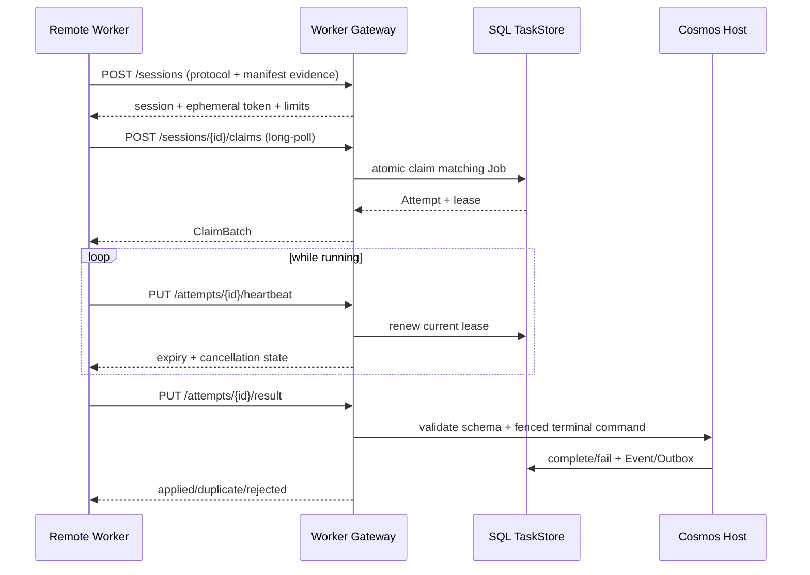

# Worker Gateway API 草案

> 状态：Draft v0.2；远程执行边界，后置于本地 Worker/Host 收敛
>
> 基础路径：`/api/worker/v1`
>
> Transport：HTTPS request/response + bounded long-poll
>
> 公共约定：[`0001-common-contracts.md`](0001-common-contracts.md)

## 1. 目标与边界

Worker Gateway 让没有数据库、Data Root 或永久 Secret 权限的远程 Worker 执行
符合其 manifest/capability 的 Action。

Gateway 初期由 NestJS 独立模块承载，未来可以拆成单独宿主。无论物理位置如何：

- TaskStore 仍是 Job/Attempt/lease 的唯一权威；
- Gateway 不维护第二份队列或终态；
- Gateway 必须通过 Cosmos Workflow Host/Application Port claim 和提交；
- Worker 主动发起所有连接，服务端不反向调用 Worker 地址；
- Job 不通过同步 `POST worker/execute` 运行；
- Gateway 的 Session 只负责协议、身份、能力和连接生命周期，不是 Job owner；
- Attempt lease 才是具体执行 ownership；
- Gateway Attempt owner 是
  `(attemptId, ownerSessionId, ownerEpoch, leaseToken, leaseExpiresAt)`；任何
  heartbeat、Receipt 或 Result 都必须匹配当前 owner；
- Session replacement 本身只阻止旧 Session claim；显式 resume 通过 TaskStore
  CAS 转移 Attempt owner、递增 epoch 并轮换 lease token，旧 owner立即失效；
- lease 丢失后的外部副作用证据使用独立、受限、短期 late-evidence capability，
  不能用它续租、提交 Result 或执行领域 Command。

## 2. 为什么 v1 使用 long-poll

HTTPS long-poll 的第一版优势：

- 兼容普通反向代理、NAT、企业网络和负载均衡；
- Gateway 实例可以保持无状态，不要求 sticky session；
- Redis/WakeupBus 不可用时仍能回退到 SQL polling；
- HTTP 重试、限流、request ID、body size 和可观察性更成熟；
- Worker 到服务端的 Result/Receipt 本来就需要可靠 request/response；
- 后续可增加 WebSocket Adapter，而不改变 Session/Claim/Attempt 语义。

long-poll 只降低空轮询开销，不改变 durable truth。连接中断时 TaskStore lease
照常过期和接管。

## 3. Action execution placement

```ts
type ActionExecutionPlacement =
    | "host"
    | "trusted_worker"
    | "remote_worker";
```

| placement | 可执行位置 | 示例 |
| --- | --- | --- |
| `host` | Cosmos Host/受信任核心执行器，靠近领域事务 | `library.ingest`、checkpoint、领域 merge/split |
| `trusted_worker` | 用户/运营者信任且拥有受控本机资源的 Worker | Browser Bridge、OpenCLI profile、本机脚本 |
| `remote_worker` | 通过 Gateway、无数据库权限的 Worker | 纯转换、允许远程执行的 HTTP/搜索/模型 Action |

`remote_worker` 表示最低要求允许远程执行；Direct/Trusted Worker 也可以执行。
`trusted_worker` 不会被发给普通远程 Session。`host` 永不通过 Gateway 下发。

placement 是执行与数据访问边界，不等于完整权限系统。Worker 仍需精确
Action manifest hash、lane、capability、预算和未来认证匹配。

## 4. 协议流程



## 5. Session API

真实 Gateway 实现前必须提供可撤销的 bootstrap trust root。具体使用 mTLS、OIDC、
部署签发 token 或其它 provider 保持可替换，但验证后的最小 claims 固定为：

```ts
type WorkerBootstrapIdentity = {
    subject: string;
    workerId: string;
    audience: "cosmos-worker-gateway";
    credentialGeneration: number;
    allowedPlacements: ("remote_worker" | "trusted_worker")[];
    capabilityPolicyRef: string;
    issuedAt: string;
    expiresAt: string;
};
```

Credential 必须绑定 workerId/audience/expiry/generation，支持轮换和撤销，并阻止
同一 credential 的无界 Session 创建。Session token 只授权一个 Session，不是
bootstrap credential，也不能用于 Product/Admin API。

### 5.1 创建 Session

```text
POST /api/worker/v1/sessions
Authorization: Bearer <bootstrap credential>
```

```ts
type CreateWorkerSessionRequest = {
    supportedProtocolVersions: string[];
    worker: {
        workerId: string;
        instanceId: string;
        version: string;
        runtime: {
            name: "node";
            version: string;
            platform: string;
            arch: string;
        };
        mode: "gateway";
        labels: Record<string, string>;
    };
    execution: {
        lanes: {
            lane: string;
            maxConcurrency: number;
        }[];
        placements: ("remote_worker" | "trusted_worker")[];
        genericCapabilities: string[];
    };
    evidence: {
        version: number;
        workflows: ManifestEvidence[];
        actions: ManifestEvidence[];
        connectors: ManifestEvidence[];
    };
    valueTransport: {
        supportedKinds: ("inline" | "blob" | "artifact")[];
        maxInlineBytes: number;
        upload: boolean;
        download: boolean;
    };
    receiptCapabilities: {
        externalEffects: boolean;
        uncertain: boolean;
        compensation: boolean;
    };
    resumeAttempts?: {
        attemptId: string;
        ownerEpoch: number;
        leaseToken: string;
    }[];
};

type ManifestEvidence = {
    ref: string;
    manifestHash: HashRef;
};

type CreateWorkerSessionResponse = {
    protocolVersion: string;
    sessionId: string;
    sessionToken: string;
    registrationGeneration: number;
    status: "ready" | "limited";
    accepted: {
        lanes: string[];
        workflowRefs: string[];
        actionRefs: string[];
        connectorRefs: string[];
    };
    rejectedEvidence: {
        ref: string;
        reason:
            | "unknown_ref"
            | "manifest_mismatch"
            | "placement_denied"
            | "capability_missing"
            | "disabled";
    }[];
    limits: {
        heartbeatIntervalMs: number;
        sessionTtlMs: number;
        attemptHeartbeatIntervalMs: number;
        defaultLeaseMs: number;
        maxClaimWaitMs: number;
        maxInFlightClaimsPerSession: number;
        maxClaimBatch: number;
        maxInlineBytes: number;
        maxRequestBytes: number;
    };
    resumedAttempts: (
        | {
            attemptId: string;
            status: "accepted";
            ownerEpoch: number;
            leaseToken: string;
            leaseExpiresAt: string;
        }
        | {
            attemptId: string;
            status: "lease_lost" | "not_found" | "ownership_mismatch";
        }
    )[];
    serverTime: string;
};
```

`sessionToken` 只在创建时返回，服务端保存 hash 或等价安全验证材料。它不进入日志、
Event、Worker discovery 或 Product API。

`workerId` 是稳定逻辑身份，`instanceId` 是进程/启动实例。相同 workerId 的新
Session 增加 registration generation，旧 Session 不能继续 claim 新 Job。
`resumeAttempts` 不是“两个 Session 共用旧 token”：每个 accepted resume 必须在
TaskStore 中 CAS 当前 owner，递增 `ownerEpoch`、绑定新 Session 并返回轮换后的新
`leaseToken`。CAS 失败不改变当前 owner。

### 5.2 Session heartbeat

```text
PUT /api/worker/v1/sessions/{sessionId}/heartbeat
Authorization: Bearer <session token>
```

```ts
type WorkerSessionHeartbeatRequest = {
    registrationGeneration: number;
    status: "ready" | "draining";
    lanes: {
        lane: string;
        freeSlots: number;
        activeAttempts: number;
    }[];
    activeAttemptIds: string[];
    evidenceRevision: number;
    observedAt: string;
};

type WorkerSessionHeartbeatResponse = {
    status: "accepted" | "fenced" | "drain_requested";
    sessionExpiresAt: string;
    nextHeartbeatInMs: number;
    serverTime: string;
};
```

Session heartbeat 不自动续租所有 Attempt。否则一个卡死进程只要主循环仍活着就能
无限延长失控 Action。`observedAt` 只作诊断，服务端 `receivedAt/serverTime` 才是
状态排序、TTL 和 fencing 的权威；超出 capability 声明时钟偏差的值被标记或拒绝，
不能推进服务端时间。

### 5.3 Drain 与注销

```text
POST   /api/worker/v1/sessions/{sessionId}/drains
DELETE /api/worker/v1/sessions/{sessionId}
```

Drain Request 使用 `Idempotency-Key`：

```ts
type GatewayDrainRequest = {
    reason: string;
    deadlineAt: string | null;
};

type GatewayDrainResponse = {
    sessionId: string;
    status: "draining" | "already_draining";
    activeAttemptIds: string[];
    acceptedAt: string;
};
```

DELETE 只在没有活跃 Attempt 时正常注销。仍有 Attempt 返回
`409 active_attempts`；Worker 应先 drain，不能靠注销逃避结果收口。

draining Session 必须继续 Session heartbeat，直到全部 Attempt 收口或 drain
deadline 到达；它的 TTL 可以续期但 `acceptingClaims=false`。deadline 到达后，
Attempt lease 不再续期，无法确认的 external effect 只允许走 late evidence。

## 6. Claim API

```text
POST /api/worker/v1/sessions/{sessionId}/claims
Authorization: Bearer <session token>
Idempotency-Key: <claim request id>
```

```ts
type ClaimJobsRequest = {
    registrationGeneration: number;
    waitMs: number;
    maxItems: number;
    slots: {
        lane: string;
        available: number;
    }[];
};

type ClaimBatchResponse = {
    claimBatchId: string;
    claims: WorkerJobClaim[];
    polledAt: string;
    nextPollAfterMs: number;
    replayUntil: string;
};

type WorkerJobClaim = {
    attemptId: string;
    attemptNumber: number;
    jobId: string;
    runId: string;
    activityId: string;
    ownerEpoch: number;
    leaseToken: string;
    leaseAcquiredAt: string;
    leaseExpiresAt: string;
    heartbeatIntervalMs: number;
    lane: string;
    priority: number;
    action: {
        ref: string;
        manifestHash: HashRef;
        effectMode: "none" | "external";
        executionPlacement: "trusted_worker" | "remote_worker";
        inputSchema: JsonSchemaRef;
        outputSchema: JsonSchemaRef;
        timeoutMs: number | null;
    };
    input: ValueEnvelope;
    idempotencyKey: string;
    deadlineAt: string | null;
    budget: WorkflowBudget | null;
    secretLeaseRefs: SecretLeaseRef[];
    lateEvidenceCapability: {
        token: string;
        expiresAt: string;
    } | null;
    trace: {
        requestId: string;
        correlation: CorrelationRef | null;
    };
};

type SecretLeaseRef = {
    ref: string;
    attemptId: string;
    actionManifestHash: HashRef;
    purpose: string;
    audience: string;
    materialSchemaRef: JsonSchemaRef;
    nonce: string;
    maxUses: number;
    expiresAt: string;
};
```

没有可领取 Job 时：

- 等待至 `waitMs` 或服务端上限；
- 返回 `204 No Content`，或 `200 { claims: [] }`；实现前由 conformance test 固定
  一种，本草案推荐 `204`；
- 不把“当前空队列”记录为 Worker failure。

Gateway 必须先在 TaskStore 中原子 claim，再返回 WorkerJobClaim。不能先发送
offer、后异步补 lease；那会允许多个 Worker 同时执行同一个 Job。

同一 Session/lane 的 persisted `maxConcurrency` 是权威容量；请求中的
`slots[].available` 只是 Worker 的保守提示。Gateway 在一个 TaskStore 事务中：

1. 验证 Session/generation/drain/TTL；
2. 计算该 Session/lane 当前未终结 Attempt reservation；
3. 只在剩余容量内 claim Job、创建 Attempt owner 和 slot reservation；
4. 保存 claim idempotency result 后返回。

多个 Gateway 副本或并发 long-poll 不能让 reservation 超过持久上限。Attempt
terminal、lease expiry 或 owner transfer 在同一 TaskStore 合同中释放/转移
reservation。

Claim filter 至少校验：

- Session 当前 generation、状态、TTL 和空闲 slot；
- Job lane/priority/availableAt/deadline；
- Action ref 和精确 manifest hash；
- execution placement 被 bootstrap policy 和 Session accepted placements 允许；
  普通 remote Session 只能领取 `remote_worker`，受信 Gateway Session 才能领取
  `trusted_worker`；
- required capabilities、ValueRef 和 receipt 能力；
- Run non-terminal/admission；
- 当前无有效 lease，或旧 lease 已过期。

每个 Session 的 in-flight long-poll 不超过握手返回上限；超出返回
`429 gateway_rate_limited` + `Retry-After`。进入 drain、replacement 或 Session
expiry 时，尚未 claim 的等待请求立即结束且不创建 Attempt。

claim 成功但 HTTP 响应丢失时，Worker 用相同 `Idempotency-Key` 重试并在
`replayUntil` 前取得同一 `claimBatchId`、Attempt 和 token；不能用新请求悄悄再领
一批。replay window 过期后返回 `claim_replay_expired`，由旧 Attempt lease
自然过期/接管，不猜测执行。batch 只有在 owner tuple 仍绑定当前 Session 时才可
重放；已 resume/reassigned 的 Attempt 不向旧 Session 返回新 token。

## 7. Attempt heartbeat 与取消

```text
PUT /api/worker/v1/attempts/{attemptId}/heartbeat
Authorization: Bearer <session token>
```

```ts
type AttemptHeartbeatRequest = {
    ownerEpoch: number;
    leaseToken: string;
    observedAt: string;
    progress?: {
        current?: number | null;
        total?: number | null;
        message?: string | null;
    } | null;
    usageDelta?: Partial<WorkflowUsage> | null;
};

type AttemptHeartbeatResponse = {
    status:
        | "renewed"
        | "cancellation_requested"
        | "lease_lost"
        | "run_terminal";
    leaseExpiresAt: string | null;
    cancelReason: string | null;
    serverTime: string;
};
```

- 服务端时间是 lease 判断权威；Worker 本地时钟只用于诊断。
- heartbeat 只续当前 Attempt 的当前 Session、owner epoch 和 token。
- 新 expiry 使用
  `min(serverNow + leaseDuration, runDeadline, actionDeadline, drainDeadline)`；
  任一 deadline 已到时返回 `cancellation_requested` 或 `lease_lost`，不能无限续租。
- Worker 收到 `cancellation_requested` 后触发 cooperative AbortSignal，并尽快提交
  cancelled/failed/uncertain 结果。
- `lease_lost` 后 Worker 必须停止后续受保护写入；外部操作无法取消时进入 Receipt
  unknown 路径。
- 为降低并发 Worker 请求量，后续可以增加 batch heartbeat，但不能改变每个 Attempt
  独立 fencing。

## 8. Value transfer

Claim input 可以 inline 或 ValueRef。远程 Worker 不能用 storage key 拼接路径。

### 8.1 下载

Gateway 为 Claim 中的 ValueRef 提供短期、Attempt-scoped download capability。
下载重新校验：

- 当前 Attempt/session；
- lease 或明确允许的恢复读取窗口；
- hash、media type 和 byte range；
- ref 仍未 retired。

### 8.2 上传

```text
POST /api/worker/v1/attempts/{attemptId}/value-uploads
```

```ts
type CreateValueUploadRequest = {
    ownerEpoch: number;
    leaseToken: string;
    mediaType: string;
    byteSize: number;
    hash: HashRef;
};

type ValueUploadCapability = {
    uploadId: string;
    method: "PUT";
    url: string;
    headers: Record<string, string>;
    expiresAt: string;
    expected: {
        mediaType: string;
        byteSize: number;
        hash: HashRef;
    };
};
```

上传完成不等于 Job 成功。Result 仍需引用已校验 ValueRef 并通过当前 lease 提交。
未被任何结果引用的临时 upload 由受控 GC 清理。

upload capability 接收原始字节并在物化前执行实际 body limit。上传后必须调用
`POST /attempts/{attemptId}/value-uploads/{uploadId}/finalizations`；服务端按实际
字节验证 size/hash/media type，成功后才返回可用于 Result 的 `ValueEnvelope`。
`DELETE .../value-uploads/{uploadId}` 只取消未 finalization 的临时值。断线、重复
finalize 和 orphan GC 必须幂等；canonical/hash 规则使用公共合同第 2、6 节。

## 9. Secret lease

Secret 永不出现在 Claim input、Event、日志或普通 ValueRef。

第一版远程 Worker 实现前需要独立 Secret Broker 设计。以下端点状态为
`Reserved`，不属于无 Secret fake Gateway 的 v1 实现：

```text
POST /api/worker/v1/attempts/{attemptId}/secret-resolutions
```

```ts
type ResolveSecretLeaseRequest = {
    ownerEpoch: number;
    leaseToken: string;
    secretLeaseRef: string;
};

type SecretMaterialEnvelope = {
    kind: "inline_secret";
    mediaType: "application/json" | "text/plain";
    value: unknown;
    byteSize: number;
};

type ResolvedSecretLease = {
    secretLeaseRef: string;
    material: SecretMaterialEnvelope;
    expiresAt: string;
    renewable: boolean;
    remainingUses: number;
};
```

约束：

- `SecretLeaseRef` 已绑定当前 Attempt、精确 Action manifest、purpose、audience、
  nonce、expiry 和使用次数；请求不能覆盖这些约束；
- 返回材料使用 no-store、禁止日志，并尽量一次性/短生命周期；
- Secret lease 到期不等于 Job lease 到期；
- Worker 不允许把 secret material 放入 output、Receipt details 或错误；
- 普通第三方 Worker 默认不能解析高敏 Secret；
- 具体认证、加密和远程信任未决前不实现此端点。
- `SecretMaterialEnvelope` 不是 `ValueEnvelope`，不得进入 ValueStore、journal、
  Result、Receipt、Event、错误序列化或通用缓存。

## 10. 外部副作用 Receipt

`effectMode=external` 的 Attempt 必须：

```text
started -> committed
        -> unknown
unknown -> committed
committed -> compensated
```

### 10.1 写 Receipt

```text
PUT /api/worker/v1/attempts/{attemptId}/receipt
```

```ts
type PutAttemptReceiptRequest = {
    ownerEpoch: number;
    leaseToken: string;
    submissionId: string;
    baseRevision: number;
    status: "started" | "committed" | "unknown" | "compensated";
    externalRef?: string | null;
    details?: ValueEnvelope | null;
    error?: FailureSnapshot | null;
    observedAt: string;
};

type PutAttemptReceiptResponse = {
    outcome: "applied" | "duplicate" | "lease_lost" | "state_conflict";
    receipt: ActionReceiptSnapshot;
    reconcileRequired: boolean;
    receivedAt: string;
};
```

规则：

- `started` 必须在调用外部系统前、当前 lease 下写入。
- `committed` 必须在外部系统确认后、当前 lease 下写入。
- 当前 lease 下的 `unknown` 要求已有 started Receipt；lease 丢失后不能再调用本
  端点，而使用下述 late-evidence API。
- `unknown -> committed` 只允许 reconcile/外部确认后的证据升级；已经 committed
  的 Receipt 不能回退为 unknown。
- `compensated` 要求已有 committed/unknown 及可审计的补偿结果。
- 同 `(jobId, attemptNumber)` 只有一个 Receipt 生命周期。
- 同 submissionId + 同 fingerprint 幂等；不同 payload 冲突。
- 每次 transition 使用 `baseRevision` 做数据库 CAS。跨 Gateway 并发时只有一个
  transition 获胜；失败方重新读取后只能按允许的下一状态继续。
- Receipt details 不能包含完整 Secret 或无界上游响应。
- `observedAt` 只作外部证据时间；`receivedAt` 和 revision 是状态顺序权威。

原 Attempt 在 lease 有效时可以提交自己执行的 compensated transition。Attempt
终结或失租后的补偿必须由独立 reconcile/compensation Workflow 通过 Host
Application Command 记录，并关联原 Receipt；late-evidence capability 无权标记
compensated。

### 10.2 lease 丢失后的 late evidence

```text
POST /api/worker/v1/attempts/{attemptId}/late-evidence
Authorization: Bearer <late-evidence capability>
```

```ts
type AppendLateAttemptEvidenceRequest = {
    submissionId: string;
    kind: "external_effect_unknown";
    externalRef?: string | null;
    details?: ValueEnvelope | null;
    observedAt: string;
};

type AppendLateAttemptEvidenceResponse = {
    outcome: "applied" | "duplicate" | "capability_expired" | "state_conflict";
    receiptRef: string;
    reconcileRequired: true;
    receivedAt: string;
};
```

late-evidence capability 只绑定一个 Attempt/external Action，短期、可撤销、按
submission 幂等，并只允许追加 `unknown` evidence。它不能续租、改变 Attempt
owner、提交 succeeded/failed Result、恢复 Secret、写 output/checkpoint/Event 或
执行 Application Command。新 Attempt 已接管时，证据仍可追加到旧 Attempt 的审计
并设置 reconcile，不能覆盖新 owner 的状态。服务端还必须验证该 Attempt 已持久化
started Receipt；没有 started 时返回 `state_conflict`，不能用 capability 伪造一次
从未开始的外部调用。

## 11. Result API

```text
PUT /api/worker/v1/attempts/{attemptId}/result
Authorization: Bearer <session token>
```

```ts
type PutAttemptResultRequest = {
    ownerEpoch: number;
    leaseToken: string;
    submissionId: string;
    observedAt: string;
    result:
        | {
            status: "succeeded";
            output: ValueEnvelope;
            receiptRef: string | null;
            usage: WorkflowUsage | null;
        }
        | {
            status: "failed";
            failure: FailureSnapshot;
            retryable: boolean;
            receiptRef: string | null;
            usage: WorkflowUsage | null;
        }
        | {
            status: "uncertain";
            failure: FailureSnapshot;
            receiptRef: string | null;
            usage: WorkflowUsage | null;
        }
        | {
            status: "cancelled";
            reason: string;
            receiptRef: string | null;
            usage: WorkflowUsage | null;
        };
};

type PutAttemptResultResponse = {
    outcome:
        | "applied"
        | "duplicate"
        | "retry_scheduled"
        | "lease_lost"
        | "run_terminal"
        | "schema_invalid"
        | "receipt_required"
        | "reconcile_required";
    jobStatus:
        | "queued"
        | "retry_wait"
        | "succeeded"
        | "failed_terminal"
        | "cancelled";
    runStatus: WorkflowRunStatus;
    nextAttemptAt: string | null;
    receiptRef: string | null;
    appliedAt: string | null;
};
```

服务端必须按以下顺序处理成功：

1. 校验 Session/Attempt identity、submission 幂等和 payload size。
2. 校验当前 owner Session/epoch、Job/Attempt lease token、expiry、Run
   non-terminal/deadline；Host 同时验证当前 Run fence。
3. 校验 Action output schema 和 ValueRef hash。
4. 对 external Action 校验 terminal Receipt。
5. 在 Cosmos Host 的持久一致性边界中写 Job/Activity terminal、Event/Outbox 和
   必需 projection。
6. 返回 `applied`。

请求成功提交但 HTTP 响应丢失时，Worker 用同 submissionId 重试，得到
`duplicate` 和已经应用的终态。不能因为网络超时再执行 Action。

旧 Attempt 的 output 不进入领域状态。已经 committed 但 lease 丢失的外部结果进入
`reconcile_required`，由独立 Maintenance Workflow 按 Receipt/外部查询能力处理。

条件合同：

- `effectMode=none` 时 `receiptRef` 必须为 `null`，且不能提交 `uncertain`；
- `effectMode=external` 的 succeeded 必须引用当前 Attempt 的 committed Receipt；
- external failed/cancelled 如果从未写 started Receipt 可以为 `null`；一旦 started，
  必须引用 committed/unknown/compensated Receipt；
- external uncertain 必须引用 started/unknown Receipt；没有 Receipt 的模糊结果
  返回 `effect_evidence_missing`，不能伪装成普通 uncertain Result；
- late-evidence API 只建立 reconcile evidence，不使旧 Result 获得应用资格。

## 12. Session replacement 与 Attempt resume

Session generation 只 fencing registration 和新 claim。已经领取的 Attempt 由
TaskStore 中独立的 owner tuple 拥有：

```text
(attemptId, ownerSessionId, ownerEpoch, leaseToken, leaseExpiresAt)
```

规则：

- 旧 Session 被 replacement 后不能 claim，但如果新 Session 没有请求 resume，
  旧 Session 仍可在原 owner tuple 和 lease 有效时完成当前 Attempt；
- 新进程提交 `resumeAttempts` 时，Gateway 在 TaskStore 中 CAS 精确旧 tuple；
- accepted resume 原子绑定新 Session、递增 ownerEpoch、轮换 leaseToken，并立即
  fencing 旧 Session 对该 Attempt 的 heartbeat/Receipt/Result；
- 旧/新 Session 不存在共享有效 token 的窗口；
- resume 不延长已经过期的 lease，也不能恢复已由其它 Worker 接管或 Run 已终结的
  Attempt；
- 无本地持久 active-attempt metadata 的 Worker 重启后等待旧 lease 过期，不猜测
  token；
- operator cancellation 可以显式撤销 Attempt，不由 registration replacement
  隐式取消所有外部操作；
- external effect 已经开始但 owner 转移时，旧进程只能使用 late-evidence
  capability，不能继续受保护写入。

因此 replacement 与 resume 是两个动作：replacement 关闭旧 claim 能力；resume
才原子转移具体 Attempt owner。

## 13. Gateway 错误

```ts
type WorkerGatewayError = {
    code: string;
    message: string;
    retryable: boolean;
    requestId: string;
    sessionId?: string | null;
    attemptId?: string | null;
    serverTime: string;
    details?: Record<string, unknown>;
};
```

| HTTP | code | 处理 |
| --- | --- | --- |
| 400 | `protocol_payload_invalid` | 修复客户端/manifest，不盲目重试 |
| 401 | `bootstrap_auth_failed` | 重新配置 bootstrap identity |
| 401 | `session_token_invalid` | 建立新 Session |
| 409 | `session_fenced` | 停止 claim，drain 当前可完成 Attempt |
| 409 | `registration_generation_mismatch` | 重新握手 |
| 409 | `attempt_owner_fenced` | 停止当前 Attempt；必要时只追加 late evidence |
| 409 | `submission_conflict` | 同 submissionId payload 不同，人工诊断 |
| 409 | `receipt_state_conflict` | Receipt 非法回退/冲突 |
| 409 | `active_attempts` | 注销前先 drain |
| 410 | `session_expired` | 新建 Session；按 token 尝试 resume |
| 409 | `lease_lost` | 立即停止受保护写；必要时上报 unknown |
| 409 | `effect_evidence_missing` | external Result 缺少 started/unknown Receipt |
| 410 | `claim_replay_expired` | 不执行未知 claim；等待 lease 过期后用新 key poll |
| 410 | `late_evidence_invalid` | capability 过期/撤销/范围不匹配 |
| 409 | `run_terminal` | 丢弃未应用结果，保存本地诊断 |
| 413 | `payload_too_large` | 使用 Value upload |
| 422 | `manifest_mismatch` | 更新/切换 Worker executable |
| 422 | `capability_mismatch` | 不领取该 Action |
| 422 | `schema_invalid` | Worker/definition 版本问题 |
| 426 | `protocol_mismatch` | 升级 Worker/Gateway |
| 429 | `gateway_rate_limited` | 按 Retry-After 退避 |
| 503 | `task_store_unavailable` | 保持 Session，退避；当前 Attempt 注意 lease |
| 503 | `value_store_unavailable` | 不执行需要该值的 Claim |

Gateway 返回 `lease_lost` 时不能泄露当前 owner/token。

## 14. 安全与日志

- bootstrap/session/lease/Secret token 全部视为 Secret。
- late-evidence token 和重放窗口内的 claim batch token 同样视为 Secret。
- bootstrap identity 必须绑定 workerId、audience、credential generation、expiry
  和 capability policy；Session replacement 不能成为夺取其它 workerId Attempt 的
  旁路。
- Gateway access log 记录 request ID、operation、worker/attempt safe ID、status 和
  duration，不记录 body。
- Worker self-reported labels 有数量、长度和 key allowlist，不能成为日志注入或
  metrics 高基数来源。
- manifest evidence 必须与 catalog hash 精确匹配；generic capability 不足以证明
  可执行。
- Input/Output schema 校验在 Worker 前后都执行；不能信任远程结果类型。
- transfer URL 短期、Attempt-scoped、hash/size-bound。
- Gateway 在解析 JSON 前执行实际 request-body 上限；inline JSON/text 和 upload
  使用公共 canonical bytes/hash 规则。
- Result 不能携带任意 Application Command 名称；ActionDefinition 决定 Host 如何
  解释 output。
- 远程 Worker 不直接访问 DomainEvent/Outbox、checkpoint、数据库或 Data Root。
- 当前单用户最大产品权限不等于任意远程 Worker 自动可信。

## 15. Direct 与 Gateway Worker 一致性

两种 Worker Transport 必须运行同一组行为测试：

| 行为 | Direct | Gateway |
| --- | --- | --- |
| TaskStore claim 是 owner 来源 | 是 | Gateway 代理 claim |
| Action manifest 精确匹配 | 是 | 是 |
| 每次 claim 形成 Attempt | 是 | 是 |
| 独立 lease heartbeat | 是 | 是 |
| 旧 token 拒绝 terminal | 是 | 是 |
| external Receipt | 是 | 是 |
| Result schema 校验 | 是 | 是 |
| Run terminal/cancel fencing | 是 | 是 |
| ValueRef hash 校验 | 是 | 是 |
| Domain Command 仅 Host 执行 | 是 | 是 |

Transport 差异不能产生两套 Job 状态机或 retry policy。

## 16. 当前实现差距

当前代码没有 Worker Gateway。已存在的可复用证据：

- Prisma WorkflowRun/Job lease；
- Worker registration generation/TTL/evidence；
- Action manifest hash 和 capability assessment；
- external Action Receipt `started/committed/unknown/compensated`；
- Run/Job 双 lease fencing；
- checkpoint CAS；
- Worker slot、heartbeat、drain；
- Value codec 的初步实现。

在实现 Gateway 前仍需：

1. 完成 `nb-workflow` Kernel 与 Cosmos Host convergence。
2. 抽出正式 TaskStore/ActivityExecutor/ValueStore Port。
3. 固定 Action execution placement 和 schema。
4. 建立 Attempt 独立投影或证明现有 Job attempt 记录足够。
5. 实现 Worker Admin。
6. 通过 Direct/Gateway conformance fake，再接 Prisma。
7. 实现 bootstrap identity provider、Session token rotation/revocation；Secret
   Broker/Secret resolution 继续保持 Reserved。
8. 实现 owner epoch/resume CAS、late-evidence capability、Receipt revision CAS、
   persisted slot reservation 和 claim batch replay/backpressure。
9. 用 PostgreSQL/S3 进行真正多主机生产验收；不使用共享 SQLite 网络盘。
