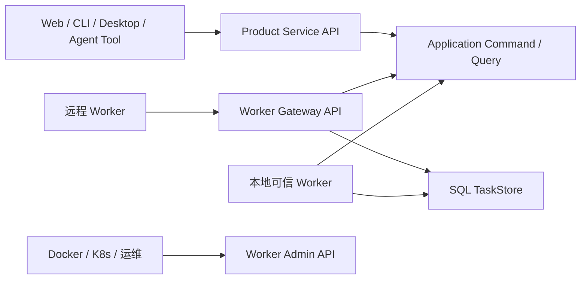

# Cosmos API 与 DTO 草案

> 状态：Draft v0.2，已完成文档审查；实现暂停，允许在后续 conformance 中调整
>
> 日期：2026-08-11
>
> 总体架构：[`../architecture/0001-cosmos-foundation.md`](../architecture/0001-cosmos-foundation.md)
>
> 信息模型：[`../architecture/0002-information-model.md`](../architecture/0002-information-model.md)
>
> 稳定边界：[`../adr/0003-service-worker-api-boundaries.md`](../adr/0003-service-worker-api-boundaries.md)
>
> 后续实施入口：[`../tasks/06-nb-workflow-kernel-convergence/README.md`](../tasks/06-nb-workflow-kernel-convergence/README.md)

## 1. 文档职责

本目录单独保存 Cosmos 的 API、Transport 和 DTO 草案。它用于：

- 从原始需求和产品模型反推完整应用能力，而不是只描述当前 Phase 1 路由；
- 固定 Product Service API、Worker Admin API 和 Worker Gateway API 的边界；
- 为后续 Zod schema、NestJS Controller、HTTP Client、Worker Client 和
  conformance tests 提供输入；
- 显式区分已实现、收敛阶段、后续阶段和仅预留的能力；
- 在不暴露 Prisma、SQLite、Data Root、Secret 或进程内对象的前提下，让 Web、
  CLI、Desktop、插件和远程 Worker 使用同一语义合同。

本目录不是 OpenAPI 生成物，也不是当前代码行为的过度声明。字段和路径只有在进入
`@cosmos/contracts`、通过行为测试并接入宿主后，才成为已实现合同。

## 2. 三个 API 面



| API 面 | 主要消费者 | 责任 | 明确不负责 |
| --- | --- | --- | --- |
| Product Service API | Web、CLI、Desktop、知识管理者工具、受控扩展 | 产品 Command、Query、Run 控制、SSE、受控文件读取 | Job claim、lease token、可执行插件加载 |
| Worker Admin API | 容器探针、编排器、运维工具 | Worker 存活、就绪、状态、能力、指标、drain | 同步执行 Job、任意 Connector 调用、领域写入 |
| Worker Gateway API | 无数据库权限的远程 Worker | Session、长轮询 claim、Attempt heartbeat、Receipt、结果提交 | 第二套 Job 状态、永久 Secret、任意领域表写入 |

Product Service 与 Worker Gateway 初期可以由同一个 NestJS 进程承载，但使用独立
模块、路径和协议版本。Worker Admin 由每个 Worker 进程在独立内部端口提供。

## 3. 文件索引

- [`0001-common-contracts.md`](0001-common-contracts.md)：协议版本、Header、分页、
  错误、幂等、并发控制、ValueRef、SSE 和兼容规则。
- [`0002-product-service-api.md`](0002-product-service-api.md)：面向产品客户端的
  完整资源和端点草案。
- [`0003-product-dtos.md`](0003-product-dtos.md)：Product Service 使用的 Command、
  Query、Snapshot 和 Event DTO 草案。
- [`0004-worker-admin-api.md`](0004-worker-admin-api.md)：Worker 运维面和 drain 合同。
- [`0005-worker-gateway-api.md`](0005-worker-gateway-api.md)：远程 Worker Session、
  claim、lease、Receipt、结果和断线恢复合同。
- [`0006-scenarios-and-conformance.md`](0006-scenarios-and-conformance.md)：需求场景、
  失败场景和后续行为测试矩阵。
- [`0007-review-findings.md`](0007-review-findings.md)：多代理审查发现、处理结果和
  未决问题。

## 4. 成熟度标记

端点和 DTO 使用以下实现成熟度标记。它们不等于 PRD 的产品 Phase：

| 标记 | 含义 |
| --- | --- |
| `Current` | 当前分支已有等价生产路由或合同；路径或 DTO 仍可能在 v1 收敛前迁移 |
| `Convergence` | 未来 Host/Worker 收敛必须满足的合同；不代表本轮或同一批次实现 |
| `Planned` | 原始需求或 PRD 已要求，但当前尚未实现；具体产品 Phase 另行标注 |
| `Reserved` | 为避免封死架构而保留的能力位，产品行为尚未确认 |

`Planned` 和 `Reserved` 不代表当前数据库存在同名表，也不代表当前 Web 可以使用。
当一个 `Planned` 端点属于尚未完成的 Phase 1 产品合同，表格会明确写成
`Planned · Phase 1 remainder`；这不会自动把它扩大进 Task 06。

当前阶段关系是：

| 产品范围 | 当前状态 |
| --- | --- |
| Phase 1 最小服务器闭环 | 已实现并有 focused/Node/browser 证据 |
| Phase 1 完整产品范围 | 尚缺 Source 删除、最小定时采集计划、Source health/checkpoint 诊断、完整 Run/Step 产品面、真实 RSS/Docker/长时间恢复等 |
| `nb-workflow` 前置门禁 | 尚未实施；先独立稳定 Kernel API、Memory Backend 和 conformance |
| Phase 1C / Cosmos 本地 convergence | Kernel 门禁通过后实现 Durable Host、本地 Worker、固定 Ingest parity、manifest-only API 和独立 Migrator |
| Worker Admin | Draft v0.2 已审查；在本地 Worker 稳定后实现 |
| Worker Gateway | Draft v0.2 已审查；远程执行和 fake conformance 后置，不进入下一轮本地 Worker |
| Phase 2–5 | 按 PRD 保持 `Planned`，不由本草案提前宣称实现 |

## 5. 从需求反推的能力面

| 需求领域 | 必需 API 资源 | 主要阶段 |
| --- | --- | --- |
| 服务器、客户端和分离部署 | health、readiness、capabilities、protocol、SSE | Current / Convergence |
| Source 与多平台采集 | SourceDefinition、SourceOperation、Connection、Source、CollectionPlan、TriggerBinding、Probe | Current / Planned |
| Workflow 主动行为核心 | Definition、Run、Activity、Step projection、Job、Attempt、Signal、Receipt、Event | Convergence |
| 不可变事实与离线信息库 | Observation、Entry、Revision、Asset、Blob | Current / Planned |
| Phase 1 最小 Story projection | 单 Entry Story、Story Detail、Story-based Feed | Current |
| 完整 Story、Topic 和关系 | StoryRevision、Membership、merge/split、Topic、Entity、Relation、Proposal | Planned |
| Knowledge 与 Research | KnowledgeSignal、ResearchRequest、Research Workflow correlation | Planned |
| 推荐与用户行为 | Feed、Related、Impression、Feedback、ReadState、SpotlightPlacement | Planned |
| 长期体验与 Agent 产物 | Workspace、InputBinding、WorkspaceUpdate、Artifact、InteractionState | Planned |
| 看板 | Board、Section、Block、rendered snapshot | Planned |
| 摘要与外部投递 | Publication、DeliveryIntent、DeliveryAttempt、Receipt、Subscription | Planned |
| 数据所有权与运维 | storage usage、backup、export、deletion plan、cleanup、integrity | Planned |
| 插件扩展 | PluginManifest、catalog、schema、capability、execution placement | Convergence / Planned |
| 远程执行 | Worker Session、Claim、Attempt、ValueRef、SecretLeaseRef、drain | Convergence design / implementation later |

## 6. 当前代码与目标差异

当前 NestJS 已提供 Source、Probe、Ingest Run、Feed、Search、Story、Entry、
Revision、Asset、Worker discovery 和 SSE。当前 Worker 是轮询进程，没有 HTTP
Admin Server。当前主要差异：

1. NestJS Controller 仍直接依赖 Prisma Repository。
2. API 仍加载 Connector/Action executable，并通过 executable Registry 生成
   `/connectors`。
3. `RunSnapshot` 和 `JobSnapshot` 仍偏固定 Source Ingest，不能表达通用
   Workflow/Activity/Attempt/Receipt。
4. `/health` 混合 API readiness 和 Worker availability；Worker 停止不应阻止用户
   读取已保存内容。
5. Worker Admin、Worker Gateway、Connection、CollectionPlan、Knowledge、
   Research、Workspace、Publication 等尚未实现。
6. HTTP Client 尚未覆盖全部当前路由，也没有通用 Command/Query Transport。
7. 当前 Product API 无认证、默认可绑定 `0.0.0.0`，Compose 直接发布 API 端口；
   它只能视为本机/受信网络验收入口，不是公网部署模板。
8. 当前 fixture Source 可配置绝对 `fixturePath`，而 API 又允许创建 Source；在
   远程暴露前必须收紧为受控 fixture root、拒绝绝对路径/遍历/symlink escape。
9. 当前 Source/Job/Asset public projection 仍可能携带内部 config/result/
   `storageKey`；Controller 迁移时必须建立白名单 DTO，不能直接返回 Repository
   对象。
10. 当前 Compose healthcheck 仍使用产品 health，尚未实现独立 `/healthz`、
    `/readyz` 和 Worker Admin。

因此实现时应先建立合同和 Application Port，再迁移 Controller；不能把当前
Prisma 方法直接包装成未来公共 API。

## 7. 实施顺序与门禁

本目录保存后续实现输入，不拥有 Workflow Kernel，也不是当前路由清单。工程顺序
固定为：

```text
稳定 nb-workflow Kernel 与 conformance
-> 参考 Task 04 Spike 的恢复、lease、Outbox 和 Ingest parity 证据
-> 按本目录实现 Cosmos 本地 Worker / Durable Host 与 Product API 收敛
-> 实现 Worker Admin
-> 最后考虑远程 Worker Gateway
```

下一轮本地 Worker 不实现 Gateway Session、远程 Secret、owner handoff 或公网
Transport。Gateway DTO 和失败场景继续保留，用于防止本地 Host/Worker 设计封死
远程边界，但不得作为当前能力或下一轮交付承诺。

Draft v0.2 尚未进入 `@cosmos/contracts` 公共 Zod schema、NestJS Controller、
Worker Admin Server 或 Worker Gateway。实现时如 conformance 暴露矛盾，先记录
失败场景和证据，再修订 Draft。

## 8. 已确认的设计决定

1. 远程 Worker v1 使用 HTTPS request/response + long-poll claim，不以 WebSocket
   连接状态持有 durable truth。
2. ActionDefinition 声明 `executionPlacement`：
   `host`、`trusted_worker` 或 `remote_worker`。
3. SQL TaskStore 是 Job/Attempt/lease 的唯一权威；Gateway 和 WakeupBus 都不拥有
   第二份终态。
4. 本地可信 Worker 可以直接访问 Cosmos Backend；无数据库权限的远程 Worker
   必须经过 Gateway。
5. Worker Admin API 不提供同步 Job 执行端点。
6. 领域写入 Action 是 `host`；远程 Worker 返回经过 schema 校验的结果或
   ValueRef，再由 Cosmos Host 执行 Application Command。
7. 外部副作用按 at-least-once、幂等键、Receipt 和 reconcile 建模，不宣称
   exactly-once。
8. Gateway Attempt ownership 绑定 Session 和 owner epoch；resume 使用 TaskStore
   CAS 原子转移，旧 owner 立即失效。
9. lease 丢失后的外部结果只能通过受限 late-evidence capability 追加
   `unknown` 证据，不能续租、完成 Job 或写领域状态。
10. 未认证 Product API 只允许本机或明确受信网络；公网、远程 Product API 和真实
    Gateway 都有独立认证/HTTPS 发布 gate。

## 9. 草案更新规则

- 改动语义前先补充失败场景或 conformance case。
- 字段重命名需要更新 DTO、端点、场景和 requirement mapping。
- 已发布协议不静默改变字段含义；不兼容变化提升路径或 payload version。
- 实现阶段可以删减没有消费者的 Reserved 资源，不为“完整”制造空壳代码。
- 实现与草案不一致时，记录证据和理由，再决定修改实现还是修订草案。
- `docs/api/0007-review-findings.md` 记录草案审查和 disposition；已经归类为
  implementation gate 的问题不能靠继续增加 DTO 字段假装解决。

## 10. 非目标

- 本轮不生成 OpenAPI 文件，不实现 NestJS Controller 或 Worker Server。
- 本轮不实现认证、多租户、权限审批或第三方插件沙箱。
- 本轮不实现 PostgreSQL、Redis、S3、远程 Worker 或 Harness Adapter。
- 本轮不把未来所有资源提前写入 Prisma。
- 本轮不承诺所有 Planned 端点在同一个 Phase 交付。
