# Cosmos 总体架构设计

> 状态：Draft v0.24
>
> 最后更新：2026-08-20
>
> 原始需求真相源：[`../requirements/0001-original-requirements.md`](../requirements/0001-original-requirements.md)
>
> 产品需求：[`../requirements/0002-product-requirements.md`](../requirements/0002-product-requirements.md)
>
> 初始调研：[`../research/2026-08-06-daily-digest-research.md`](../research/2026-08-06-daily-digest-research.md)
>
> `nb-memory` 调研：[`../research/2026-08-08-nb-memory-research.md`](../research/2026-08-08-nb-memory-research.md)
>
> 信息领域模型：[`0002-information-model.md`](0002-information-model.md)
>
> API 与 DTO 草案：[`../api/README.md`](../api/README.md)
>
> API 边界 ADR：[`../adr/0003-service-worker-api-boundaries.md`](../adr/0003-service-worker-api-boundaries.md)
>
> 已合入实现规格：[`../spec/README.md`](../spec/README.md)

本文是可持续调整的总体设计，不是不可修改的最终合同。用户的新需求先逐字追加到 requirements，再在本文中解释、建模和调整；稳定且改回成本高的决定再提炼为 ADR。
本文正式使用 `Workflow`。旧文档中的 `Flow` 只作为原始需求措辞或历史迁移说明保留，不再作为现行架构合同。

## 1. 结论

Cosmos 应采用“服务器优先的本地优先模块化单体 + 持久化事件/任务流水线 + 稳定 Transport + 可插拔扩展 SDK”：

- Source、Trigger、Workflow、Action 分开建模，提供类似 GitHub Actions 的可编排体验。
- 所有渠道先进入不可变的采集层，再形成可查询的信息库；网页 URL 只是可选来源属性。
- 信息库不只保存文章，而是保存来源记录、修订、媒体、实体、长期关注对象、具体事件、标签、批注和关联。
- Story 是每个 Entry 的上层规范内容单元，通过稳定核心 kind 和受管理、可扩展 subtype 区分形态；Topic 表示围绕问题或目标的长期、主观关注范围。
- Agent 作为 Workflow 中的一种受控 Action，可以查询信息库、继续调研并生成版本化 Artifact。
- 知识管理者是共享长期记忆之上的高权限系统角色，可以通过 Web Chat、`cosmos cli` 和 ingest/research Workflow 参与系统操作。
- Workflow 是 Cosmos 的主动行为核心；Ingest、Knowledge、Research、Maintenance、Delivery 和 Interaction 共用 `nb-workflow` 的规范脚本 Kernel，不在 Cosmos 内长期维护第二套 replay 语义。
- `nb-workflow` 以类似 LangChain 的可组合组件提供脚本执行、Activity journal、并发、等待和恢复协议；持久化是显式选择的 Backend 能力，不绑定 Cosmos、Prisma、SQLite 或 Harness。
- Cosmos Workflow Host 负责持久 Run/Journal、TaskStore、Job/Attempt/Lease、Outbox、Worker 和领域事务；SQL 是任务权威，可选 WakeupBus 只负责唤醒。
- Workspace 表示长期、可更新、可交互的体验容器；Artifact 表示一次版本化输出。
- 看板是查询与编排层，不拥有底层内容。热点、精华、普通信息流和 Workspace 可以引用同一批领域对象。
- 逻辑上保持模块化单体，物理上从第一条切片起分为 Next.js Web、NestJS API 和 Worker 进程；这不是微服务拆分，而是明确的宿主边界。
- 服务器部署是第一优先级，同时为嵌入式客户端和客户端与服务分离保留同一套 Service Endpoint、Command、Query、Event 和流式 Transport 合同。
- 第一阶段以看板闭环为主，推送暂缓实现，但保留可靠投递所需的 Publication、Outbox 和 Delivery 边界。

```mermaid
flowchart LR
    subgraph External["外部渠道"]
        RSS["RSS / RSSHub"]
        Social["BiliBili / X / Telegram / 群聊"]
        Mail["邮箱"]
        Web["官网 / 公告 / 搜索结果"]
        API["状态与结构化 API"]
    end

    subgraph Automation["自动化运行时"]
        Trigger["Trigger"]
        Workflow["Workflow"]
        Kernel["nb-workflow Kernel"]
        Host["Cosmos Workflow Host"]
        Action["Action / Agent Extension"]
    end

    subgraph Library["本地信息库"]
        Observation["Observation"]
        Entry["Entry + Revision"]
        Asset["Blob / Asset"]
        Knowledge["Story / Topic / Entity"]
        Search["全文 / 实体 / 关系检索"]
    end

    subgraph Curation["理解与策展"]
        Recommend["候选与推荐"]
        Artifact["Artifact"]
        Workspace["Workspace"]
    end

    subgraph Experience["用户体验"]
        Board["可配置 Board"]
        Publication["摘要 / Publication"]
        Delivery["后续推送"]
    end

    External --> Trigger
    Trigger --> Workflow
    Workflow --> Kernel
    Kernel --> Host
    Host --> Action
    Host --> Observation
    Observation --> Entry
    Observation --> Asset
    Entry --> Knowledge
    Entry --> Search
    Knowledge --> Search
    Search --> Recommend
    Search --> Artifact
    Artifact --> Workspace
    Knowledge --> Workspace
    Recommend --> Board
    Workspace --> Board
    Board --> Publication
    Publication --> Delivery
```



## 2. 目标与边界

### 2.1 产品目标

1. 在用户授权和资源预算内，尽可能广地采集用户关注领域的信息。
2. 让已采集的正文、元数据和尽可能多的图片/附件在本地离线可访问。
3. 把多个平台中的碎片信息组织成可检索、可关联、可持续更新的信息库。
4. 把“录入什么”与“现在展示什么”分开，支持广采集、窄展示。
5. 允许用户和系统通过自定义 Trigger、Workflow、Action、Agent、查询和看板区块扩展行为。
6. 让所有摘要、聚类、推荐和 Agent 报告都能追溯到原始来源。
7. 先完成高自定义看板，再实现紧急推送和定时摘要。
8. 以个人本地优先作为 v1 和默认产品合同，保留未来协作所需的 actor/revision 扩展位。

### 2.2 当前非目标

- 第一阶段不解决互联网级规模、多租户 SaaS、多人账户同步或复杂协作权限。
- 第一阶段不引入 Kafka、RabbitMQ 或微服务治理；Web、API、Worker 的多进程宿主只用于形成清晰的运行边界。
- 不承诺所有平台都能完整下载图片、视频或受保护正文。
- 不让 LLM 直接成为原始事实、权限或外部副作用的最终裁决者。
- 不把第三方平台推荐结果视为客观质量；系统需要记录其发现来源并建立自己的展示排序。
### 2.3 当前实现与设计合同

当前实现基线为 `5ce628690ab0110b0525e8ebcbacbe673ced9c55`，依赖
`@notnotype/nb-workflow@0.2.0`。固定的 `cosmos.ingest@1` 已接入
`nb-workflow` Durable Host：Cosmos 提供 Prisma Workflow Backend、Host Store、
Value Store、Event Sink、Action Registry 和三条本地 lane（Run、Activity、Completion），
Worker 默认启用该 Host；只有显式设置
`COSMOS_WORKFLOW_HOST_ENABLED=false` 才回退到保留的 legacy IngestionWorker 路径。

API 手动触发和 schedule 通过版本化 `cosmos.ingest@1` 创建带 definition、input、
correlation 和 Source execution snapshot 的 `WorkflowRun`；Worker 依次执行
`source.fetch@1`、`library.ingest@1[]` 和 `source.checkpoint@1` Activity Job，写入
Observation、Entry/Revision、Asset、最小 Story、FTS、DomainEvent/Outbox 和 checkpoint。
Run/Job/Completion 的 lease、幂等、重试和双重 fencing 由 Host/SQL 持久边界负责；Probe
与 legacy Source Job 仍保留为兼容/回退 lane。通用自定义 Workflow 的安装、配置和稳定
管理 API 仍不是完整产品能力。

Product API 当前通过静态 Manifest Catalog 读取 Source、Workflow 和 Action 定义、schema、
capability 及 hash；Controller 的 catalog 路由和 Source probe 不加载或执行 executable，
executable 只在 Worker 执行面注册。公开投影使用白名单，不能把 lease token、Secret、
storage key、绝对路径或任意内部 payload 作为 Product DTO 返回。

Worker Admin 当前由 Worker 进程提供独立的 Node `http` loopback host，默认
`127.0.0.1:9091`，提供 `/healthz`、`/readyz`、`/metrics` 以及
`/admin/v1/status`、`/admin/v1/capabilities` 和 drain 端点；direct mode 的 poll、readiness、
manifest evidence、错误脱敏、幂等 drain 和 active poll/Attempt 分离已有 focused 测试。
非 loopback 绑定必须显式提供授权回调；Gateway/remote Worker 仍未实现。

实现行为的可重建合同见 [`docs/spec/README.md`](../spec/README.md) 及其
[`application/0007-workflow-host-contract.md`](../spec/application/0007-workflow-host-contract.md)、
[`application/0008-workflow-host-runtime.md`](../spec/application/0008-workflow-host-runtime.md)、
[`application/0004-manifest-catalog.md`](../spec/application/0004-manifest-catalog.md)、
[`interfaces/0002-product-api-http.md`](../spec/interfaces/0002-product-api-http.md) 和
[`runtime/0003-worker-admin.md`](../spec/runtime/0003-worker-admin.md)。Task 07 的 focused/full
测试和 Node durable smoke 已有证据；Docker、browser/e2e、真实来源、跨进程 recovery、
长时双 Worker fencing、Worker Admin SIGTERM/活跃 Attempt deadline、Gateway/Redis/多主机仍未验证
或未实现。

以下内容是本架构确认的设计合同，但不是当前已经交付的能力：

- TaskStore + WakeupBus 的正式公共 Port、自适应唤醒和可选 Redis Streams Adapter；当前
  SQLite TaskStore 与 fallback polling 已能支撑本地 Host，但 Redis/WakeupBus 不是当前实现；
- 通用自定义 Workflow 的插件加载、稳定管理 API、Trigger/Binding 产品模型和完整生产运维面；
- Connection、SecretStore、ConnectorStateStore、多个采集计划和 Source Operation 的完整持久模型；
- 将固定 Ingest 已验证的双 lease fencing 扩展到未来 Knowledge、Research、Artifact、Delivery
  等全部领域写入和外部副作用；
- Knowledge Workflow、KnowledgeSignal、ResearchRequest、Research Workflow、Trigger Consumer
  和循环保护；
- Outbox 的完整投递/消费恢复链路、独立 Migrator、Gateway/remote Worker、多主机和可选 Redis；
- `neuro-agent-harness`/`nb-memory` Adapter、Knowledge Manager Web/CLI 和个性化配置生成。

Round 98–105 已把固定 Ingest 从 focused seam 接到 API、schedule 和生产 Worker：
URL-free fallback 使用规范化 `sourceLocator`，discovery provenance 至少保存
manual/schedule、Workflow ref 和 Action command key；事实事务同时验证 Run/Job
lease，Prisma 接管测试证明旧 Worker 不能继续写；Source checkpoint 使用
revision/CAS，过期并发 Run 不会回滚 cursor；Workflow Run 保存 correlation、
真实 started/finished 时间，以及独立 `SourceExecutionSnapshot`。排队后修改
Source 配置不会改变已创建 Run 的 fetch 输入，相同幂等键也复用首次快照。

仍待收口的是 Connection/多采集计划 StateStore、Source 删除与历史事实保留、
Blob GC、弱 fallback identity 的强度/版本合同、journal value/reference 与
retention，以及把同样的写入 fence 扩展到后续领域 Command。

## 3. 架构原则

### 3.1 原始证据与派生理解分离

外部采集到的 Observation 是证据，保持不可变。正文清洗、摘要、分类、embedding、Story 归并、推荐分数和 Agent 观点都是派生结果，可以升级算法后重算，但不能覆盖原始证据。

### 3.2 录入与展示分离

`Admission` 决定一条信息是否值得进入本地信息库；`Ranking` 决定它是否值得在当前用户、当前看板和当前时刻展示。两者使用不同的规则、预算和反馈。

### 3.3 本地优先

只要内容已经成功录入，核心文本、元数据、关系、用户批注和已保存媒体应在没有外网时仍可查询。外部链接用于回到来源，不作为本地可用性的前提。

### 3.4 扩展走合同，不走数据库

Connector、Trigger、Action、Agent 和 Board Block 只能通过版本化 SDK、Command、Query 和 Event 合同访问系统。扩展不能直接依赖数据库表名或写内部表。

第一版只运行用户明确安装的本地可信扩展，不实现细粒度权限系统；保持 SDK 和进程边界，是为了以后可以增加能力限制或更强隔离，而不是第一阶段交付权限平台。

### 3.5 持久运行

轮询、抓取、LLM、Agent 和生成任务都可能跨进程重启。每个 Run、Activity、
Job/Attempt 和外部副作用都需要可恢复状态、幂等键、租约、重试预算和可诊断
错误；命名 Step 作为可选投影也必须可重建或持久化。

### 3.6 展示角色不污染领域模型

“热点”“精华”“信息流”首先是看板上的展示角色，不是所有内容必须继承的底层类型。同一个 Story 可以同时出现在热点区、某份竞品报告的依据和普通信息流中。

### 3.7 多宿主与 Transport 边界

Cosmos 需要兼容三种运行形态：

1. **服务器部署模式**：Next.js Web、NestJS API 和 Worker 部署在同一服务器或同一 Docker Compose 应用中，作为第一优先级交付形态。
2. **客户端模式**：Desktop Shell 承载 Web UI，并启动或连接本机 API/Worker；数据仍由本地服务管理。
3. **客户端与服务分离模式**：Desktop Shell 或浏览器连接远端 API/Worker，客户端不拥有核心数据库写入权。

宿主可分离性需要区分“进程已经分开”和“可以部署到不同物理主机”：

- Web 当前只通过 HTTP/SSE 使用 API，可以部署在独立主机。
- NestJS API 与 Worker 当前是独立进程，没有同步 RPC 调用；它们通过同一个
  SQLite/Data Root 中的 Run、Job、lease、Outbox 和领域状态协作。
- 因为 SQLite、Blob Root 和 Artifact Root 仍要求本地共享，当前 API 与核心
  Worker 可以分容器并共享卷，但不支持安全地部署到不同物理主机。
- 真正的多主机可信 Worker 目标是 PostgreSQL TaskStore/领域库、S3/MinIO
  ValueStore 和可选 Redis WakeupBus；远程或第三方 Worker 则通过 Worker Gateway
  主动连接，不直接访问数据库或 Data Root。

三种模式共享以下边界：

- UI、Connector、Agent 和外部扩展通过版本化 Service Endpoint 访问应用能力，不直接导入 Prisma Client、SQLite Repository 或 Data Root 实现。
- Command 负责状态修改，Query 负责读取，Event 负责跨模块通知；Transport 负责把这些合同映射到 HTTP、JSON 和 SSE，不把 HTTP 路由名称当作领域合同。
- 服务暴露健康检查、协议/能力版本和可操作错误。协议不兼容、服务不可用、校验失败、冲突、未找到和结果未知需要分别表达。
- SSE 事件带有稳定 Event ID 和协议版本；客户端重连时携带游标，服务无法补齐缺失事件时返回 `snapshot_required`，由客户端重新获取授权快照后继续。
- Blob 与 Artifact 通过服务端受控地址或下载能力访问；客户端不根据文件系统路径拼接用户数据地址。

控制面与执行面还必须进一步解耦：

- API 当前只加载 Workflow/Action/Adapter manifest、schema 和 capability，负责 Command、Query、Run 控制、SSE 和 catalog/probe；它不加载 Connector executable、不执行 Workflow，也不访问外部平台。实现锚点见 [`interfaces/0002-product-api-http.md`](../spec/interfaces/0002-product-api-http.md)。
- Worker 加载 Workflow 脚本、Action/Connector executable 和 Agent Extension，注册 manifest evidence，领取 Job 并执行 Activity；当前 direct Worker 的组合锚点见 [`runtime/0001-worker-process.md`](../spec/runtime/0001-worker-process.md)。
- 独立 Migrator 在 API/Worker 启动前执行数据库迁移仍是目标运维边界；当前 Compose 仍由 API 启动命令执行 migration，不能把独立 Migrator 写成已实现能力。
- Worker Admin 已由 Worker 进程的独立 loopback Node `http` host 提供；可靠任务仍通过 TaskStore 领取，不通过同步 HTTP 调用形成第二套调度真相。

当前合入代码已满足 manifest-only Product API 和 direct Worker Admin 的本地切片；API/Worker 仍共享 SQLite/Data Root，未认证 Product API 只适用于本机或明确受信网络。Compose 的公网绑定、Docker、Gateway、Redis 和多主机部署仍是后续或未验证边界。

对外 API 正式拆成三个面：

| API 面 | 消费者 | 责任 |
| --- | --- | --- |
| Product Service API | Web、CLI、Desktop、知识管理者工具 | Product Command、Query、SSE、受控文件 |
| Worker Admin API | 容器探针、编排器、运维工具 | health、readiness、status、capability、metrics、drain |
| Worker Gateway API | 无数据库权限的远程 Worker | Session、long-poll claim、Attempt heartbeat、Receipt、Result |

Product Service 与 Worker Gateway 初期可以由同一个 NestJS 宿主承载，但使用独立
模块、路径和协议版本。Worker Admin 使用独立内部端口，不提供同步 Job execute。
远程 Worker v1 使用 HTTPS long-poll；Gateway 必须先在 SQL TaskStore 原子 claim
再返回 Attempt lease，不以 HTTP 连接、Redis 消息或进程内 Session 决定 owner。
Attempt owner 由持久
`(attemptId, ownerSessionId, ownerEpoch, leaseToken, leaseExpiresAt)` 决定；
Session replacement 只停止旧 Session 新 claim，显式 resume 通过 TaskStore CAS
转移 owner、递增 epoch 并轮换 token。并发 Gateway claim 还必须原子保留
Session/lane slot，Worker 上报的 free slot 只是提示。

ActionDefinition 还必须声明 `executionPlacement`：

```text
host
trusted_worker
remote_worker
```

领域 Command/checkpoint 是 `host`；依赖 Browser Bridge、本机 profile 或其它受信任
资源的是 `trusted_worker`；只有 `remote_worker` Action 才能发给普通 Gateway
Session。远程 output 经 schema/hash 校验后由 Cosmos Host 提交，远程 Worker 不
直接写领域表、checkpoint 或 Outbox。

Desktop Shell 的具体技术（Tauri、Electron 或其它实现）、安装生命周期、远端认证和公网暴露策略都保持在宿主层，不进入领域模型。

### 3.8 Web 组件与开发工具边界

Web 展示层按四层单向依赖组织：

```text
页面数据容器
  → Cosmos 产品组件
    → components/ui primitives
      → 全局语义 token
```

- 页面数据容器负责 Product API、SSE、表单提交和页面级状态，不把 Transport 或远程数据访问下沉到展示组件；
- Cosmos 产品组件表达 Feed、Source、Search、Story 和状态摘要等可复用产品语义，使用显式 props 与合成 fixture 即可独立渲染；
- `components/ui` 继续维护 shadcn `base-nova` / Base UI primitive 源码，不为未来换肤增加只转发 props 的包装层；
- 产品组件只消费 Cosmos/shadcn 语义 token，不依赖某套主题私有变量或字面主题颜色；颜色、圆角、密度、阴影和字体优先在 token 与 primitive 层调整。

组件实验室是开发工具，不是 Product Service 能力。开发模式的 `/dev/components` 使用固定、脱敏的合成 fixture 展示真实 primitive 和产品组件；它不访问 Product API、SSE、Prisma、SQLite、Blob Root、Artifact Root 或用户数据。生产构建访问该路由必须返回 404，实验室不进入产品导航。

实验室只允许调节组件 props、交互状态、已登记主题/配色和设计 token。URL 保存有界、可分享的会话选择；大量 token 草稿只保存在版本化 localStorage，并可经边界校验后原子导入/导出 JSON。浏览器不获得源码写入、任意 CSS、外部模块加载或代码执行能力。

所有 `components/ui` 公共模块和无副作用的 Cosmos 产品组件都必须登记至少一个默认实验室场景；Route、Layout、Provider、数据请求容器、测试 helper 和一次性内部实现不在该登记合同内。注册表与公共组件模块的一致性由 CI 行为测试强制，不能只依赖评审记忆。具体方案与验收见已接受的 [`react-component-lab` Proposal](../proposals/react-component-lab.md)。

## 4. Source、Trigger、Workflow 与 Action

用户体验可以类似 GitHub Actions，但底层需要拆开四个概念。

| 概念 | 责任 | 示例 |
| --- | --- | --- |
| `SourceDefinition` | 描述一种来源类型及其配置 schema | RSS、IMAP、Telegram、BiliBili 首页推荐 |
| `SourceInstance` | 用户配置好的一个具体来源 | 用户 A 的 BiliBili 首页、某个邮箱收件箱 |
| `TriggerBinding` | 判断何时启动一个 Workflow，并绑定输入和定义版本 | 手动、cron、轮询发现变化、webhook、内部事件 |
| `WorkflowDefinition` | 编排一组有顺序和分支的步骤 | 拉取 → 标准化 → 去重 → 入库 → 触发分析 |
| `ActionDefinition` | 可复用执行能力 | `rss.poll`、`http.fetch`、`agent.run`、`artifact.publish` |
| `WorkflowRun` | 某一版 Workflow 对输入快照的一次执行 | 2026-08-06 08:00 的日报 Run |
| `Activity` | Run journal 中一次需要稳定恢复的交互 | Action 调用、Query、Signal、Timer、Child Workflow |
| `Job` / `Attempt` | 宿主可领取的任务，以及持有 lease 的一次实际尝试 | Worker 第 2 次执行 `rss.poll@1` |
| `Step` | 可选的命名逻辑分组和 UI 投影 | “拉取”“入库”“研究” |

### 4.1 Trigger 类型

第一版合同预留以下 Trigger：

- `manual`：用户点击、CLI 或 API 触发。
- `schedule`：cron 或固定间隔。
- `poll`：按计划执行轻量检查，仅在游标、版本或条件变化时发出事件。
- `webhook`：外部平台主动通知。
- `event`：订阅 Cosmos 内部领域事件，例如 `entry.created`、`story.materially_updated`。
- `condition`：基于查询结果、状态或阈值触发，例如“DeepSeek 状态由 available 变为 degraded”。
- `dependency`：另一个 Workflow 或 Step 成功、失败或产出特定结果后触发。

“轮询邮箱，有新邮件则触发”应建模为：

1. `schedule` 唤醒 IMAP Poll Trigger；
2. Trigger 使用持久 checkpoint 检查 UID / ModSeq；
3. 有变化时发出 `source.change_detected`；
4. Workflow 调用 IMAP Action 获取并录入新邮件。

Trigger 只负责发现“应该开始”，不承担完整抓取、LLM 和写库逻辑。这样同一套 IMAP Action 可以被手动触发、定时触发或其它 Workflow 调用。

### 4.2 Action 类型

- `connector`：调用外部平台或读取本地输入。
- `transform`：解析、清洗、规范化、切分和格式转换。
- `library`：通过公开 Command 写入 Entry、Asset、关系或 Annotation。
- `query`：查询信息库、Saved View 或关联图。
- `control`：条件、分支、循环、fan-out、fan-in、wait 和 retry。
- `script`：执行用户提供的受控代码。
- `agent`：启动带模型、工具、预算和配置能力范围的 Agent Run。
- `artifact`：创建或更新 Artifact Revision。
- `render`：把 Board、Workspace 或 Artifact 渲染成网页、图片或其它格式。
- `delivery`：后续向 Telegram、QQ、Email 等渠道发送。

`ActionDefinition` 是能力合同，不是任务实例。它声明版本化的输入/输出 schema、Capability、幂等、超时、取消、重试和恢复语义；一次实际调用由 Workflow 记录为 Activity，Cosmos Host 在需要外部执行时创建 Job，每次 Worker 执行形成一个带 lease 的 Attempt。Step 只在需要逻辑分组或 UI 投影时创建。

### 4.3 Workflow 定义

Workflow 使用版本化定义描述 Trigger Binding、输入、步骤、能力范围和预算。脚本式 Workflow 是最底层、最灵活的执行形态；Graph、IR 和 Comfy 类表达属于上层编排格式，可以转换为脚本式 Workflow 语义，不建立第二套执行 Runtime。

```yaml
id: important-mail-intake
version: 1

triggers:
    - kind: schedule
      every: 2m
    - kind: manual

capabilities:
    - source:mail.personal.read
    - library:entry.write
    - agent:classify.run

steps:
    - id: poll
      uses: connector.imap.poll@1
      with:
          source: mail.personal

    - id: ingest
      foreach: ${{ steps.poll.items }}
      uses: library.entry.ingest@1

    - id: classify
      if: ${{ steps.ingest.created }}
      uses: agent.run@1
      with:
          profile: mail-importance
          input: ${{ steps.ingest.entryId }}
```

上例只表达合同方向，具体 DSL 在实现 Task 中通过 schema 和行为测试确定。

Workflow Definition、Action Definition、Trigger Binding 与 Workflow Run 的关系是：

```text
TriggerBinding
  -> WorkflowDefinition@version
      -> WorkflowRun(inputSnapshot, definitionSnapshot)
          -> Journal
              -> Activity[]
                  -> ActionDefinition@version
                      -> Job
                          -> Attempt + Lease
          -> Step projection[] (optional)
```

- `WorkflowDefinition` 描述可执行流程；它可以由脚本注册，也可以由 Graph/IR 转换生成。
- `ActionDefinition` 描述可复用能力；它不代表某一次执行。
- `TriggerBinding` 只负责触发时机、绑定的来源/输入、并发与计划策略，不拥有执行状态。
- `WorkflowRun` 保存触发原因、定义版本、输入快照、预算、父子关系和最终收口，是一次实际执行的 durable truth。
- `Activity` 以稳定 path、序号、kind 和输入 fingerprint 标识，完成后可在 replay
  中复用；输入 fingerprint 改变时，Runtime 必须按已定义规则使相关后缀失效。
- `Job` 是 Host 执行 Activity 的持久任务，`Attempt` 才是具体 Worker lease；
  Job 终态不能由 WakeupBus 或 Worker 内存决定。
- `Step` 不参与底层 replay 身份，可由脚本命名、trace 或产品 UI 投影生成。

#### 脚本式 Workflow 与上层编排格式

- 脚本式 Workflow 适合开发者表达复杂控制流、复用 TypeScript 函数和组合 Action，是 Runtime 的底层执行语义。
- Workflow IR/Graph 适合持久化、版本化、检查、可视化和由用户/知识管理者生成；它们转换成脚本式 Workflow 语义，而不是拥有独立的执行器。
- 脚本式 Workflow 不能绕过 Runtime；执行时必须产生可追踪的定义版本、Run、Activity journal、必要的 Job/Attempt、输入/输出引用和 DomainEvent。Step 是可选投影。
- Graph/IR 不能直接执行任意网络、文件或进程操作；转换后的副作用仍必须映射到已注册的 ActionDefinition 和 Capability。
- 不是所有脚本都需要或能够反向转换成 Graph；支持从 Graph/IR 到脚本语义的单向转换即可。
- `nb-workflow` 是规范脚本 Kernel，拥有 Activity journal、`path + seq + kind +
  fingerprint`、`wf.map`/`wf.all`、`wf.ask`/resume、受控非确定性、取消传播和
  Child Workflow 的脚本语义。它通过 Backend/Port 使用内存或持久实现，不依赖
  Cosmos 领域。
- Cosmos 提供 `nb-workflow` 的 Durable Backend/Host：把 Run/Journal 映射到现有
  Prisma Store，把需要执行的 Activity 映射到 ActionDefinition/Job，把领域写入
  映射到 Application Command。当前独立 Runtime Spike 必须经 Task 06 收敛后才能
  视为该目标架构的实现。
- Graph/IR/Comfy 只转换成 `nb-workflow` 脚本语义，不拥有第二个执行器。不是所有
  TypeScript Workflow 都必须能反向转换成 Graph。

#### Workflow 类型

Workflow 使用轻量 `kind + tags` 分类，不为每类 Workflow 复制一套 Runtime：

- `ingest`：把外部来源事实编排进入 Cosmos。
- `knowledge`：对 Entry 做规则、模型或 Agent 分析，生成 Story/Topic/关系 Proposal。
- `research`：查询 Cosmos 信息库并主动访问已配置的外部渠道。
- `maintenance`：重建索引、清理、对账和修复。
- `delivery`：生成、渲染和发送用户可见结果。
- `interaction`：处理用户/Agent 交互、等待输入和恢复。
- `custom`：用户或插件定义的其它流程。

分类只影响展示、默认优先级/预算和运维统计，不改变 Workflow 的执行语义。

### 4.4 自定义代码与插件

扩展包使用 manifest 声明：

- 唯一 ID、版本和兼容的 Cosmos SDK 版本；
- 提供的 Source、Source Operation、Trigger、Action 或 Board Block；
- 配置 schema 与 Secret 引用；
- 网络、文件、模型、库查询、库写入和外部投递能力声明；
- 幂等、超时、取消和恢复能力；
- 运行入口和资源预算。

`SourceOperation` 是未来由 Adapter 对外部来源提供的一项可调用操作，例如 `bilibili.dynamic`、`bilibili.recommendation` 或 `rss.poll`。它声明输入配置、输出的标准化 `NormalizedIngestItem`、稳定 external key、`originLocator`、`discoveryContext`、媒体状态、checkpoint 读写范围和错误语义；它不是 Workflow，也不直接写 Cosmos 数据库。

Phase 1B 当前实现使用较小的 `IngestConnector` 运行时边界：`ConnectorRegistry` 按业务 `Source.kind` 解析一个 Connector，Connector 只执行配置校验和外部读取，返回标准化 items 与 cursor。`SourceOperation` 是未来在一个 Provider 下区分多个采集操作的设计粒度，当前不作为用户配置字段或 Registry override。

Workflow 通过 `ActionDefinition` 调用 Source Operation。Adapter manifest 只注册能力和 schema，用户的 Connection、SourceInstance 和采集计划再把某个 operation 绑定到具体凭证、范围、Trigger、Workflow 版本和 StateStore 命名空间。

执行策略分两级：

1. 内置、受信任扩展可以在受控 Worker 中运行。
2. 用户或第三方代码默认在独立进程中运行，只通过 RPC SDK 访问能力。

第一版只实现用户明确安装的本地可信扩展，不建设细粒度权限 UI 或不可信代码沙箱。公开合同仍不得依赖进程内对象或直接数据库访问，以免后续无法隔离。

### 4.5 Agent 是可选 Extension/Action，不是 Core 或特殊旁路

`nb-workflow` Core 不直接依赖 Agent 或 `neuro-agent-harness`。可选 Agent
Extension 提供 `wf.agents.invoke()` 等脚本 API，底层仍记录为 journaled Activity
并调用版本化 `agent.invoke@1` ActionDefinition。Cosmos 的 Harness Adapter 在
Worker 中实现该 Action；Harness 文档和稳定合同完成前不接入。

`agent.invoke@1` 与其它 Action 使用相同的 Run、配置能力范围、超时、取消、产出
和重试合同。当前单用户阶段按最大产品权限运行，不建设审批 UI；
Capability/Service 边界主要用于可靠执行、数据隔离和未来扩展。Agent 可以：

- 查询 Entry、Story、Topic、Annotation 和 Saved View；
- 调用已注册并可用的外部搜索/抓取 Action；
- 创建 Annotation、关系建议和 Artifact Revision；
- 请求用户输入或补充信息；
- 发出后续 Workflow Event。

Agent 可以创建或维护 Topic、Workspace、Artifact、Source 和其它内部对象。当前不强制新外部 Source、数据范围扩大或外部发送经过审批；未来多人、远端或不可信扩展再增加独立权限策略，不能改变 Workflow/Service 合同。

Agent 不能：

- 改写 Observation；
- 绕过 Connector 或 Library Command 直接写表；
- 绕过已注册的 Adapter/Action、Capability、SecretRef 或 Application Command；
- 把自己的结论伪装成来源原文。

状态所有权固定为：

| 状态 | 所有者 |
| --- | --- |
| Workflow Run、Activity journal、Job、Attempt、lease | Cosmos Workflow Host |
| Agent Invocation、Session、Profile、Model Runtime | `neuro-agent-harness` |
| 知识管理者共享长期记忆 | `nb-memory` |
| Entry、Story、Artifact 等领域事实 | Cosmos Domain |

Harness 自身的恢复能力不能同时成为 Cosmos Job 的 durable truth。等待、取消、
usage、SessionRef、模型/Profile 版本快照和 unknown external result 的公共合同，
必须在 Harness Adapter Task 中明确后才能进入生产接线。

### 4.6 Connection、State 与采集计划

外部 Provider、Adapter、SourceInstance 和用户连接需要分开：

| 概念 | 责任 | 示例 |
| --- | --- | --- |
| `Provider` / Producer | 外部平台或数据提供者 | Bilibili、RSS、AI HOT |
| `Adapter` / Connector | 连接 Provider 的代码 | Bilibili Connector、RSS Connector |
| `ConnectionInstance` | 用户登录或授权后可复用的连接 | “我的 Bilibili 主账号” |
| `SourceInstance` | 用户配置的具体采集目标 | 动态、推荐流、某个 RSS |
| `Trigger` | 何时或因何启动 | 每 30 分钟、每 2 小时、内部事件 |
| `WorkflowBinding` | 该采集目标使用哪一版 Workflow | `bilibili.dynamic@1` |
| `CollectionPlan` | 用户可见的独立采集计划 | “主账号动态每 30 分钟” |

同一个 `ConnectionInstance` 可以被多个 `CollectionPlan` 引用。每个计划把 Source
Operation、Trigger、WorkflowBinding、checkpoint namespace、发现上下文、预算、
错误、重试和重叠策略组合为独立边界。重叠策略至少预留 `forbid`、`queue`、
`replace`、`allow` 和 `merge`；用户配置采集计划，不直接配置 Worker。

凭证和普通 Adapter 状态分离：

- `SecretStore` 由 Cosmos 统一提供；Adapter 负责登录协议和凭证格式，但不自行决定凭证的持久化位置。
- `ConnectionInstance` 只保存连接状态、授权范围和 `SecretRef`；Cookie、Token、Refresh Token 不进入普通配置、Job payload、DomainEvent 或日志。
- `ConnectorStateStore` 保存 cursor、ETag、分页 token、速率状态等非秘密状态。Adapter 可以定义状态 schema，Cosmos 负责命名空间、版本、备份、并发和恢复。
- OpenCLI/Browser Bridge 可以作为外部登录态管理例外，Cosmos 只保存 profile 引用；长期仍需映射到统一 Connection 合同。

## 5. 持久化事件与任务运行时

Cosmos 的生产者/消费者特征集中在运行时，而不是把整个产品简化成一个 FIFO 队列。

### 5.1 执行词汇与持久记录

| 类型 | 用途 |
| --- | --- |
| `WorkflowRun` | 某个 Definition 与输入快照的一次执行及其最终状态 |
| `Journal` / `Activity` | 可 replay 的调用、查询、等待、计时器和子 Workflow 记录 |
| `Job` | TaskStore 中等待 Host/Worker 执行的持久任务 |
| `Attempt` | Worker 对 Job 的一次实际执行，绑定 lease token 和时间窗口 |
| `DomainEvent` | 已发生的领域事实，例如 `entry.created` |
| `OutboxIntent` | 准备调用外部系统的副作用 |

Command 在一个数据库事务中修改领域状态并写入 Event/Outbox。Dispatcher 在提交后投递任务，避免“数据库已写但事件丢失”。

`Step` 不在这张底层持久记录表中。它是可选的命名逻辑分组或 UI/trace 投影；
当前 Spike 的 `WorkflowStepRun` 可以作为迁移证据保留，但后续不能要求每个
Activity 都再复制一份 Step 输入/输出。`Attempt` 也不强制必须独立成一张表；
可以由 Job attempt 计数、lease 记录和 receipt 投影实现，只要审计与 fencing
合同完整。

当前已有持久 DomainEvent/SSE、Workflow Outbox、per-Consumer delivery/cursor 和
parent-wake Consumer；外部发布 Dispatcher、dead-letter policy、通用 Trigger
Consumer 与所有业务消费者的生产注册仍未交付。

### 5.2 TaskStore 与 WakeupBus

“队列”拆成两个职责，避免 SQL 与 Redis 各自持有一套 Job 真相：

| Port | 责任 | 不负责 |
| --- | --- | --- |
| `TaskStore` | Job 状态、priority/lane、availableAt、retry、Attempt、lease、幂等和 fencing | 低延迟通知 |
| `WakeupBus` | 通知某个 lane/capability 的 Worker 可能有工作 | claim、lease、终态和领域写入 |

可靠路径是：

```text
Application transaction
  -> WorkflowRun / Job + Outbox
  -> commit
  -> Relay 发布 Wakeup
  -> Worker 被通知
  -> Worker 回 TaskStore 正式 claim
  -> 提交结果时再次校验 lease
```

Wakeup 丢失时 fallback polling 最终仍能发现 Job；Wakeup 重复时 TaskStore lease
和幂等拒绝重复 owner。Redis、PostgreSQL `LISTEN/NOTIFY` 或进程内 signal 都只能
实现 WakeupBus，不能取代 SQL lease，也不能决定 Job 已完成。

部署预设：

| 预设 | TaskStore | WakeupBus | 目标 |
| --- | --- | --- | --- |
| Ephemeral | Memory | In-process | 测试、CLI、Demo；不宣称跨进程恢复 |
| Local Durable | SQLite | 自适应 polling，可选 in-process signal | Desktop、个人服务器、单机 Compose |
| Server Enhanced | SQLite/PostgreSQL | 可选 Redis Streams + SQL fallback | 更低唤醒延迟 |
| Distributed Durable | PostgreSQL | 可选 Redis Streams + SQL fallback | 多主机 Worker |

本地默认不要求 Redis。Redis 可以承担 wakeup、Streams 通知、rate limit、cache
和非权威 presence，但不能成为 WorkflowRun、Job terminal、checkpoint 或唯一
lease 真相。直接用 BullMQ 等 Redis 队列替代 Cosmos Job 会让 Redis lease 无法
与 SQL 领域写入做原子 fencing，因此不是当前方案。

### 5.3 Job 状态与 Attempt

```text
queued
  -> leased
  -> succeeded

leased
  -> retry_wait
  -> queued

leased
  -> failed_terminal
  -> cancelled
```

需要等待用户、外部 webhook、Timer 或 Agent 后续输入时，WorkflowRun/Activity
进入 `waiting`，不占用 Worker lease；Step 可以投影该状态，但不是等待真相。
每次从 `queued`/`retry_wait` 成功 claim 都形成新的 Attempt 语义，旧 Attempt
不能复用过期 token 提交。

### 5.4 幂等、租约与接管

- 每个 Job 和外部 Intent 有业务幂等键。
- Worker 领取任务时取得 `lease_token` 和 `lease_expires_at`。
- 心跳只能延长当前 token 的 lease。
- lease 过期后新 Worker 可以接管；旧 Worker 不能用旧 token 提交成功。
- Gateway Session resume 不能让新旧进程共用 lease token；owner handoff 必须
  原子轮换 token/epoch 并立即 fencing 旧 Session。
- lease fencing 必须保护整个 Job 的写入窗口，而不只是最终把 Job 标记为成功：Observation、Entry/Revision、Asset、FTS、DomainEvent、checkpoint 和 Job terminal close 都必须验证当前 lease token。
- 失去 lease 的 Worker 必须在下一次受保护写入前停止；旧 Worker 不能继续追加事实、推进 checkpoint 或覆盖接管者的结果。
- Ingest 需要把“事实写入”和“checkpoint 提交”纳入同一可验证的收口边界；checkpoint 只能在本次 Run 的所有受保护写入成功后推进。
- 超时和取消必须先收口受 Cosmos 所有的子进程，再释放 lease。
- 重试使用有上限的指数退避，终态失败进入可查询的失败队列。
- 外部副作用可能已发生但 lease 已丢失时，只允许用短期 late-evidence capability
  追加 `unknown` 审计并触发 reconcile；该能力不能续租、完成 Job 或写领域状态。
- Receipt transition、claim batch replay 和 Session/lane capacity 使用 TaskStore
  revision/幂等/CAS；HTTP 连接和 Worker 本地时间不参与权威排序。

内部执行采用 at-least-once，因此 Action 必须幂等。外部系统不提供幂等键或查询接口时，无法承诺 exactly-once。

固定 Ingest 已实现以下更具体的收口：

```text
WorkflowRun lease + Action Job lease
  -> Observation / Entry / Revision / Asset / Story / FTS / Event / Outbox
  -> source checkpoint revision CAS
  -> Workflow checkpoint / terminal close
```

事实写入与 Source checkpoint 是两个有顺序的受保护事务：只有全部 item Command
成功后才调用 checkpoint Action。每个事务都重新验证两层 lease。checkpoint
同时比较入队时保存的 expected revision；若其它 Run 已推进状态，本 Run 记录
`source.checkpoint.superseded.v1` 并保留已采集 Observation，但不覆盖当前 cursor。
内容寻址 Blob 可以在数据库事务前预写，因此进程崩溃仍可能留下不可见 orphan
bytes；它不构成领域提交，后续由 Blob GC 处理。

### 5.5 外部结果未知

发送请求后进程可能在保存响应前中断。此时记录：

```text
uncertain
```

`uncertain` 不自动当作失败重发。恢复策略由渠道能力决定：

- 能按 idempotency key 查询：查询后收敛为 sent/failed。
- 不能查询但重复可接受：策略可明确允许重发。
- 重复不可接受：等待用户或受控恢复。

### 5.6 并发、Lane、限流与预算

任务至少区分：

- `urgent`
- `interactive`
- `ingestion`
- `analysis`
- `artifact`
- `maintenance`

限流可以绑定 Connector、SourceInstance、域名、账号、模型和用户预算。大量推荐信息录入不能饿死用户交互和紧急状态检查。

并发控制分成五层，不能只设置一个 Worker 数字：

1. **Worker slot**：单进程同时执行多少个 Run。当前 Worker 已支持有界 slot，
   `COSMOS_WORKER_WORKFLOW_CONCURRENCY` 默认是 `1`。
2. **多 Worker 进程**：多个进程通过 TaskStore lease 竞争；只有 claim 成功者是
   owner。
3. **Workflow 内部并发**：`nb-workflow` 的 `wf.map`/`wf.all` 提供稳定分支路径、
   有界并发、backpressure 和 replay，不代替全局资源限流。
4. **资源级并发/速率**：按 Provider、Connection、Source、域名、模型和
   ActionDefinition 的 `concurrencyClass`/`rateLimitClass` 限制。
5. **CollectionPlan 重叠策略**：`forbid`、`queue`、`replace`、`allow` 或
   `merge` 决定同一计划重复触发的处理。

SQLite 可以安全承载少量网络并发和多 Worker claim，但仍是单写者模型。Local
Durable 必须保持有界 slot、分页/批处理、数据库写 lane 和 SQLite busy 有界重试；
完整资源限流、公平调度、overlap policy 和大规模 backpressure 尚未实现。

### 5.7 子任务与知识 Pipeline

LLM、规则处理和外部调研都必须复用同一持久运行时：

```text
WorkflowDefinition@version
  -> Run
  -> StepRun
  -> Job
  -> Child Run/Job
  -> DomainEvent
```

Action 或 Agent 可以请求子任务，但请求必须经过 Runtime 校验可用 Action/Source、预算、递归深度和并发。当前单用户阶段按最大产品权限运行，不建设审批状态；未来权限策略可以在同一入口上增加。子任务保存父 Run/Step、因果 Event、输入/输出引用和最终收口原因，不能只存在于进程内内存。

Ingest、Knowledge 和 Research 使用同一 Runtime，但职责分开：

1. `Ingest Workflow` 负责外部事实进入 Cosmos。Observation、Entry/Revision、Asset 和最小 Story 的事实事务不等待 LLM。
2. `Knowledge Workflow` 负责对 Entry 做规则、模型或 Agent 分析；用户和 Agent 可以配置“全量 Agent”或“脚本优先、困难/强相关/重要内容升级 Agent”等策略。
3. `Research Workflow` 负责查询 Cosmos 信息库并主动访问外部渠道。Knowledge Workflow 可以产生紧急、需要研究或来源冲突信号，再创建持久 `ResearchRequest`（名称待定），由 Trigger 启动 Research Workflow。
4. Research Workflow 的新发现重新经过 Observation → Entry，而不是直接写入 Story；研究失败不能丢失原始 Entry。

Entry → Story 的知识路径建议保留两条实现策略：

1. 全量 Agent：Entry 批次统一交给 Agent 处理。
2. 脚本优先：先用确定性规则处理，难以决策、强相关或重要的内容再升级给 Agent。

LLM Proposal 不能直接改写 Observation 或绕过 Library Command。每个派生结果需要记录输入 Revision、producer、版本、置信度、evidence 和关联 Run；由 Policy 决定自动接受、进入候选或请求用户确认。

### 5.8 KnowledgeSignal 与 ResearchRequest

`KnowledgeSignal` 和 `ResearchRequest` 是两个不同对象：

| 对象 | 责任 | 是否直接执行 |
| --- | --- | --- |
| `KnowledgeSignal` | 表示系统对某个 Entry/Revision/Story 的判断，例如紧急、需要研究、来源冲突或高重要性 | 否，只记录判断及证据 |
| `ResearchRequest` | 表示一次需要执行的研究行动，绑定目标、范围、优先级、幂等键和结果 | 是，由 Trigger 启动 Research Workflow |

`KnowledgeSignal` 的最小合同包括 `targetType`、`targetId`、`targetRevisionId`、`kind`、`reason`、`evidenceRefs`、`producer`、`producerVersion`、`confidence`、`runId` 和 `createdAt`。新判断追加记录，不覆盖旧判断。

`ResearchRequest` 的最小合同包括：

- `signalIds`、`goal`、`scope`、`priority`、`idempotencyKey`；
- `parentRunId`、`parentStepId`、`workflowRef`、`workflowVersion`；
- `status`、`createdAt`、`startedAt`、`finishedAt`、`resultRefs` 和 `error`。

其状态为：

```text
queued -> running -> succeeded
                  -> failed
                  -> cancelled
                  -> expired
```

Research Trigger 必须保存触发原因、输入快照、预算和循环深度。研究结果不直接写 Story；外部发现必须通过统一 Ingest Command 重新进入 `Observation -> Entry`，并携带 ResearchRequest、查询目标和发现来源。

## 6. 采集层：Observation 没有 URL 假设

### 6.1 Observation

Observation 表示 Cosmos 在一次采集过程中看到的不可变外部事实：

```text
Observation
├─ id
├─ sourceInstanceId
├─ sourceEventId?          外部稳定 ID，可空
├─ eventKind               create / update / delete / snapshot
├─ occurredAt?             来源时间
├─ capturedAt              Cosmos 获取时间
├─ originLocator           结构化来源定位
├─ discoveryContext        为什么会发现它
├─ payloadRef              原始 payload 或 Blob 引用
├─ contentFingerprint?
├─ webUrl?                 可选网页链接
└─ runId                   哪次 Workflow 产生
```

`RawObservation.url` 不作为必需字段。`webUrl` 只在来源提供稳定网页入口时存在。

Telegram 消息的 `originLocator` 可以是：

```json
{
    "provider": "telegram",
    "kind": "message",
    "accountId": "personal",
    "conversationId": "-100123456",
    "messageId": "4821",
    "authorId": "9988"
}
```

公众号、群聊和邮件使用各自字段。系统同时生成稳定的内部地址，例如：

```text
cosmos://entry/01J...
```

内部地址用于看板、Artifact 引用和离线跳转，不假装它是外部网页 URL。

### 6.2 Discovery Context

同一条内容为什么被发现，会影响后续推荐与审计。每次采集记录：

- `followed_account`
- `home_recommendation`
- `search_query`
- `announcement_watch`
- `mailbox`
- `direct_message`
- `manual_import`
- `related_link`
- `agent_research`

搜索词、推荐页面位置、关注列表或父 Entry 作为结构化参数保存。这样系统能区分“用户明确关注”与“平台首页偶然推荐”。

### 6.3 Entry 与 Revision

Observation 是每次看到的事实，Entry 是一个外部信息单元在 Cosmos 中的稳定身份：

```text
Connector Run
  -> Observation(create)
  -> Entry
  -> EntryRevision(1)

Later poll
   -> Observation(update)
   -> EntryRevision(2)
```

例如 Telegram 消息被编辑时，旧 Observation 和 Revision 保留，新版本追加。来源删除时追加 delete Observation，并在 Entry 上投影当前可见状态；本地是否保留已采集内容由用户保留策略决定。

跨平台的两篇报道仍是两个 Entry。它们可以被标记为副本、转载或加入同一个 Story，但不丢失各自来源身份。

`NormalizedIngestItem` 是 Phase 1B Connector 唯一的标准化输出合同：

```text
NormalizedIngestItem
├─ externalId?                 外部内容 ID，可空
├─ title / summary / contentText
├─ webUrl?                     可选网页入口
├─ kind                        ContentKind，不是 StoryKind
├─ publisher?                  Publisher，可为 null
├─ metrics?                    当前互动指标快照，可为 null
├─ publishedAt? / updatedAt?   TemporalValue
├─ sourceLocator               结构化来源定位
├─ rawPayload                  原始证据，最终进入 Blob Store
└─ assets                      媒体元数据或已保存内容
```

`externalId` 与作者 `publisher.platformId` 都允许为空，但二者不表达同一身份。
持久层必须为每次 Observation 生成可回放的 `externalKey`：优先使用内容 external
ID，其次使用稳定 URL 或条目级稳定 locator，最后才使用来源定位和规范化内容的
fallback。作者名不能单独作为内容身份键，缺失作者 ID 不得阻止录入。

最后一级 fallback 只是确定性的弱身份，不自动等于跨修订稳定身份。如果 Adapter
只能提供页面级 `sourceLocator`，正文修改会改变包含内容的 fallback key，可能创建
新 Entry 而不是 EntryRevision。扩展更多来源前需要显式保存
`identityStrength`、`identityVersion` 和 `identityBasis`，并由 Adapter 声明条目级
locator 是否稳定；在该合同落地前不能把全部 URL-free 内容描述为“稳定身份已完成”。

`Publisher` 的 `platformId` 类型为 `string | null`；空白值规范化为 `null`。有作者名但无平台 ID 时仍保存 Publisher；没有作者信息时 Publisher 为 `null`。`Publisher.kind` 允许 `unknown`，不得为了填满枚举而猜测作者类型。

`ContentKind` 使用 `post`、`article`、`video`、`audio`、`image`、`comment`、`listing`。它通过显式映射投影到上层 `StoryKind`，不能把视频的 `kind` 直接写成 Story 的 `kind`。

`TemporalValue` 优先保存证据层精准时间并统一为 UTC；只有精准时间缺失时才保存展示文本解析出的 fallback。旧的 `sourcePublishedAt` 继续作为查询/API 的 UTC 投影，不作为 Connector 的第二套输入合同。fallback 到 exact 的精度提升不创建新 Revision。

指标是 Entry 上的当前快照；指标变化只更新 `metricsJson` 和 `capturedAt`，不创建 EntryRevision。Publisher 和 ContentKind 作为 Revision 内容属性保存，参与语义指纹。

### 6.4 Asset 与“尽可能保存”

图片、音频、视频、PDF、HTML 快照和其它附件统一建模为 Asset：

```text
Asset
├─ id
├─ sha256?
├─ mediaType
├─ byteLength?
├─ sourceLocator
├─ localBlobRef?
├─ acquisitionStatus
├─ failureReason?
├─ rightsPolicy?
└─ observedAt
```

`acquisitionStatus` 至少包含：

- `pending`
- `stored`
- `metadata_only`
- `skipped_policy`
- `too_large`
- `authentication_required`
- `failed_retryable`
- `failed_terminal`
- `source_unavailable`

Blob 使用内容寻址去重。原始媒体与缩略图、转码和 OCR 结果分开：原始媒体属于可备份数据，派生变体属于可重建缓存。

“尽可能保存”由每个 SourceInstance 的媒体策略控制，包括：

- 允许的媒体类型；
- 单文件和单次 Run 的字节预算；
- 是否抓取外链图片；
- 是否保存视频本体或只保存封面与元数据；
- 认证内容和隐私内容的保留期限；
- 失败重试次数。

## 7. 信息库领域模型

本节只保留总体架构摘要。Entry、Story、Topic、相关性、推荐和 Workspace 的判定规则以 [`0002-information-model.md`](0002-information-model.md) 为准。

### 7.1 建议术语

| 用户当前称呼 | 建议领域对象 | 说明 |
| --- | --- | --- |
| 原始信息 | `Observation` + `Entry` | 前者保留采集证据，后者是可查询的信息单元 |
| 上层规范内容 | `Story` | 每个 Entry 的主上层单元；event kind 严格聚合同一现实事件 |
| 话题 | `Topic` | 围绕问题或目标持续组织 Story，不直接收录 Entry |
| 精华 | `Workspace` + 可选 `Artifact` | Workspace 是长期体验；Artifact 是报告、网页和附件包 |
| 热点 | `Spotlight` | 一段时间内的高关注展示决定，可引用 Story、Topic、Workspace 或 Artifact |
| 信息流 | `Feed` / `SavedView` | 由查询、候选生成和排序产生 |
| 看板 | `Board` | 用户可配置的 Section 与 Block 集合 |

这些是架构内部的建议名称，中文 UI 文案可以在产品设计阶段继续调整。

### 7.2 Story：统一规范内容单元

event Story 聚合报道同一现实事件的多个 Entry，例如：

```text
Story: 阿里发布 Qwen-Image-3.0-Pro
├─ 官方公告
├─ X 发布帖
├─ BiliBili 评测
├─ 媒体报道
└─ 本地部署教程（document Story，related，但不是同一 event Story member）
```

Story 保存：

- 当前标题和状态；
- 首次与最近更新时间；
- 成员 Entry 及其关系；
- 结构化时间线；
- 当前摘要和关键事实；
- 实体、地点和产品；
- 新颖性、重要性、紧急性；
- 归并算法版本、置信度和人工修正；
- 最近一次 Workspace / Publication 状态。

每个 Entry 默认拥有一个主 Story，允许单 Entry Story。Story 核心 kind 包括 event、document、media 和 thread，细分使用受管理的 subtype 注册表；注册项声明所属 kind、版本、展示信息和身份规则。内置与插件 subtype 使用同一合同，未知 subtype 可按核心 kind 降级展示。event 候选生成结合时间、实体、来源、标题和地理，严格判定需要比较人物/组织、动作、对象、时间、地点和关键事实。不确定时先分开，后续允许 merge/split。

Story membership 按 kind 表达规范内容身份。共享人物、主题或语义相似的不同 Story 使用 Relationship 或共同 Topic 关联。

Story merge 选择 canonical ID，并保留旧 ID alias、revision 和引用。Story split 则保留旧 Story 为历史壳，以 `replaced_by[]` 指向全部后继 Story；当前成员转移保存显式 mapping，旧 ID 不会被静默重定向到某一个后继。

Story 身份保持稳定；当前标题、摘要、关键事实和时间范围通过不可变 Story Revision 表达，并由 `current_revision_id` 选择当前表示。只有语义实质变化才产生新 Revision，每个 Revision 保存 producer、evidence、confidence 和变更摘要；历史 Artifact 和 Publication 固定引用原 Revision。

merge 后当前收藏、隐藏、不感兴趣和反馈解析到 canonical Story，同时保留旧对象历史来源；split 后这些状态以及 Topic membership 留在历史壳，不自动复制给全部后继，必须通过显式 migration command 选择继承对象。

人类接受的字段可以被保护。Agent 更新先生成候选 Revision；未受保护字段可以按策略自动提升，受保护字段不能被静默覆盖。第一版不做复杂三方合并，候选至少支持整体接受/拒绝，并保留字段级 producer、actor 和依据。

### 7.3 Topic：长期、目的驱动的关注范围

Topic 表示用户或 Agent 为持续理解一个问题而建立的范围，不要求成员属于同一事件：

- DeepSeek API 状态；
- 如何看待 DeepSeek 涨价及其后续影响；
- 为什么 Jeff Dean 离职引起轰动；
- 某个大会的议题与进展；
- AI 写作类项目；
- Claude 原理学习计划；
- 某个公司、人物、技术或产品系列。

Topic 可以绑定：

- 搜索查询；
- SourceInstance；
- 关注实体和标签；
- Story；
- 定时 Workflow；
- 告警规则；
- Saved View；
- Workspace。

Story 可以属于多个 Topic。Topic 不替代 Story，例如“DeepSeek 定价与生态影响”是 Topic，“DeepSeek 2026-08-06 宣布涨价”是 Story。Topic 只收录 Story，成员应记录 `core`、`update`、`background`、`analysis`、`counterpoint` 或 `tutorial` 等角色。

v1 不建立 Topic 父子层级；Topic 之间的联系使用带类型的 Relation、标签或 Workspace/Board 组织。一个 `(Topic, Story)` 只有一个当前成员角色，纳入、移除和角色变化通过 revision history 保留操作者、理由、证据和关联 Run。

Agent 可以直接移除系统/Agent 自动加入且未被人类确认的成员；人类明确加入或确认的成员只能由 Agent 提议移除。所有移除形成可恢复的 membership revision，不静默删除历史。

### 7.4 Entity 与 Relationship

Entity 保存人物、组织、产品、项目、地点、模型和其它可识别对象。Relationship 是有来源的有向关系：

```text
Entry --mentions--> Entity
Story --about--> Entity
Story --related_to--> Story
Entry --explains--> Story
Artifact --derived_from--> Entry
Workspace --tracks--> Topic
```

每个自动关系保存 producer、version、confidence 和 evidence；用户确认或手工创建的关系单独标记，重新分析不能覆盖。

### 7.5 Label、Annotation、Collection 与 Saved View

- `Label`：用户或系统定义的分类标签。模型建议与用户确认分开。
- `Annotation`：对 Entry、Story、Topic、Artifact 或具体文本片段的批注、观点和待办。
- `Collection`：用户手工维护的有序集合。
- `SavedView`：持久化查询，例如“过去 48 小时、开发类、未读、来自关注账号”。

“便签”按 Annotation 理解；如果后续需求指的是标签，应在下一轮原始需求中明确，两者架构上都已保留。

## 8. 检索与查询

用户原文中的 “BM5” 当前按 “BM25” 理解。SQLite FTS5 提供 BM25 排序能力，适合第一阶段本地全文检索。

### 8.1 四类检索信号

1. 结构化过滤：时间、来源、作者、媒体类型、标签、状态、读写状态和 Topic。
2. 词法检索：FTS5 + BM25，适合精确术语、名称和代码。
3. 关系检索：Story、Topic、Entity、引用、转载和 Artifact provenance。
4. 未来语义检索：embedding，适合概念相似与跨语言查询；第一版不实现。

第一版查询先做结构化剪枝，再组合 BM25、Entity、时间、引用和关系候选，最后用可解释排序合并。embedding 作为未来可替换 Projection，不写死在领域对象中。

### 8.2 Query Contract

查询合同应能表达：

```text
text
semanticText
timeRange
sourceIds
discoveryKinds
labels
subjectIds
storyIds
entityIds
mediaTypes
readState
savedState
relatedTo
sort
limit
cursor
```

Board、Agent、搜索页和推荐系统消费同一 Query 服务，不各自直接拼 SQL。

### 8.3 索引是 Projection

FTS、推荐特征和关系邻接索引属于可重建 Projection；未来 embedding 也遵循同一合同：

- 每个索引记录 schema/producer version。
- 变更算法时创建重建任务，不阻塞原始采集。
- 重建期间保留旧索引服务，准备完成后原子切换。
- 核心 Entry、用户 Annotation 和来源链不依赖索引才能恢复。

## 9. 采集相关性与推荐系统

### 9.1 两道决策

```text
外部候选
  -> Admission：是否值得保存
  -> 本地信息库
  -> Ranking：是否值得此刻展示
```

Admission 倾向于高召回，但必须受存储、网络、隐私和来源预算约束。Ranking 倾向于高精度，结合当前 Board、时间、用户反馈和内容新颖性。

### 9.2 候选来源

- 用户明确关注的账号、Feed、邮箱和网站。
- 平台主页推荐。
- 用户或系统为 Topic 配置的搜索查询。
- 已录入 Entry 中的相关链接、作者和引用。
- Agent 深入调研发现的来源。
- Story/Entity 关联扩展。

### 9.3 非 LLM 默认信息流

普通信息流默认不需要 LLM 逐条参与。候选与排序可以使用：

- 来源/作者权重；
- 用户明确关注；
- 新鲜度与去重；
- Topic/Label 匹配；
- 阅读、收藏、隐藏、停留和后续点击反馈；
- 内容质量与媒体完整度；
- 探索配额，防止推荐越来越窄；
- 已在 Spotlight/Workspace 展示的降权。

LLM 可离线提供主题、实体、质量特征或小规模 rerank，但 Feed 在模型不可用时仍应工作。

### 9.4 Impression 与 Feedback

系统记录一条内容是否被展示，而不只记录是否被点击：

- `impression`
- `open`
- `save`
- `hide`
- `not_interested`
- `follow_topic`
- `annotate`
- `complete_interaction`

Feed 的主要展示对象是 Story，因此 impression、open、read、hide 和 not_interested 默认绑定 `(用户, Story, surface)`；展开具体信源后再补充 Entry 级交互。收藏和批注可以明确指向 Story 或 Entry。

反馈属于用户真相；训练或排序使用时保留 policy/version，避免一次算法升级改变历史含义。

Read State 额外保存用户在 Story/surface 上最后看过的 `last_seen_revision_id`。当当前 Revision 变化时显示“有更新”，但不把历史已读记录重置为未读。

### 9.5 Spotlight Policy

Spotlight 分别保存趋势、重要性、紧急性和用户兴趣信号，由版本化 policy 计算进入与续期。自动 Placement 使用可续期 TTL 和迟滞阈值，进入门槛高于保持门槛，避免在临界分数附近反复闪烁。

每次 Placement 保存信号明细、主要原因、policy/version、`expires_at`、actor 和 Run。人工固定或排除在解除前覆盖自动策略，LLM 只能贡献信号，不能单独决定 Spotlight。

## 10. Agent、Artifact 与 Workspace

### 10.1 Artifact：可追溯的工作产物

Artifact 是人或 Agent 生成的版本化内容包，可以包含：

- Markdown、HTML、JSON 和数据文件；
- 图片、图表和附件；
- 可视化页面；
- 批注和分析报告；
- 交互页面的静态代码与资源；
- provenance manifest。

建议物理形态：

```text
artifacts/
└─ <artifact-id>/
   └─ revisions/
      └─ <revision-id>/
         ├─ artifact.json
         ├─ provenance.json
         ├─ index.html
         ├─ data/
         └─ assets/
```

`artifact.json` 至少声明：

- kind、title、entrypoint 和 media type；
- producer、Workflow Run、Agent Run 和模型；
- 依赖的 Entry/Story/Topic/Artifact 及精确 revision；
- 生成时间和刷新策略；
- 交互能力与所需宿主能力；
- 内容 hash 和文件清单。

Artifact Revision 提交后不可原地修改。刷新产生新 Revision，旧版本可追溯。

### 10.2 Workspace：长期、可更新的体验容器

Workspace 是一个长期存在、可更新、可交互的用户体验单元。它替代此前边界过宽且容易与“软件功能”混淆的 `Feature`。它可以引用：

- 一个或多个 Story；
- 一个或多个 Topic；
- 一个或多个 Artifact；
- Saved View、Collection 或 Query；
- 刷新 Workflow；
- 用户 Interaction State。

这些输入通过多对多 `WorkspaceInputBinding` 表达，并可设置一个可选主要锚点用于标题、导航和默认上下文。主要锚点不表示所有权；Learning Workspace 等对象可以没有 Topic。

内部名称已确认为 `Workspace`；UI 按 kind 使用“栏目”“专题”“学习计划”或“工作区”。Workspace 的 Saved View、Collection 和 Query 结果以 Story 为内容单位，不直接持有 Entry。

示例：

| 使用场景 | 建模 |
| --- | --- |
| SeedRealtime 发布热点 | Story → Spotlight；需要深读时创建 Dossier Workspace |
| 每天记五个单词 | Learning Workspace → 每日 Artifact Revision + 用户完成状态 |
| 深入了解 Claude 原理 part 5 | Learning Workspace → Topic + 课程 Artifact + 进度 |
| 每日 AI 写作竞品分析 | Brief Workspace → Topic + 每日研究 Artifact |

Workspace 与 Artifact 分开，避免每次 Agent 刷新报告时丢失栏目配置、用户进度和看板位置。Timeline、Dossier、Brief、Learning 和 Custom 是 Workspace View，不是新的聚合实体。

### 10.3 交互状态

Artifact 文件与用户交互状态分开保存：

- Artifact Revision 是可重现的内容。
- `WorkspaceInteractionState` 保存完成、回答、批注、进度和偏好。
- 刷新 Artifact 时按 manifest 的 migration contract 迁移或保留交互状态。

例如“每天五个单词”的打卡和答案不会因为 Agent 重新生成页面而消失。

### 10.4 Workspace 更新状态

Workspace 的生命周期、维护执行、内容新鲜度、Board 可见性和 Interaction State 分开建模。“Agent 正在更新”由持久 `WorkspaceUpdate`/Run 及其投影表达，不写成一个混合所有含义的 Workspace `status`。

用户至少应看到 `queued`、`running`、`waiting`、`failed` 等更新状态，以及关联 Agent/Workflow Run、操作者、当前步骤、开始时间、预算和最近完成结果。Workspace Update 完成状态还包括 `succeeded` 和 `cancelled`；更新期间继续展示最近一次成功发布的内容，新 Artifact 先暂存并在成功后原子切换。并发更新、重复触发合并和取消/接管的细节仍待确认。

### 10.5 Agent 自主调研

Agent 可以由以下条件触发：

- 用户手动要求；
- Topic 的定时研究 Workflow；
- 新 Story 达到重要性阈值；
- 信息库发现新的竞品 Entity；
- Workspace 到达刷新时间；
- 现有 Artifact 的依赖发生实质更新。

每个 Agent Run 需要：

- 明确目标和输出 schema；
- 可查询的数据范围；
- 可调用 Connector/Action；
- token、时间、网络和文件预算；
- 最大递归/子任务数；
- 可创建或调用的 Source/Trigger/Workflow；
- 完整 provenance。

Agent 的观点应以 Annotation 或 Artifact 保存，并引用依据；不能改写 Entry 正文。

### 10.6 知识管理者（草案）

知识管理者不是某一个聊天 Session，也不是一个绕过应用边界的超级进程，而是建立在共享长期记忆之上的高权限系统角色。它可以有多个聊天、ingest、研究或其它专业分身，但这些分身共享同一个 `nb-memory` 记忆与知识库。

知识管理者的交互入口包括：

- Web GUI 内的直接聊天；
- `cosmos cli`；
- ingest、research 和其它 Workflow 中由系统触发的 Agent 调用。

这些入口都通过同一组 Service Endpoint、Command、Query、Workflow、Capability、
Run/Activity/Job/Attempt 和 Event 合同；Step 是可选进度投影。当前单用户阶段
知识管理者按最大产品权限运行，可以代替用户执行 GUI 中可执行的操作，也可以
请求创建来源、搜索或研究任务；Capability、预算和运行记录仍然是执行合同，
未来再叠加权限/审批策略。

知识管理者与 `nb-memory` 的职责分工：

```text
nb-memory
    ├─ 自然语言记忆、事实、主体、别名和知识上下文
    └─ 多个知识管理者分身共享的长期记忆

Cosmos
    ├─ Observation / Entry / Story / Source 等信息库事实
    ├─ 用户行为观察
    ├─ Workflow / Run / Step / Job / DomainEvent
    └─ Adapter、Secret、Blob 和外部副作用边界

Knowledge Manager
    ├─ 读取/写入 nb-memory
    ├─ 读取 Cosmos 信息库和行为观察
    ├─ 生成程序可读的个性化配置
    └─ 参与 ingest / research / Workflow
```

个性化配置当前采用简化方向：

```text
Agent 记忆 + Cosmos 观察到的用户行为 + 未来可能的其它信号
    -> 程序可读的配置
```

这不是要求每个配置字段都保存独立的 producer/version/evidence。个性化配置可以由知识管理者重新生成、由用户编辑，并在配置整体或更新记录层面保留足够的更新时间和操作者信息。Story、关系、推荐特征、Artifact 和其它一般派生结果仍按各自合同保存 provenance。

平台自身的推荐信号目前只视为候选来源上下文，不作为独立的 Cosmos 用户偏好模型。平台推荐流可以被采集，但不能直接当作用户明确喜欢什么的结论。

### 10.7 可视化页面安全

Agent 生成的 HTML/JS 默认在沙箱 iframe 中显示：

- 严格 CSP；
- 无宿主 DOM、文件系统、Secret 和数据库直接访问；
- 只通过受限 Bridge 读取 manifest 允许的数据或写入 Interaction State；
- 网络访问默认关闭；
- 生成文件经过大小、类型和入口校验。

## 11. 看板架构

### 11.1 Board、Section 与 Block

```text
Board
└─ Section[]
   └─ Block[]
```

Board 保存用户布局和主题；Section 表示热点、精华、信息流等区域；Block 是可配置渲染单元。

首批 Block 类型：

- `spotlight`：展示一个或多个高关注 Workspace / Story / Topic / Artifact。
- `workspace`：展示精选、学习、报告或交互体验。
- `feed`：展示 Saved View 或推荐结果。
- `story-timeline`：展示 Story 时间线和多来源观点。
- `topic-status`：展示长期 Topic 的状态、指标和最近变化。
- `artifact`：嵌入报告、图表或可视化页面。
- `query-result`：展示用户配置的固定查询。
- `collection`：展示手工集合。

### 11.2 Block 数据来源

Block 可以绑定：

- 固定对象 ID；
- Workspace；
- Saved View；
- 动态 Query；
- Recommendation Policy；
- Workflow 输出；
- 插件提供的数据和 Renderer。

布局配置不复制内容。删除一个 Block 不删除 Story、Entry、Artifact 或用户批注。

### 11.3 默认看板

第一版默认看板可以按用户描述组织：

1. 热点：Spotlight Block 展示 Story、Topic、Workspace 或 Artifact。
2. 精华：展示 Agent 或用户策展的 Workspace、Artifact 或 Story。
3. 信息流：按娱乐、硬件、开发等 Saved View 或推荐策略分区。

用户可以重新排序、隐藏、复制和配置区块；未来允许多个 Board，例如“工作”“AI 研究”“娱乐”和“晨间摘要”。

### 11.4 深入页面

点击热点后进入 Story / Topic 深入页或对应 Workspace：

- 多来源成员和观点差异；
- 时间线；
- 官方来源与二手来源；
- 相关教程、项目和 Entity；
- Agent 批注与 Artifact；
- 相关 Feed；
- 用户 Annotation、收藏和追踪操作。

“本地部署 Qwen-Image-3.0-Pro 教程”使用独立 document Story，并与发布 event Story 建立 related 关系，不能强行成为同一 event Story 成员。

## 12. Publication 与后续推送

推送暂不作为第一阶段实现重点，但需要从一开始保留以下模型：

### 12.1 Publication

Publication 是某个时点冻结的用户可见版本，例如 08:00 晨报：

- 固定 Board 或 Query snapshot；
- 使用的 Story、Topic、Workspace、Entry 和 Artifact revision；
- 标题、摘要和渲染模板；
- HTML 页面；
- 渲染图片；
- 可公开或鉴权访问的内部链接；
- policy 和生成 Run。

先冻结候选 snapshot，再生成文字和图片，避免生成过程中信息库变化导致页面、图片和推送内容互相不一致。

### 12.2 Delivery

```text
Publication
  -> DeliveryIntent
  -> Channel Adapter
  -> DeliveryAttempt
```

Channel Adapter 负责把平台无关的优先级、图片、正文和链接映射到 Telegram、QQ、Email 等渠道。

推送主要服务：

- 紧急状态变化；
- 用户追踪 Topic 的重大 Story 更新；
- 定时摘要；
- 用户明确订阅的 Workspace 更新。

热点判定、重要性、紧急性和最终渠道优先级分开保存。LLM 可以提供建议，但硬规则和用户策略拥有最终路由权。

## 13. 数据所有权与存储

### 13.1 数据类别

| 类别 | 示例 | 删除/重建语义 |
| --- | --- | --- |
| 原始证据 | Observation、原始 payload、已保存原图 | 按保留策略删除，不能由重分析替代 |
| 核心身份 | Entry、SourceInstance、Story 人工修正 | 持久真相 |
| 用户真相 | Label、Annotation、Collection、Board、交互进度 | 持久真相，升级必须迁移 |
| 派生理解 | 摘要、实体建议、embedding、Story 自动归并 | 可重建，但保留版本和当前选择 |
| 共享知识记忆 | `nb-memory` 的 episode、facts、registry、state | 由 `nb-memory` 自己维护事实源与替换语义；索引可重建，不替代 Cosmos 来源事实 |
| Artifact | 报告、网页、附件包 | 版本化产物；未被引用的旧版本按策略清理 |
| 缓存 | 缩略图、转码、临时候选、查询 cache | 可删除、可重建、有容量预算 |
| 外部副作用账本 | DeliveryIntent、Attempt、receipt | 审计真相，不从日志推断 |

### 13.2 第一阶段存储

- Prisma + SQLite：核心元数据、关系、用户状态、Run、Journal、Job/lease 和 Outbox。普通读写通过 Prisma Repository 和应用层事务边界完成。
- Local Durable 目标要求显式配置并验证 SQLite WAL、busy timeout、并发 Worker
  上限、checkpoint CAS 和备份恢复。当前代码/迁移尚未找到并验证统一
  `PRAGMA journal_mode=WAL`，因此 WAL 不能作为已实现能力报告。
- 受控 SQLite SQL Adapter：承载 FTS5 虚拟表、BM25 排序、触发器和其它 SQLite 专用查询；这些实现不泄漏到领域对象或 Transport。
- 可替换的 Vector Index：第一阶段可使用 SQLite 扩展，合同不绑定具体实现。
- Content-addressed Blob Store：原始 payload、图片、附件和大文本。
- Artifact Root：版本化 Artifact 文件夹。
- Cache Root：缩略图、转码、临时抓取和重建索引。
- Secret Store：与普通配置分离；具体使用 OS 凭据库还是加密文件待实现 Task 决定。
- Connector State Store：保存命名空间化、版本化的非秘密 Adapter 状态；不替代 Secret Store，也不允许扩展直接写核心表。
- `nb-memory` Storage Root：由 `NbMemoryPort`/Adapter 管理，保存知识管理者共享记忆；具体是否位于 Data Root 内、如何备份和如何与 Node 生产运行时兼容，留待接入 Task 决定。

建议运行时目录：

```text
<Cosmos Data Root>/
├─ cosmos.sqlite
├─ blobs/
│  └─ sha256/
├─ artifacts/
├─ cache/
├─ logs/
└─ secrets/
```

源码 checkout 不是用户数据根。测试必须使用独立的临时 Data Root。

运行日志属于运行诊断数据，不是业务真相、Domain Event 或外部副作用账本。第一版由 API、Worker 和 Web 服务端写入版本化 `log.v1` JSONL，分别使用 `api.jsonl`、`worker.jsonl`、`web.jsonl`，默认写入 `<Data Root>/logs`，也可由 `COSMOS_LOG_ROOT` 指定，并同时输出 stdout。API 在 Nest 路由前建立 `requestId` 和请求上下文，日志通过 `requestId`、`runId`、`jobId`、`sourceId` 和 `connectorId` 关联；不得写入 Secret、Cookie、Token、完整请求体、原始 payload、正文或 Prompt。API 错误 details 只保留受控的校验信息。默认保留 7 天、日志根目录最多 256 MiB，超过后按最旧轮转文件清理。文件 sink 故障回退 stdout，并通过 stderr 报告，不能阻断业务进程。

### 13.3 未来迁移

Prisma Repository、受控 SQL Adapter 和公开 Query/Command 合同允许未来将核心数据库迁移到其它 SQL 存储。Blob 可以迁移到 S3 兼容对象存储，Worker 可以拆成多进程或多主机；领域模型、Transport 和扩展 SDK 不应因此改变。

第一阶段不为未来分布式部署引入双写或复杂一致性协议。

## 14. 模块与仓库布局

采用一个仓库、一个版本体系和清晰模块边界。逻辑上保持模块化单体，物理上存在
Web、API、Worker 和一次性 Migrator 入口；开发时可以由一个命令共同启动，生产
宿主必须能独立启动和验收。

```text
cosmos/
├─ apps/
│  ├─ web/                    Next.js App Router 看板
│  ├─ api/                    NestJS 控制面：Command、Query、SSE、manifest
│  ├─ worker/                 执行面：Kernel Host、Action/Connector executable
│  └─ migrator/               一次性 migration/deploy 单元
├─ packages/
│  ├─ contracts/              DTO、事件和版本化公共 schema
│  ├─ logging/                运行日志、上下文、脱敏和本地 JSONL sink
│  ├─ domain/                 Entry、Story、Topic、Workspace 等领域逻辑
│  ├─ application/            Use case、Command、Query、事务边界
│  ├─ workflow-host/          组装 nb-workflow Kernel、TaskStore 与 Cosmos Port
│  ├─ workflow-backend-prisma/ Run/Journal/Job/Lease/Outbox Prisma Adapter
│  ├─ worker-protocol/        远程 Worker Gateway 与 capability 合同
│  ├─ storage-prisma/         Prisma、SQLite、迁移和受控 SQL Adapter
│  ├─ blob-store/             Blob/Artifact/Cache Root 访问
│  ├─ secret-store/           SecretRef 与凭证租约 Adapter
│  └─ transport-http/         HTTP/SSE Service Client 与服务端映射
├─ plugins/
│  └─ rss/                    首批 RSS/RSSHub Connector
├─ fixtures/
│  └─ rss/                    fixture Connector 输入
├─ docs/
└─ docker/
```

上述是目标职责图，不冻结最终包名，也不要求一次创建所有空目录。`nb-workflow`
自身的 Core/Runtime/Backend/Extension 包结构仍是初步草案，必须在 Task 06 中用
独立仓库变更和 conformance tests 决定。依赖方向保持：

```text
apps -> application / workflow-host
workflow-host -> nb-workflow core/runtime + Cosmos application ports
workflow-backend-prisma -> workflow/application ports
plugins -> plugin SDK/contracts
application -> domain/contracts
storage/runtime -> application ports
transport -> contracts/application
domain -> no infrastructure dependency
```

## 15. 公开合同

### 15.1 Command

所有状态修改通过 Command，例如：

- `IngestObservation`
- `UpsertEntryRevision`
- `AttachAsset`
- `AssignStoryMember`
- `CreateAnnotation`
- `CreateArtifactRevision`
- `UpdateBoard`
- `RecordInteraction`

Command 负责范围检查、校验、事务、幂等和 Event/Outbox。

### 15.2 Query

所有读取通过 Query Service：

- `SearchLibrary`
- `GetEntry`
- `GetStoryWorkspace`
- `GetTopicWorkspace`
- `ResolveSavedView`
- `RankFeed`
- `RenderBoard`
- `GetArtifactManifest`

插件和 Agent 获取的是经过授权的 DTO，不是 ORM 对象。

### 15.3 Event

事件名称和 payload version 显式管理：

```text
source.change_detected.v1
observation.captured.v1
entry.created.v1
entry.revised.v1
story.materially_updated.v1
subject.signal_changed.v1
artifact.published.v1
workspace.refreshed.v1
publication.ready.v1
```

消费者记录 Event ID 和处理幂等键。事件升级增加新版本，不静默改变旧 payload 含义。

### 15.4 Service Endpoint 与流式 Transport

Service Endpoint 是三种宿主模式共用的应用边界。第一阶段至少提供：

| 能力 | 责任 | 约束 |
| --- | --- | --- |
| `health` | 返回服务状态、协议版本、数据迁移状态和 Worker 摘要 | 可用于启动页、Docker 健康检查和客户端连接诊断 |
| `command` | 执行版本化状态修改 | 输入先校验，结果带 command ID、幂等结果和关联 Event |
| `query` | 返回授权的只读投影 | 返回 DTO，不暴露 ORM、绝对文件路径或内部表结构 |
| `events` | 通过 SSE 推送状态变化 | 使用 Event ID、游标和 `snapshot_required` 恢复语义 |
| `blob/artifact` | 读取已授权的文件内容或 manifest | 由服务端解析 Root，客户端不拼接文件系统路径 |

HTTP、JSON 和 SSE 是当前初步 Transport 实现；它们可以在客户端模式中连接本机服务，也可以在分离模式中连接远端服务。Transport 错误需要保留稳定的错误码、可读消息、重试建议和关联 request/command ID。

### 15.5 Workflow Runtime / SDK

Workflow API 必须保持通用，不把 RSS、Bilibili、LLM 或某一个 UI 直接写进 Runtime。脚本式 Workflow 的概念签名可以接近：

```ts
type Workflow<I, O> = (
    context: WorkflowContext,
    input: I,
) => Promise<O>;
```

该脚本 API 的规范实现属于 `nb-workflow`，而不是 Cosmos 自有的第二套 Context。
建议组件职责是：

```text
nb-workflow Core
  -> 脚本控制流、Activity identity/fingerprint、replay、map/all、wait/signal

nb-workflow Runtime
  -> Backend、ActivityExecutor、DefinitionRegistry、ValueStore、EventSink Port

Cosmos Workflow Host
  -> Prisma Backend、TaskStore、Worker、Application Command、DomainEvent/Outbox
```

持久化可以选择，但 Backend 必须声明实际能力，例如：

```ts
type DurabilityCapabilities = {
    processRestart: boolean;
    multiWorker: boolean;
    leases: boolean;
    signals: boolean;
    durableTimers: boolean;
    externalReceipts: boolean;
    outbox: boolean;
};
```

WorkflowDefinition 可以声明最低 durability 要求；Runtime 在启动 Run 前拒绝不满足
要求的 Backend，不能让 Memory Backend 假装支持跨进程恢复。

`WorkflowContext` 至少提供以下稳定能力：

- `callAction(actionRef, input, options)`：调用版本化 ActionDefinition，处理输入/输出、幂等、超时、重试和 Job。
- `query(queryRef, input)`：读取授权的 Cosmos Query DTO。
- `startChildWorkflow(workflowRef, input, options)`：创建有父子关系的子 Workflow。
- `waitForSignal(signalRef)`：等待用户、内部事件、外部通知或定时条件。
- `emit(event)`：发布版本化 Domain Event 或 Workflow Event。
- `checkpoint(value)`：保存可恢复的 Workflow 进度，不直接写 Adapter 状态。
- `isCancelled()` / `getBudget()`：读取取消和预算状态。

Workflow 脚本不能直接导入 Prisma、SQLite、Blob Root、任意 HTTP Client 或任意进程 API。所有外部访问都必须映射到 Action/Connector，所有领域写入都必须通过 Command/Application Service。

Agent API 不进入 Core。可选 Agent Extension 可以提供：

```ts
await wf.agents.invoke({
    profile: "knowledge-manager",
    session: sessionRef,
    input,
});
```

底层必须映射为 `agent.invoke@1` Activity/Action/Job；具体 Harness Adapter 等
`neuro-agent-harness` 的 Invocation、waiting、cancel、usage、SessionRef 和恢复
合同稳定后再接入。

Graph/IR Adapter 的职责是把结构化流程转换为上述脚本语义；它不直接实现另一套 lease、retry、cancel、journal 或恢复逻辑。具体的 `WorkflowContext` schema、脚本 journal、Action invocation 和 Graph/IR 转换规则留待独立 Workflow Runtime Task 通过行为测试确定。

当前 `WorkflowRun` 持久保存 definition snapshot、input snapshot、可选
`correlation { type, id }`、lane、priority、budget、startedAt/finishedAt 和父子关系。
`correlation` 用于把通用 Run 投影回 Source、ResearchRequest 或 Workspace 等业务
对象，不授予 ownership，也不替代 lease。固定 Ingest 使用
`{ type: "SourceInstance", id: sourceId }`，因此来源列表可以显示真实 Workflow
运行与错误，而不读取旧 Run 表。retryable Action 在 `nextAttemptAt` 前不会让
Worker 反复领取父 Run。

固定 Ingest 的 input snapshot 还包含：

```text
SourceExecutionSnapshot(id, name, kind, config, enabled, createdAt, updatedAt)
cursor
checkpointRevision
triggerKind
```

`SourceExecutionSnapshot` 与查询态的 `lastRunAt/lastError` 分离。
`source.fetch@1` 只消费该快照，不在 Action 执行时重新读取 Source 表；因此
Source 在 Run 排队后被修改，不会改变该 Run 的外部读取含义。相同幂等键的合法
重放复用首次 input，不读取当前 Source 或当前 checkpoint。该快照只能包含
非秘密配置和 `SecretRef`，不能复制 Cookie、Token 或短期凭证租约；当前内置
Connector 已遵守这一边界，未来 Adapter manifest 必须继续校验。

当前 journal 仍把 fetch page、Action Job result、Invocation result、Step output
和后续逐条 ingest input 物化为值。fixture 和小 Feed 可接受，但大型 Feed、媒体或
Agent 产物会放大 SQLite 体积。进入这些场景前必须定义 value/reference 阈值、
Blob/Artifact reference、journal retention 和安全重放边界，不能只靠提高数据库
容量掩盖重复持久化。

目标 ValueStore 使用引用而不是重复复制大值：

```ts
type WorkflowValue =
    | { kind: "inline"; value: unknown }
    | { kind: "blob"; ref: string; mediaType: string; hash: string }
    | { kind: "artifact"; ref: string; hash: string };
```

小 JSON 可以 inline；大文本、二进制、Feed page 和模型产物进入 Blob/Artifact
ValueStore。Job result、Journal 和下一 Activity input 共享引用。阈值、retention、
终态压缩与删除后恢复语义由 Backend 能力和 Task 06 行为测试固定。

### 15.6 Worker capability discovery 与 Run admission 分离

Workflow slot 可以通过持久 `WorkflowWorkerRegistration` 声明自己的
`workerId`、lane、Workflow/Action refs、capabilities、TTL、heartbeat 和
`registrationGeneration`。它是
跨进程 discovery/routing projection，不是 Run owner；Run lease 仍是唯一的
执行 ownership。

当前 registration 已持久化版本化 Workflow/Action evidence，但 refs、generic
capabilities 和 evidence 都首先是 Worker 自报的 discovery input。旧
registration 默认 `evidenceVersion=0`/`legacy`/空 evidence；当前 Runtime
descriptor 使用 `evidenceVersion=1`/`local-executable`。因此它们可以回答“哪个
slot 声称加载了某个 ref、并报告了什么 manifest”，仍不能单独回答“这个 slot
是否能执行给定 Run 的精确 `definitionSnapshot`”。Worker `version` 也只是进程
版本，不等于 Definition catalog 或 binding revision。

`WorkflowRun.admissionStatus` 不能被任意 Worker 的负面本地观察直接写成全局
`definition_unavailable`。Worker refresh 只在本地 Definition、Action、catalog
和 Run snapshot 精确匹配时写入正向 `ready`；缺少本地能力或 catalog mismatch
只进入该 Worker 的 diagnostics。这样一个能力不完整的 Worker 不会阻塞另一个
拥有同一 Workflow ref 的 Worker。

未来如需显示 `no_capable_worker`，应建立独立的 routing/availability projection，
至少记录 checkedAt、registry authority、stale window、Workflow ref、lane 和
capability evidence。它不能把“当前没有 active registration”误判为“系统没有
该 Definition”，也不应在 Registry disabled/unavailable 时自动改变 Run claim
语义。

对外只读查询使用 Worker discovery envelope，而不是裸数组：

```ts
{
    status: "enabled" | "disabled" | "unavailable",
    checkedAt: string,
    staleAfterMs: number,
    items: WorkflowWorkerSnapshot[],
}
```

`enabled + items=[]` 表示 Registry 查询成功但当前没有 active slot；`disabled`
表示配置关闭且不访问 Registry。Worker Registry 只有显式
`COSMOS_WORKFLOW_WORKER_REGISTRY=prisma` 才启用，未设置时默认 disabled；
`unavailable` 表示读取 Registry 失败。这个 envelope 只表达可观测性，不改变
Run claim、lease ownership 或 `admissionStatus`。

Projection consumer 不能把 `listActive()` 的空数组解释为删除命令。当前另有
只读 `listObserved()` inventory，读取不含 registration token 的 durable
registration，并把 persisted slot 的时间状态表达为 `live`、`stopped` 或
`expired`。Projection Runner 使用单次
`observe({ now, staleAfterMs })` 返回的 `checkedAt` snapshot 同时取得 active
和 observed registration；`listActive/listObserved` 仍是兼容读取。这样同一
tick 不会因为两次 Registry 查询的时序差异混合不同状态。
`WorkflowWorkerCapabilityProjectionStore.listStale()` 只做有界的过期候选查询；
Runner 在 Registry 可用、观察到明确 terminal registration 且 grace period
已过时报告 cleanup candidate，但 Runner 本身不执行删除或 tombstone，也不
清除 last-known admitted snapshot。Registry unavailable、active set empty 或
inventory 中没有对应 registration 时，projection 保守保留。这个候选结果不
参与 Run/Job claim、lease fencing 或 `WorkflowRun.admissionStatus`。

Candidate 后续可以通过版本化的
`cosmos.maintenance.worker-capability-projection-cleanup@1` 转换为普通
Maintenance Workflow enqueue command。Command id 由 `workerId`、
`projectionRevision`、`registrationGeneration` 和 terminal state/time 稳定派生；
输入只保存 `expectedProjectionRevision`、generation、观察时间和 cleanup policy，
不复制 registration/projection lease token。Application 已提供对应的版本化
Cleanup Workflow/Action catalog 注册 seam 和最小执行实现：Action Job 由现有
Workflow Runtime 领取和恢复，执行前重新观察 registration terminal state/time，
执行时通过同一条 Prisma 条件更新再次校验 generation 和 terminal observation，
并通过 projection revision CAS 设置 `retiredAt`、retirement reason/terminal time，
保留 last-known snapshot 并清空 projection lease。重复 invocation 返回
`already_retired`，registration 复活、generation 已变化或 revision 已变化则安全
跳过；当前仍未把该 Definition/Action 接入 `apps/worker` 默认 wiring、scheduler
或 candidate consumer，因此不代表生产自动 cleanup 已完成。

同一个 `workerId` 的首次 registration generation 为 `1`，replacement 时递增，
heartbeat 不递增。Prisma retirement 的单条条件更新同时要求 projection revision
匹配、`retiredAt IS NULL`，并在同一 Data Root 中找到相同 worker、generation 和
terminal state/time 的 registration。这样 re-check 后发生的 registration
replacement 会得到 `registration_conflict`，而不会把旧 registration 的
tombstone 写进新 projection 生命周期。这个保证只存在于 Prisma/SQLite 的同库
边界；InMemory reducer/store 只验证运行语义，不能模拟跨表数据库原子性。

当前已经有独立、可版本化的 capability evidence 内容合同和
Application CatalogAdmission source/service：

```text
workerId
workflowRef
workflowManifestHash
actionDependencies: [{ actionRef, manifestHash }]
capabilities
observedAt
expiresAt
```

CatalogAdmission 只在显式调用时把本地 snapshot 与 Definition/Action catalog
精确匹配，并产生 `admitted`/`partial`/`rejected` 结果；source unavailable
则保持不可用诊断。它目前不检查 binding、不自动写 registration，也不构成远程
签名信任。未来 availability projector 仍必须要求 Registry 明确 enabled、观察
仍在 stale window 内，并评估所有候选 evidence 后，才能把某个 Run 的诊断投影
设为 `no_capable_worker`。这个投影不能改变 Run claim 或 lease ownership。

## 16. 安全、隐私和平台边界

- Source Secret 与普通配置分开，日志只记录 Secret 引用。
- 私信、群聊和邮件默认是敏感信息；Agent、插件和 Artifact 的读取范围按 Source/Conversation/Label 控制。
- 生成 Artifact 时默认不复制完整敏感原文，除非模板和权限明确允许。
- 每个 Connector 需要记录认证方式、平台限制、速率限制和允许的采集范围。
- BiliBili、X、公众号和群聊的真实接入方式、平台条款与登录态风险必须逐个调研，不能由通用 Connector 合同代替验收。
- 用户删除 Source 凭据不自动删除已采集数据；删除来源、撤销权限和删除历史是三个明确动作。
- 外部网页和 Agent 生成页面均视为不可信内容，渲染和解析需要隔离。

## 17. 使用场景映射

### 17.1 08:00 晨报

```text
schedule trigger
  -> snapshot morning Board
  -> select Story / Topic / Workspace / Feed
  -> agent or template summary
  -> render HTML + image
  -> create Publication
  -> DeliveryIntent for QQ / Telegram / Email
```

Publication 中保存精确 snapshot，用户点击链接进入对应 Board 版本或当前 Board，并能继续打开 Story、Entry 和 Artifact。

### 17.2 产品发布热点

```text
官方公告 + X + BiliBili + 新闻
  -> Entry[]
  -> Story
  -> Topic association
  -> Spotlight decision
  -> Story / Topic detail or Dossier Workspace
```

深入页展示不同信源和时间线；相关教程通过关系和推荐出现，不需要伪装成同一报道。

### 17.3 每天五个单词

```text
Learning Workspace
  -> daily schedule
  -> query learning Topic and progress
  -> agent creates Artifact Revision
  -> Board interactive Block
  -> Interaction State records answers/completion
```

### 17.4 每日竞品分析

```text
Competitor Topic
  -> search/followed Sources
  -> new Entries and Stories
  -> scheduled agent.run
  -> versioned research Artifact
  -> Workspace refresh
```

### 17.5 普通分类信息流

```text
Saved View / recommendation policy
  -> candidate generation
  -> dedupe and ranking
  -> Feed Block
  -> impression and feedback
```

默认路径不要求 LLM 在线参与。

## 18. 实施路线

### Phase 0：架构基础

当前阶段。

- 原始需求、架构、Task 和 ADR 工作流。
- 核心术语、所有权、扩展边界和恢复语义。

完成标准：后续需求能明确落到已有对象，或通过记录变更理由调整对象。

### Phase 1：信息录入与离线查询垂直切片

- Source/Trigger/Workflow/Action 最小合同，以及脚本优先的 Workflow API。
- manual + schedule Trigger。
- RSS/RSSHub 真实 Connector 和一个 fixture Connector，先验证通用合同，再扩展到其它平台。
- Next.js App Router Web、NestJS API 和独立 Worker 的最小宿主边界。
- Observation、EntryRevision、Asset 和一个 Entry → 一个最小 Story projection。
- Prisma + SQLite、受控 SQLite SQL Adapter、Blob Store、FTS5/BM25。
- 版本化 Service Endpoint、Command、Query、Event、SSE 和健康检查。
- 最小搜索页和以 Story 为入口的 Feed Board Block。

完成标准：定时录入真实信息，重启后不重复，断网后仍可搜索正文和已保存图片；用户可以从 Feed 打开 Story → Entry → Source/Revision；本阶段只实现固定 Ingest Workflow，不要求通用用户自定义 Workflow、跨来源聚类、Story merge/split、Topic 维护或完整推荐。

### Phase 1B：受管 Collector Runtime

Phase 1B 扩展 API 与 Worker 的采集能力，但不改变 Phase 1 的模块化单体和 Service Endpoint 边界：

- Source kind 使用业务来源类型：`rss`、`fixture-rss`、`bilibili`、`aihot`。
- Connector 只负责来源配置校验、外部获取和 `NormalizedIngestItem` 标准化，不直接写核心数据库。
- OpenCLI 是 Bilibili Connector 的内部执行器，只允许固定的 `hot`/`feed` 场景；用户不能提交任意 command。
- AI HOT 使用固定公开 endpoint 和服务返回的 cursor；不开放任意 endpoint、Header、认证或自定义服务地址。
- API 只创建和查询持久 Job；外部 HTTP、Browser Bridge 和 OpenCLI 均由 Worker 执行。
- `source-probe` 是 dry-run，Probe 成功不产生 Observation、Entry、Asset，也不推进 checkpoint。
- OpenCLI profile、配置目录和登录态由 OpenCLI/浏览器管理，Cosmos 只保存 profile 引用，不保存 Cookie 或 Token。
- Docker 生产入口不内置用户浏览器；Bilibili 的 Browser Bridge 是外部运行前置条件，依赖不可用时返回明确的可诊断错误。

完成标准：API/Worker 可以通过持久 Job 接入 AI HOT 和受管 Bilibili 场景；重复轮询不产生重复 Entry，来源修订追加 EntryRevision，Worker 重启后可接管任务；Probe 无副作用；未满足 Browser Bridge 前置条件时不会伪装成成功。

### Phase 1C：Workflow Kernel convergence 与宿主解耦

固定 Ingest 的本地 direct 实现切片已随 `5ce628690ab0110b0525e8ebcbacbe673ced9c55`
合入：

- `@notnotype/nb-workflow@0.2.0` 作为规范脚本 Kernel；Cosmos 提供 Prisma Durable
  Backend/Host、SQL TaskStore、Action、ValueStore、EventSink 和 Run/Activity/Completion
  lanes，不再扩展独立的 Cosmos replay 内核；
- 固定 `cosmos.ingest@1` 通过该 Kernel 执行，保留 Source snapshot、checkpoint CAS、
  Run/Job 双 lease fencing、幂等和重试；
- Product API 使用 manifest-only Catalog，Worker 独占 executable；
- Worker Admin 使用独立 loopback host，提供 liveness/readiness/status/capability/metrics/drain。

上述是已实现的本地 direct mode 和固定 Ingest 范围，不等于通用自定义 Workflow 平台已完成。
TaskStore 的正式 WakeupBus/Redis Adapter、独立 Migrator、完整 parity、跨进程 recovery、
长时 fencing、真实来源、Gateway/remote Worker 和多主机部署仍未实现或未验证。Task 04 的
Cosmos Runtime Spike 只提供历史恢复、lease、Outbox、Ingest parity 和生产验收证据，不是继续
扩展的规范 Kernel。

实现合同和测试锚点见 [`docs/spec/README.md`](../spec/README.md)；Task 07 的过程、验证和
未验证边界见 [`.agents/tasks/07-deferred-workflow-host/README.md`](../../.agents/tasks/07-deferred-workflow-host/README.md)。

### Phase 2：信息组织与可配置看板

- Label、Annotation、Collection、Saved View。
- Board/Section/Block 配置。
- Story、Topic 和基础关系。
- 多分区 Feed 与 Spotlight。

完成标准：用户能按来源、分类、时间、全文和 Topic 浏览，并能打开一个多来源 Story。

### Phase 3：Agent Artifact 与 Workspace

- `agent.run` Action。
- Knowledge Manager 的 Web Chat、`cosmos cli` 和共享 `nb-memory` 记忆 Adapter。
- Knowledge Workflow、Research Workflow，以及 Research Request/Trigger 与 Ingest 的解耦边界。
- Artifact Workspace、Revision、provenance 和沙箱渲染。
- Recurring Workspace 和 Interaction State。
- 技术博客批注、竞品分析和学习 Workspace。

完成标准：Agent 能从信息库生成可追溯报告/页面，刷新后保留用户进度。

### Phase 4：推荐与广度扩展

- Admission Policy、候选生成、Ranking、Impression/Feedback。
- 平台推荐页、关注账号、搜索查询和相关链接来源。
- BM25、Entity、时间、引用和关系混合检索；第一版不使用 embedding。
- 存储、网络和探索预算。

完成标准：普通信息流不依赖在线 LLM，能解释主要排序信号并避免明显重复。

### Phase 5：Publication 与推送

- Board snapshot、HTML/图片渲染。
- Telegram、Email、QQ 等 Channel Adapter。
- Outbox、receipt、uncertain 和恢复。
- 紧急 Topic/Story 路由。

完成标准：08:00 摘要和紧急更新可追溯、可恢复，不因 Worker 重启盲目重复发送。

## 19. 当前决定

以下决定进入当前 v0.19 基线，但后续需求仍可通过记录理由调整：

1. Source、Trigger、Workflow、Action 分离。
2. URL 为可选字段；结构化 origin locator 承担来源定位。
3. Observation 不可变，Entry 通过 Revision 表达来源变化。
4. Story 与 Topic 分开；Story 是带 kind 的规范内容单元，Topic 表示目的驱动的长期范围。
5. Artifact 与 Workspace 分开；Workspace 保存长期体验，Artifact 保存版本化产物。
6. Timeline 是视图；热点是 Spotlight 展示决定；精华是 Board 策展角色。
7. 看板与底层内容解耦，Block 通过 ID、Workspace、Saved View 或 Query 引用内容。
8. Agent 使用普通 Action/Run 合同和配置能力范围。
9. 第一阶段采用 Prisma + 本地 SQLite + Blob/Artifact 文件存储；SQLite 专用能力集中在受控 SQL Adapter。
10. 看板优先，推送后置，但保留 Publication/Delivery 边界。
11. 每个 Entry 默认拥有一个主 Story，允许单 Entry Story；Topic、Workspace、Spotlight 和 Feed 等上层体验使用 Story，不直接使用 Entry。
12. Topic 只收录 Story；Agent 自动创建 Topic 后默认启用独立 Maintenance Binding。
13. 第一版聚类和相关推荐不使用 embedding。
14. Agent 自动创建 Topic 需要至少两个不同 Story，或命中用户明确跟踪规则。
15. Topic 不自动过期，人工归档后置。
16. 人类、Agent 和系统按协作者记录 actor、revision、理由与关联 Run。
17. 第一版预算使用全局日预算、单次 Run 上限和紧急保留预算，超预算时降级为确定性规则。
18. `active`、Board 可见性、Spotlight 和订阅拆成独立 Binding/Placement/Subscription。
19. 自动 Spotlight 使用可续期 TTL，人工固定可以不设 TTL。
20. 第一版保留 actor/revision/理由/Run 审计，复杂权限与冲突处理后置。
21. 一个 Entry 只有一个主 Story，但可以作为证据关联多个其它 Story。
22. Story/Topic merge 使用 canonical ID，并保留旧 alias/redirect、历史 revision 和引用。
23. Story subtype 通过受管理注册表扩展；注册项声明核心 kind、版本、展示信息和身份规则，核心 kind 合同保持稳定。
24. Story split 保留旧 Story 历史壳，并以 `replaced_by[]` 指向全部后继；旧 ID 不模糊重定向到单一后继。
25. v1 不建立 Topic 父子层级；Topic Relation、标签和 Workspace/Board 负责跨 Topic 组织。
26. 一个 `(Topic, Story)` 只有一个当前成员角色，历史变化保存在 membership revision history。
27. Story 当前标题、摘要、关键事实和时间范围使用不可变 Story Revision，并由 `current_revision_id` 选择当前表示。
28. Feed 的 impression/open/read/hide/not interested 默认按 `(用户, Story, surface)` 记录，Entry 交互在展开信源后补充。
29. Agent 只能直接移除未被人类确认的自动 Topic 成员；人类确认成员需要提出移除建议。
30. Workspace 输入使用多对多 binding 和可选主要锚点，不要求一个 Workspace 只绑定一个 Topic。
31. Spotlight 使用分离信号、版本化 policy、迟滞阈值、可续期 TTL 和人工覆盖。
32. Workspace 更新运行态与生命周期、内容新鲜度、Board 可见性和 Interaction State 分开。
33. Workspace Update 使用 `queued`、`running`、`waiting`、`succeeded`、`failed` 和 `cancelled`；失败/取消保留上一成功版本，成功时原子发布。
34. 人类接受的 Story/Workspace 字段可以保护；Agent 先生成候选 Revision，不能静默覆盖受保护字段。
35. Story Read State 保存 `last_seen_revision_id`，新 Revision 只派生“有更新”，不删除已读历史。
36. merge 将当前用户状态解析到 canonical；split 不自动将用户状态和 Topic membership 扇出到全部后继。
37. Spotlight 人工固定/排除绑定具体 target placement，直到用户解除；不同 kind 共用 policy 合同。
38. v1 和默认产品合同面向单个本地用户；未来协作不破坏 actor/revision 合同，但当前不建设多人同步和多租户。
39. 当前单用户阶段知识管理者和 Agent 按最大产品权限运行，不建设审批 UI 或细粒度权限模型；未来再叠加远端/多人/不可信扩展的权限策略。
40. 第一版不建设细粒度权限 UI 或不可信插件沙箱，只运行用户明确安装的本地可信扩展。
41. Phase 1 首条真实 Connector 使用 RSS/RSSHub，并配套 fixture Connector。
42. 初步技术基线为 React + Next.js App Router、Tailwind、shadcn/ui、React Hook Form、Zod、NestJS、Prisma + SQLite；开发使用 Bun，生产使用 Node。
43. 服务器部署优先，同时为客户端模式和客户端与服务分离模式保留兼容边界；三种模式共用 Service Endpoint、Command、Query、Event 和 SSE Transport。
44. Phase 1 直接使用 `pi-ai`；`neuro-agent-harness` 独立去领域化演进，稳定后通过 ModelRuntime、SessionStore、Profile 和 Capability Adapter 接入；sidecar 不属于 Harness Core。
45. Desktop Shell 的具体技术后置；Docker/Compose 作为服务器交付形态的初步封装，不能改变领域和 Transport 合同。
46. Phase 1B 的来源类型使用业务 `Source.kind`，不暴露 `opencli` 这类底层执行器类型，也不允许任意 connector override。
47. Phase 1B 的 OpenCLI 只实现受管 Bilibili `hot`/`feed` 场景；新增场景必须通过新的配置合同和标准化测试进入 Registry。
48. Phase 1B 的 AI HOT 只调用固定公开 endpoint，并使用服务返回的 cursor；通用 HTTP 代理能力不属于 Collector 核心。
49. API 不执行外部采集；Probe 和 Ingest 都先创建持久 Job，由 Worker 负责执行、租约、重试和恢复。
50. Probe 是 dry-run，不写 Observation、Entry、Asset，不推进 checkpoint；Probe 结果通过 Job Snapshot 查询。
51. OpenCLI 的浏览器登录态由 OpenCLI/Browser Bridge 管理，Cosmos 只保存 profile 引用，不保存 Cookie、Token 或密码。
52. 运行控制采用 `Job + Workflow` 组合；脚本式 Workflow 是底层执行形态，Graph/IR/Comfy 类表达转换为脚本语义并落到同一持久 Runtime。
53. 知识管理者是共享 `nb-memory` 之上的高权限系统角色，可以通过 Web Chat、`cosmos cli` 和 ingest/research Workflow 参与系统操作；它不是单一 Session。
54. 个性化配置由 Agent 记忆、Cosmos 观察到的用户行为和未来其它信号共同生成；当前不要求逐字段 provenance，也不独立建模平台推荐偏好信号。
55. `nb-memory` 作为共享记忆/知识库通过 Adapter/Port 接入 Cosmos；它不替代 Cosmos 的 Observation、Entry、Run、Job 或 Workflow Runtime。
56. Workflow 是 Cosmos 的主动行为核心；Ingest、Knowledge、Research、Maintenance、Delivery 和 Interaction 都使用同一脚本优先 Runtime，并通过 `kind + tags` 做轻量分类。
57. Ingest 本身是一种 Workflow；外部来源事实先完成 Observation/Entry/Revision/Asset 入库，不等待 LLM。
58. Entry → Story 是可由用户或 Agent 配置的 Knowledge Workflow；Research 不直接耦合 Ingest，而是由分析信号产生 Research Request，再由 Trigger 启动独立 Research Workflow。
59. Research Workflow 可以查询 Cosmos 信息库并访问外部渠道；研究结果重新经过 Observation → Entry，不直接写入 Story。
60. `NormalizedIngestItem` 是 Phase 1B 唯一标准化输出合同；`SourceOperation` 是未来操作粒度，不与当前 `Source.kind -> IngestConnector` 映射混用。
61. `externalId` 和 `Publisher.platformId` 都允许为空；作者 ID 缺失不能阻止录入，也不能用作者名伪造内容身份。
62. `ContentKind` 与 `StoryKind` 是两个不同层次的枚举，必须通过显式映射投影。
63. `TemporalValue` 优先保存证据层精准 UTC 时间；fallback 只在 exact 缺失时产生，精度提升不创建 Revision。
64. ContentMetrics 是 Entry 当前快照；指标变化不创建 EntryRevision，Publisher 和 ContentKind 参与内容 Revision 指纹。
65. `nb-workflow` 是 Cosmos Worker 使用的规范脚本 Kernel；Cosmos 不再长期维护第二套 Activity identity、fingerprint、replay、map/all、wait 和 Child Workflow 语义。
66. `nb-workflow` 持久化是可选 Backend 能力；Memory、Local Durable 和 Distributed Durable 必须显式声明不同的恢复能力，能力不足时在 Run 启动前拒绝。
67. Cosmos Workflow Host 持有 Run/Journal、TaskStore、Job/Attempt/Lease、Outbox、Worker 和领域事务的 durable truth；`nb-workflow` 不依赖 Cosmos 领域。
68. `Activity` 是 journal 恢复单元，`ActionDefinition` 是能力合同，`Job` 是可领取任务，`Attempt` 是带 lease 的一次执行；`Step` 是可选逻辑/UI 投影。
69. `TaskStore` 是 Job 状态、retry 和 lease 的唯一权威；`WakeupBus` 只负责通知，Redis Streams 是可选 Adapter，不是 Job 或领域终态真相。
70. Local Durable 默认 SQLite + 自适应 polling；真正多主机目标是 PostgreSQL + S3/MinIO + 可选 Redis，不通过共享 SQLite 网络盘实现。
71. API 是 manifest-only 控制面，Worker 是 executable 执行面，Migrator 是独立一次性运维单元；当前代码尚需 convergence 才完全满足。
72. Agent 能力属于可选 `nb-workflow` Extension，映射到 `agent.invoke@1`；Core 不依赖 Harness，具体 Adapter 等 `neuro-agent-harness` 合同稳定后接入。
73. 并发控制分为 Worker slot、多 Worker、Workflow 内并发、资源级限流和 CollectionPlan overlap policy；任一层都不能替代 TaskStore lease/fencing。
74. 对外边界拆为 Product Service API、Worker Admin API 和 Worker Gateway API；三者使用独立消费者、路径和版本。
75. Worker Gateway v1 使用 HTTPS long-poll，先由 SQL TaskStore 原子 claim 再返回 Attempt；未来 WebSocket 只能作为相同语义的 Transport Adapter。
76. ActionDefinition 使用 `host`、`trusted_worker` 和 `remote_worker` execution placement；领域写入不经普通远程 Worker。
77. Direct Worker 与 Gateway Worker 必须共享 TaskStore/Attempt/Receipt conformance；Worker Admin 不提供同步 Job execute，Gateway 不持有第二套终态。

## 20. 核心边界结论与后置决定

本次 grilling 已结束。首批来源、扩展信任范围和初步技术基线已经记录；其它问题保留为后置决定，不阻塞 Phase 0。

### 20.1 首批来源

已确认：原始 Phase 1 先实现 RSS/RSSHub + 本地 fixture；Phase 1B 在其后接入受管 Bilibili `hot`/`feed` 和固定 AI HOT endpoint。BiliBili 的搜索、用户视频、dynamic 以及其它平台仍后置。

### 20.2 插件信任范围

已确认：第一版不建设权限平台或不可信插件沙箱，只运行用户明确安装的本地可信扩展。扩展仍使用 SDK/Command/Query/Event，不直接写核心数据库，以保留未来隔离升级空间。

### 20.3 本地数据保留

【决策点】Cosmos 默认保存多少原始媒体和历史修订？

【背景】“尽可能保存”与磁盘、隐私和版权存在直接冲突。文本、图片、视频和私信需要不同策略。

【选项】

- 推荐：文本与元数据长期保存；图片按预算保存；视频默认只保存元数据、封面和用户明确收藏的本体。
- 最大化保存所有可获取媒体，离线能力最强但成本和风险最高。
- 只保存文本与外链，空间最小但不满足稳定离线浏览。

【建议】采用第一项，并允许每个 SourceInstance 覆盖。

【选错代价】策略可调整，但未下载且来源后来消失的内容无法补回；过度保存则需要可靠清理和隐私工具。

### 20.4 初步技术基线与后置边界

已确认当前实现方向：React/Next.js App Router、NestJS、独立 Worker、Prisma + SQLite、Tailwind/shadcn/ui、React Hook Form/Zod、Bun 开发、Node 生产，以及服务器优先的三种宿主模式。

这些选择仍是可回滚的实现方向。以下事项在真正进入实现 Task 后通过兼容性检查和 focused 验收确认：

- Bun 开发命令与 Node 生产启动的兼容矩阵。
- Prisma migration、SQLite FTS5/触发器/Raw SQL Adapter 与未来存储替换边界。
- Service Endpoint、HTTP/JSON/SSE Transport、健康检查、版本协商、断线恢复和 Blob/Artifact 访问。
- Docker 镜像与 Compose 运行方式。
- Desktop Shell 技术和本地生命周期。
- `pi-ai` 到 `neuro-agent-harness` 的迁移门槛。

### 20.5 2026-08-08：用户视角架构审查形成的方向

本轮审查确认：当前 Phase 1/1B 是采集基础和最小离线信息库闭环，不应描述为完整的可编排知识平台。继续增加 Provider/Adapter 前，优先验证以下边界：

1. 数据库是事实、状态、历史和用户真相的持久中心；DomainEvent 是持久事实日志，FTS、分类、关系、推荐特征和 LLM 结果是带 producer/version/evidence 的可重建 Projection。
2. 当时先把 `Domain`、`Run`、`Step`、`Job` 和 `DomainEvent` 分开；该历史术语已
   在 20.8/ADR-0002 进一步细化为 Run、Activity、Job、Attempt 和可选 Step。
3. Provider、Adapter、ConnectionInstance、SourceInstance、Trigger 和 WorkflowBinding 分开；一个连接可以被多个独立采集计划复用。
4. 凭证建议由 Cosmos `SecretStore` 统一管理，Adapter 只负责认证协议；非秘密 cursor、ETag、分页 token 和限流状态通过命名空间化 `ConnectorStateStore` 管理。
5. 用户配置的是采集计划，不是 Worker。类似“动态每 30 分钟、推荐流每 2 小时”的场景应有独立 Trigger、Workflow、checkpoint、预算和错误边界。
6. Ingest 本身是一种 Workflow；Entry → Story 采用同步确定性事实入库和异步可配置 Knowledge Workflow 两条路径。LLM 以受 Runtime、Capability 和预算约束的 Agent/Action 生成 Proposal，可以请求持久子 Job，但不能直接改写 Observation 或最终用户真相。
7. Story 跨来源聚类需要 StoryMembership、候选、merge/split 历史和 evidence；当前单 Entry Story projection 只作为 Phase 1 保守实现。
8. 推荐区分外部候选、Admission 和 Cosmos Ranking；代码负责硬约束和模型不可用时的降级，LLM 只提供可追溯的异步特征或受限 rerank。

以上是架构方向，不代表本轮已经完成对应数据库迁移、UI 或 Agent 实现。SecretStore 后端、Workflow DSL、Proposal 自动接受门槛和推荐预算仍需在实现 Task 中单独验证。

### 20.6 2026-08-08：知识管理者与 `nb-memory` 修正

本轮进一步确认：

1. `nb-memory` 是知识管理者共享的长期记忆/知识库候选，Cosmos 通过 Adapter/Port 使用，不直接共享内部文件或把它改造成 Cosmos Runtime。
2. 知识管理者是高权限交互角色；当前单用户阶段按最大产品权限运行，可以通过 Web Chat、`cosmos cli` 和 ingest/research Workflow 代替用户执行 GUI 操作；它可以有多个分身，但共享同一长期记忆。
3. 个性化配置由“Agent 记忆 + Cosmos 观察到的用户行为 + 未来其它信号”生成程序可读配置；当前不要求每个配置字段单独保留 producer/version/evidence。
4. 平台自身的推荐信号当前不建立独立偏好模型；平台推荐流仍可作为候选来源，但不能直接推断为用户偏好。
5. 以上是草案和方向确认，不代表 Phase 1 已完成 `nb-memory` 接入、Knowledge Manager UI/CLI、行为观察或个性化配置生成。

### 20.7 2026-08-08：Workflow 核心与 Ingest/Research 解耦

本轮进一步明确：

1. Workflow 是 Cosmos 的主动行为核心，但不是领域事实本身；Observation、Entry、Story、Source 和用户状态仍由领域/Application Layer 持久化。
2. 脚本式 Workflow 是底层执行形态。Graph、IR 和 Comfy 类表达是上层编排格式，转换为脚本语义，不建立第二套 Runtime。
3. Ingest、Knowledge、Research、Maintenance、Delivery 和 Interaction 是同一 Runtime 下的用途分类；分类只影响默认展示、预算、优先级和运维统计。
4. Ingest Workflow 先保存外部事实，不等待 LLM。Entry → Story 的处理策略可以由用户或 Agent 配置为全量 Agent，或脚本优先后升级 Agent。
5. Research 不直接嵌入 Ingest。分析 Workflow 产生紧急、需要研究或来源冲突等信号，创建 `ResearchRequest`（名称待定），再由 Trigger 启动 Research Workflow。
6. Research Workflow 既可以查询 Cosmos 信息库，也可以访问已配置的外部渠道；研究发现重新经过 Observation → Entry，不直接写入 Story。

### 20.8 2026-08-11：`nb-workflow` Kernel、队列与 Agent Extension

本轮在检查 Web/API/Worker 多宿主、SQLite 队列和当前 Workflow Spike 后确认：

1. 当前 Web 可以与 API 分主机；API 与 Worker 虽是独立进程，但仍共享
   SQLite/Data Root/Blob Root，只适合同机或共享卷，不支持不同物理主机。
2. 当前 Cosmos Spike 与 `nb-workflow` 是两套平行脚本内核。目标改为
   `nb-workflow` 拥有规范脚本语义，Cosmos 提供持久 Backend/Host；现有 Prisma、
   Job/Lease、Outbox、双 fence 和固定 Ingest 证据保留。
3. `nb-workflow` 定位为类似 LangChain 的可组合框架，持久化可选且能力显式；
   Core/Runtime/Memory Backend/Agent Extension/Testing 的物理拆分只是初步草案。
   实际代码调整先进入独立 `nb-workflow` 任务；Cosmos Task 06 在 Kernel
   稳定门禁通过前保持暂停。
4. 队列拆为 SQL `TaskStore` 与可选 `WakeupBus`。本地默认 SQLite 自适应轮询；
   Redis Streams 可以降低唤醒延迟，但 Worker 仍回 SQL claim，Redis 不持有终态或
   唯一 lease。
5. Worker 已有 slot 并发和多进程 lease 基础；完整并发还需要 Workflow
   `map/all`、Provider/Connection/Source/Model 资源限流、公平调度和
   CollectionPlan overlap policy。
6. `wf.agents.invoke()` 属于可选 Agent Extension，底层映射
   `agent.invoke@1`；`nb-workflow` Core 不依赖 `neuro-agent-harness`，具体接入等待
   Harness 文档和稳定合同。

以上是目标架构合同，不代表 TaskStore/WakeupBus Port、Redis、PostgreSQL、
Migrator、manifest-only API、Kernel convergence 或 Harness Adapter 已经实现。

### 20.9 2026-08-11：Product API、Worker Admin 与远程 Worker Gateway

本轮从原始需求、PRD、信息模型、当前 NestJS 路由和 Worker Spike 反推完整
API/DTO 能力，并确认：

1. Product Service API 面向 Web/CLI/Desktop/知识管理者工具；Worker Admin 只做
   运维；远程 Worker 通过 Worker Gateway 主动连接。
2. Worker Admin 不接受同步 Job execute。Job 仍由 SQL TaskStore claim，避免
   HTTP/Redis 与 SQL 形成两个 owner。
3. Gateway v1 使用 HTTPS long-poll；Session heartbeat 不代替 Attempt lease
   heartbeat，迟到结果继续受 lease fencing。
4. `host`、`trusted_worker`、`remote_worker` 三档 execution placement 决定 Action
   可下发位置；远程 Worker 只返回结果/ValueRef/Receipt，领域写入由 Host 完成。
5. API、DTO、失败场景和 conformance 草案单独保存在
   [`docs/api/`](../api/README.md)，并显式标记 Current、Convergence、Planned 和
   Reserved，不把未来资源伪装成当前实现。

这些决定由 [`ADR-0003`](../adr/0003-service-worker-api-boundaries.md) 固定。以下是 2026-08-11
文档快照的历史状态；合入后的当前实现以本节 2.3、Phase 1C 和 [`../spec/README.md`](../spec/README.md)
为准：Product API 已使用 manifest-only Catalog，Worker Admin 已有 direct mode 的独立 loopback host；
Gateway/remote Worker 仍未实现，API/Worker 的持久化边界仍是 Prisma + SQLite/Data Root。

### 20.10 2026-08-11：文档收口与 Kernel-first 实施门禁

本轮只收口已经讨论并审查的架构、API/DTO 和 Task 状态，不修改 Cosmos 或
`nb-workflow` 运行时代码。历史工程顺序固定为：

```text
文档收口
-> 独立规划并稳定 nb-workflow
-> 通过 Kernel API / conformance 稳定门禁
-> 参考 Task 04 Spike 证据和 docs/api Draft v0.2
-> 实现 Cosmos 本地 Worker / Durable Host
-> 实现 Worker Admin
-> 最后考虑远程 Worker Gateway
```

Task 04 保留为历史 Spike 和 parity/回滚证据，不再作为未来脚本 Runtime 的扩展入口。API Draft
v0.2 保留可调整的目标合同身份；以下“尚未进入”的描述属于 2026-08-11 历史记录。当前已实现
的 Product API catalog、Durable Host 和 Worker Admin direct mode 只以 [`docs/spec/README.md`](../spec/README.md)
及其组件规格为实现依据。`nb-workflow` 后续包拆分、远端 Gateway、发布方式、独立 Migrator 和
Attempt 物理表继续留给后续任务验证。

## 21. 架构不变量
后续实现和重构必须持续验证：

1. 新算法不能改写原始 Observation。
2. 外部信息没有 URL 时仍能完整录入、查询、关联和显示。
3. 重新抓取和重启不能无界地产生重复 Entry、Job 或推送。
4. 用户标签、批注、收藏、Board 和交互进度不因重分析或 Artifact 刷新丢失。
5. 每个自动摘要、关系、Story 归并和 Artifact 都能追溯 producer/version/evidence。
6. Connector、Action、Agent 和 Board 插件不直接依赖核心数据库表。
7. Feed 在 LLM 不可用时仍能工作。
8. 已保存内容在断网时仍能被搜索和阅读；未保存媒体清楚显示状态。
9. 删除看板区块不会删除其引用的信息。
10. 外部副作用结果未知时不会被伪装为成功或自动当作失败重放。
11. Story split 不会让旧链接或历史 Artifact 被静默导向错误的单一后继。
12. v1 的 Topic 关系不会被实现成隐含的父子树。
13. 同一 Topic 中同一 Story 的当前角色唯一，历史修改可审计。
14. Story 当前表示更新不会改写历史 Artifact、Publication 或批注引用的 Revision。
15. Feed 反馈的粒度与实际被排序、展示的 Story 保持一致。
16. Agent 不会静默移除人类明确加入或确认的 Topic 成员。
17. Workspace 的输入 binding、主要锚点和身份相互独立。
18. Spotlight 人工覆盖在解除前不会被自动策略反向修改。
19. Workspace 更新失败不会把上一次成功内容替换为半成品。
20. 人类接受的字段保护不会被 Agent 自动更新绕过。
21. Story 的“有更新”投影不会伪造或删除历史已读记录。
22. split 不会把收藏、隐藏、反馈或 Topic membership 无提示地复制到所有后继。
23. Spotlight 人工覆盖在具体 Placement 上生效，不会意外改变其它 Board 的展示。
24. 第一版不会因为未来多人协作设想而引入多租户、同步或复杂权限系统。
25. 当前单用户阶段不建设审批拦截；未来权限策略不得绕过既有 Service/Workflow/Capability 合同。
26. 本地可信扩展仍不能直接依赖核心数据库表，未来隔离升级不需要重写扩展合同。
27. UI 和扩展不直接访问 Prisma、SQLite、Data Root 或 Blob/Artifact Root；跨宿主访问统一经过版本化 Transport。
28. Phase 1 的 Story 是最小 projection，不把跨来源聚类、merge、split 和 Topic 维护误报为已完成能力。
29. Worker 即使与 API 分进程运行，仍与应用层共享持久 Job/Lease/Idempotency 合同，不依赖进程内内存状态恢复。
30. API 不直接执行外部 Connector；所有 Probe/Ingest 外部副作用都经过持久 Job 和 Worker lease。
31. Connector 不接受任意 OpenCLI command、任意 HTTP endpoint、Header 或认证信息作为用户配置。
32. Probe 不写入 Observation、Entry、Asset 或 checkpoint。
33. Adapter 不直接持久化 Secret；凭证通过 SecretRef/SecretStore 访问，非秘密运行状态通过命名空间化 StateStore 访问。
34. 一个 Connection 可以复用多个 SourceInstance，但每个采集计划的 Trigger、Workflow、checkpoint、预算和错误状态必须可区分。
35. LLM 或其它 Action 请求的子任务必须持久化父子关系、因果 Event、能力范围、预算和收口状态，不能只依赖进程内内存。
36. LLM 生成的分类、Story 聚类、关系、推荐特征和 Artifact 结果必须保留 producer/version/evidence，并不能伪装成来源事实。
37. 外部平台推荐流是候选发现来源，不等于 Cosmos 的最终 Ranking；普通 Feed 在 LLM 不可用时仍能工作。
38. Job 与 Workflow 必须共享同一持久 Runtime；脚本式 Workflow 是底层执行形态，Graph/IR/Comfy 类表达不能形成绕过租约、重试和恢复的第二执行路径。
39. 当前单用户阶段知识管理者可以代替用户执行 GUI 操作，但不能绕过 Service/Capability/Workflow/Job 边界或直接访问核心数据库。
40. 多个知识管理者分身共享 `nb-memory` 长期记忆；`nb-memory` 不替代 Cosmos 的 Observation、Entry、Run、Job 和外部来源证据。
41. 个性化程序配置可以由记忆和行为观察重新生成，不要求每个配置字段都复制一般派生结果的 producer/version/evidence 账本。
42. 平台推荐信号当前不作为独立的 Cosmos 用户偏好模型输入；平台推荐流仍不能直接等同于用户偏好。
43. Ingest Workflow 保存外部来源事实时不等待 LLM；LLM 或 Knowledge Workflow 失败不能丢失已提交的 Observation/Entry。
44. Entry → Story 的处理策略可以由用户或 Agent 配置为不同 Knowledge Workflow，但任何策略都不能覆盖旧 Observation。
45. Research 不直接嵌入 Ingest；研究请求、触发原因和 Research Workflow Run 必须可追踪、可重试和可恢复。
46. Research Workflow 发现的新来源内容重新经过 Observation → Entry，不直接把未经入库的外部结果写入 Story。
47. Cosmos 与 `nb-workflow` 不能各自维护一套 Activity identity、fingerprint 和 replay 真相；脚本语义只有一个规范 Kernel。
48. 可选持久化 Backend 必须公开 durability capabilities；Memory Backend 不能被描述成支持进程重启、多 Worker 或 durable timer。
49. TaskStore 是 Job/Attempt/lease 的唯一权威；WakeupBus 消息丢失或重复不能改变任务最终可执行性和 owner。
50. Worker 收到 Redis 或其它 Wakeup 后仍回 TaskStore claim；任何领域写入继续在 SQL transaction 中验证当前 lease。
51. API 不加载或执行 Connector/Action executable；可信 Worker 独占 executable，远程 Worker 不直接访问数据库和 Data Root。
52. Migrator 的成功是 API 与 Worker 生产启动的前置条件，不由 API 生命周期隐式拥有。
53. Workflow 内并发、Worker slot、多 Worker、资源限流和 CollectionPlan overlap policy 都必须有界，且不能绕过幂等和 lease fencing。
54. `nb-workflow` Core 不依赖 Harness；Agent Invocation/Session 的恢复不能与 Cosmos Job durable truth 形成双重所有权。
55. Product Service API 不返回 Worker/Job lease、Secret 或 executable；Worker Admin 不执行 Job；Worker Gateway 不拥有第二套任务终态。
56. API readiness 不依赖 Worker 在线；Worker unavailable 时已保存内容仍可查询，产品健康单独表达执行能力降级。
57. Gateway Session generation 控制 registration/claim；Attempt ownership 由 Session、owner epoch、lease token 和 expiry 的持久 tuple 决定，resume 必须 CAS 转移并轮换 token。
58. 只有 `remote_worker` Action 可下发给普通远程 Worker；`host` 领域写入必须通过 Application Command 和当前 fence。
59. Direct/Gateway Transport 的差异不能改变 Job 状态机、retry、Receipt、取消或迟到结果处理。
60. lease 丢失后的 late evidence 只能追加 external `unknown` 审计，不能取得 owner、Secret、terminal 或领域写入能力。
61. 并发 Gateway claim 必须在 TaskStore 中原子保留 Session/lane capacity；Worker 上报 slot 和进程内 long-poll 都不是容量权威。
62. `nb-workflow@0.2.0` Kernel API 已用于当前 Cosmos Durable Host 固定 Ingest；后续扩展仍须通过 Kernel/Backend conformance。Task 04 Spike 与 API Draft 只能作为 Host/Worker 边界和历史证据，不能被误报为 Gateway 或其它未实现能力。

## 22. 变更记录

### v0.23 - 2026-08-16

- 记录 `5ce628690ab0110b0525e8ebcbacbe673ced9c55` 合入后的实现事实：
  `@notnotype/nb-workflow@0.2.0` Durable Host、manifest-only Product API catalog 和
  direct Worker Admin loopback host 已存在并有源码/测试锚点。
- 保留完整 parity、跨进程 recovery、Docker/browser/真实来源、Gateway/Redis/多主机和
  独立 Migrator 的未实现或未验证边界；实现规格统一从 [`../spec/README.md`](../spec/README.md) 进入。

### v0.22 - 2026-08-11

- 固定 Kernel-first 实施门禁：先独立稳定 `nb-workflow`，再实现 Cosmos 本地
  Worker/Durable Host。
- 明确 Task 04 是历史 Spike/验收证据，`docs/api/` Draft v0.2 是后续接口输入，
  两者都不是当前已交付的规范 Runtime 或 Worker API。
- 将 Worker Admin 放在本地 Worker 收敛之后，将远程 Worker Gateway 保持为后续
  分布式实施；本轮只同步文档，不冻结包发布、Attempt 物理表或 Gateway 实现。

### v0.21 - 2026-08-11

- 根据五路 API/DTO 审查收口 Gateway Attempt owner tuple、Session resume CAS、
  token/epoch 轮换和旧 owner fencing。
- 增加 lease-lost late-evidence capability、Receipt revision CAS、幂等 claim
  batch replay、持久 slot reservation、deadline 和 backpressure 不变量。
- 明确 bootstrap identity/Secret Broker/公网认证仍是实现 gate；未认证 API 只能
  用于本机或明确受信网络。
- API 草案更新为 v0.2；补齐 Trigger/Research provenance、KnowledgeSignal
  disposition、协作审计、Story 状态迁移、推荐解释、Artifact sandbox、
  Workspace update 和 Publication/数据生命周期 DTO。

### v0.20 - 2026-08-11

- 分离 Product Service API、Worker Admin API 和 Worker Gateway API；Product 与
  Gateway 初期可同宿主但协议独立。
- 固定远程 Worker v1 使用 HTTPS long-poll；Gateway 先在 SQL TaskStore claim，
  Session/Redis/HTTP 连接不拥有任务终态。
- 为 ActionDefinition 增加 `host`、`trusted_worker`、`remote_worker` execution
  placement，保持领域写入和远程执行边界。
- 明确 API readiness 与 Worker availability 分离，Worker 下线时已保存内容仍可
  读取。
- 增加独立 [`docs/api/`](../api/README.md) API/DTO/场景草案和
  [`ADR-0003`](../adr/0003-service-worker-api-boundaries.md)。
- 本轮仍只定义合同，不代表 Worker Admin/Gateway、远程 Secret、PostgreSQL/S3 或
  manifest-only API 已实现。

### v0.19 - 2026-08-11

- 将 `nb-workflow` 从“语义参考”提升为规范脚本 Kernel；Cosmos 保留 Durable
  Backend/Host、TaskStore、Job/Lease、Outbox、Worker 和领域事务，不再继续扩展
  平行 replay 内核。
- 用 Activity/ActionDefinition/Job/Attempt/Step 重新划分执行词汇，Step 降为可选
  逻辑/UI 投影。
- 固定 SQL `TaskStore + WakeupBus`：本地默认 SQLite 自适应轮询，Redis Streams
  只做可选唤醒、限流和缓存，不持有 Job/lease 终态。
- 补充 Worker slot、多进程、Workflow 内并发、资源级限流和 CollectionPlan
  overlap policy 五层并发边界。
- 明确 Web 当前可独立部署，API/Worker 当前仍受共享 SQLite/Data Root 约束；
  目标增加 manifest-only API、executable Worker、独立 Migrator、可信直连 Worker
  和远程 Worker Gateway。
- 将 `wf.agents.invoke()` 放入可选 Agent Extension，等待
  `neuro-agent-harness` 稳定合同；Core 不依赖 Harness。
- 增加 Phase 1C/Task 06 convergence gate，并明确本轮只更新设计合同，未实现
  Kernel 迁移、Redis、PostgreSQL、Migrator 或 Harness Adapter。
- 修正 SQLite WAL 的状态：它是 Local Durable 目标，当前尚未在代码/migration
  中显式验证，不能作为已实现能力。

### v0.18 - 2026-08-10

- 为固定 Ingest 增加独立 `SourceExecutionSnapshot`；Run 排队后 Source 配置变化
  不再改变 fetch，幂等重放复用首次 Source/cursor/checkpoint 输入。
- 固化 Run/Probe 幂等冲突、持久 budget、legacy checkpoint CAS 和版本化
  Workflow journal value codec 的正确性边界。
- 将尚未进入 `origin/master` 的 Workflow spike migration 压缩为一个增量
  migration；全新数据库使用 4 条 migration，且真实 master 三条 migration
  携带数据升级后保持外键完整。
- 降级“URL-free stable identity 已完成”的过度表述：当前 fallback 已包含
  `sourceLocator`，但缺少条目级稳定 locator 时仍需 identity strength/version
  合同。
- 记录大 Feed/媒体下 journal value/reference 与 retention，以及 Source 查询
  `1 + 2N` 投影的后续扩展风险。

### v0.17 - 2026-08-10

- 将 `cosmos.ingest@1` 接到 API 手动触发、schedule、生产 Worker 和 Prisma atomic
  command repository。
- 固化 Workflow Run/Action Job 双 lease fencing、Source checkpoint revision/CAS、
  correlation、真实 started/finished 时间和 retry_wait claim 去抖。
- 接入 Worker Registry/discovery envelope、版本化 capability evidence 和
  capability projection/retirement seam，同时保持 Registry 与 Run ownership 分离。
- 完成 Node production、Windows standalone 和浏览器最小闭环验收，并保留
  Docker、真实 RSS/RSSHub 和跨平台验收边界。

### v0.16 - 2026-08-10

- 固化 Phase 1B `NormalizedIngestItem` 的唯一实现合同：`ContentKind`、`Publisher`、`ContentMetrics` 和 `TemporalValue`。
- 明确 `Publisher.platformId` 可为 `null`，空白 ID 不参与内容身份；作者类型允许 `unknown`。
- 明确 `ContentKind` 与 `StoryKind` 的映射、指标快照不进 Revision、fallback 时间升级不进 Revision。
- 明确当前 Connector 是按 `Source.kind` 解析的运行时边界，`SourceOperation` 保留为未来操作粒度。

### v0.15 - 2026-08-08

- 正式统一使用 `Workflow`；`Flow` 仅保留为原始需求或历史迁移说明中的旧称。
- 补充 Workflow Definition、Action Definition、Trigger Binding、Workflow Run 和 `WorkflowContext` 的关系。
- 固定脚本式 Workflow 为最低层执行语义，Graph/IR/Comfy 只转换为脚本语义，不建立第二套 Runtime。
- 补充 Job/Workflow 的 durable truth、lease fencing、checkpoint 收口和旧 Worker 拒绝中途写入的不变量。
- 补充 Connection、SourceInstance、采集计划、SecretStore、ConnectorStateStore、Adapter manifest 和 Source Operation 的边界。
- 分离 `KnowledgeSignal` 与 `ResearchRequest`，明确 Research Workflow 的触发、预算、优先级、幂等和结果重新入库路径。
- 明确上述通用 Runtime、Connection/Secret/State、Knowledge/Research、Outbox/Trigger Consumer 和 Harness Adapter 仍是设计合同，不是当前实现能力。

### v0.15 maintenance note - 2026-08-10

- 记录 Round 97 的 `registrationGeneration`：同一 `workerId` replacement
  递增 generation，heartbeat 不递增。
- 明确 capability projection retirement 的 Prisma 条件更新同时校验
  generation、terminal observation 和 projection revision，防止旧 cleanup 在
  registration replacement 后写入旧 tombstone。
- 明确该 guard 只覆盖同一 SQLite Data Root 的 capability projection cleanup，
  不代表完整 Ingest lease fencing 或生产自动 cleanup subsystem 已完成。

### v0.14 - 2026-08-08

- 将 Workflow 明确为 Cosmos 的主动行为核心，脚本式 Workflow 作为底层执行形态。
- 明确 Graph/IR/Comfy 类表达转换为脚本语义，不建立第二套执行 Runtime。
- 将 Ingest、Knowledge、Research、Maintenance、Delivery 和 Interaction 定义为同一 Runtime 下的轻量 Workflow 分类。
- 将 Entry → Story 明确为可由用户或 Agent 配置的 Knowledge Workflow。
- 将 Research 与 Ingest 解耦：研究信号创建 Research Request，再由 Trigger 启动独立 Research Workflow；研究结果重新经过 Observation → Entry。
- 记录当前单用户阶段按最大产品权限运行，不建设审批 UI 或细粒度权限模型。

### v0.13 - 2026-08-08

- 引入 `nb-memory` 调研结论和知识管理者共享记忆/知识库边界。
- 明确知识管理者的 Web Chat、`cosmos cli`、多个分身和 ingest/research 参与方向；不把它建模为单一 Session。
- 确认个性化配置由 Agent 记忆、Cosmos 行为观察和未来其它信号生成，并简化逐字段 provenance 要求。
- 确认 `Job + Workflow` 组合，以及脚本式 Workflow 与 Workflow IR 的双表示。
- 明确平台推荐信号暂不建模为独立用户偏好输入。

### v0.12 - 2026-08-08

- 记录从用户角度对数据库、Provider/Adapter、Connection/Secret/State、采集计划和 Worker 关系的审查方向。
- 明确 Run、Step、Job、Domain 与 DomainEvent 的职责边界。
- 增加 ConnectionInstance、SecretStore、ConnectorStateStore 和多采集计划的架构边界。
- 明确 Entry → Story 的同步确定性入库、异步知识 Pipeline、LLM Proposal/Provenance 和持久子任务方向。
- 明确外部平台推荐、Admission、Cosmos Ranking、代码规则与 LLM 特征之间的边界。

### v0.11 - 2026-08-08

- 增加 Phase 1B Collector Runtime。
- 固化受管 Bilibili `hot`/`feed`、固定 AI HOT endpoint、异步 Probe 和 Worker-only 外部执行边界。
- 明确 OpenCLI profile/Browser Bridge 前置条件与不保存 Cookie/Token 的约束。

### v0.10 - 2026-08-07

- 对齐 React/Next.js App Router、NestJS、独立 Worker、Prisma + SQLite、Bun 开发/Node 生产的初步技术基线。
- 增加服务器、客户端、客户端与服务分离三种宿主模式，以及版本化 Service Endpoint、Command、Query、Event、SSE Transport 边界。
- 将 Phase 1 明确为 RSS/RSSHub + fixture + 最小 Story projection；跨来源 Story 维护和 Topic 后置。
- 记录 `pi-ai` 先行、`neuro-agent-harness` 独立演进、sidecar 移出 Harness Core，以及 Desktop Shell/Docker 的后置边界。

### v0.9 - 2026-08-07

- v1 和默认产品合同确认为个人本地优先，未来协作仅保留 actor/revision 扩展位。
- Agent 可维护已配置范围内的内部对象；新外部来源、扩大数据范围和外部发送需要显式配置/批准。
- 第一版不建设细粒度权限 UI 或不可信插件沙箱，只运行本地可信扩展。
- Phase 1 首条真实 Connector 确认为 RSS/RSSHub + fixture。
- 本次 grilling 结束，未解决问题转入后置清单。

### v0.8 - 2026-08-07

- Workspace Update 正式采用六种状态，失败/取消保留上一成功内容，成功时原子发布。
- 人类接受字段优先于 Agent 候选 Revision，受保护字段不能被静默覆盖。
- Read State 使用 `last_seen_revision_id` 和 `updated_since_last_seen`。
- merge/split 用户状态迁移采用 canonical 解析与显式 migration，不自动扇出。
- Spotlight 人工覆盖绑定具体 Placement，直到用户解除；不同 kind 共用 policy 合同。

### v0.7 - 2026-08-07

- Story 当前表示采用不可变 Story Revision 和 `current_revision_id`。
- Feed 曝光与主要反馈按 Story/surface 记录。
- Agent 只能直接移除未被人类确认的自动 Topic 成员。
- Workspace 输入采用多对多 binding 和可选主要锚点。
- Spotlight 采用分离信号、版本化 policy、迟滞、TTL 和人工覆盖。
- 新增 Workspace Update/Run 状态边界，更新运行态不再与 Workspace 生命周期或看板状态混写。

### v0.6 - 2026-08-07

- subtype 正式采用受管理注册表，核心 kind 合同保持稳定。
- Story split 正式采用历史壳 + `replaced_by[]` + 显式成员转移，不做模糊单目标重定向。
- v1 不建立 Topic 父子层级，改用 Relation、标签或 Workspace/Board 组织。
- Topic membership 正式采用一个当前角色与 revision history。

### v0.5 - 2026-08-07

- 核心 Story kind 保持稳定，细分通过可扩展 subtype。
- 正式采用 TopicMaintenanceBinding、BoardPlacement、SpotlightPlacement 和 Subscription 解耦。
- 确认自动 Spotlight 使用可续期 TTL，人工固定可以不设 TTL。
- 第一版简化权限与预算：保留 actor/revision/理由/Run，使用全局日预算、单次 Run 上限和紧急保留预算。
- Entry 只有一个主 Story，可通过 evidence_for/mentions 关联其它 Story。
- Story/Topic merge 使用 canonical ID + alias/redirect，保留历史引用。

### v0.4 - 2026-08-07

- Story 扩展为带 kind 的统一规范内容单元，每个 Entry 默认拥有一个主 Story。
- Agent 自动创建 Topic 需要至少两个不同 Story，或命中用户明确跟踪规则。
- Topic 不自动过期，人工归档后置。
- 人类、Agent 和系统统一按协作者记录 actor/revision。
- 接受分层多维维护预算、召回缺口度量和 Workspace 按 kind 显示中文名称。
- 提出将维护、Board 放置、Spotlight 和订阅从 Topic 字段中拆出的候选方案。

### v0.3 - 2026-08-07

- 接受 `Subject -> Topic` 与 `Feature -> Workspace`。
- 每个事件型 Entry 默认创建或加入 Story，允许单 Entry Story。
- Topic 只收录 Story；Topic、Workspace、Spotlight 等语义聚合体验使用 Story，不直接使用 Entry，普通 Feed 的内容单位待确认。
- Agent 创建 Topic 默认激活。
- 第一版聚类和相关推荐不使用 embedding。
- Topic 与 Spotlight 的过期、合并和每日维护预算可配置，并允许 Agent 维护。

### v0.2 - 2026-08-06

- 将同一事件的 Story 聚类与宽泛相关推荐分开。
- 用 Topic 替代 Subject，强调目的驱动、可持续且主观的内容范围。
- 用 Workspace 替代 Feature，Artifact 继续表示版本化输出。
- 明确 Timeline 是视图，热点是 Spotlight 决定，精华是 Board 策展角色。
- 将详细判定规则拆分到 [`0002-information-model.md`](0002-information-model.md)。

### v0.1 - 2026-08-06

- 历史版本使用 Source / Trigger / Flow / Action 模型。
- 将 URL 调整为可选来源属性。
- 建立 Observation、EntryRevision、Asset、Story、Subject、Artifact、Feature 和 Board 模型。
- 把广采集 Admission 与看板 Ranking 分开。
- 明确 Agent Artifact、交互状态、持久运行和后续投递边界。
