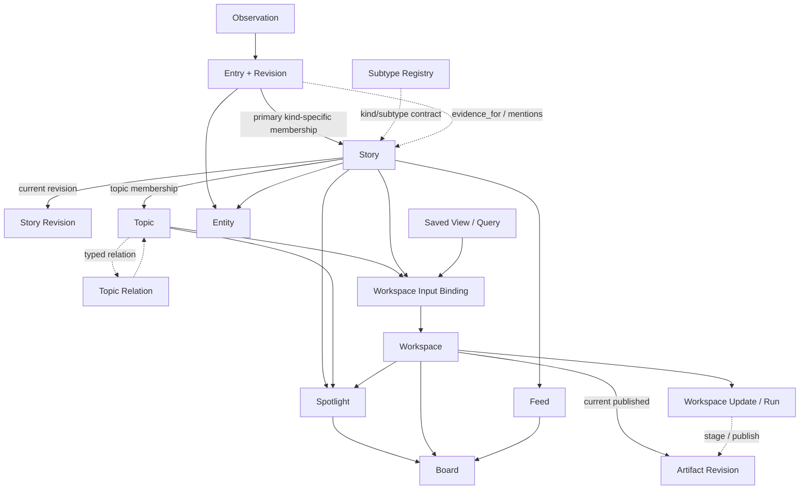

# Cosmos 信息模型、相关推荐与持续工作区

> 状态：Draft v0.11
>
> 最后更新：2026-08-09
>
> 产品共同语言：[`../../CONTEXT.md`](../../CONTEXT.md)
>
> 总体架构：[`0001-cosmos-foundation.md`](0001-cosmos-foundation.md)
>
> 原始需求：[`../requirements/0001-original-requirements.md`](../requirements/0001-original-requirements.md)
>
> Workflow Runtime：[`../tasks/04-workflow-runtime/README.md`](../tasks/04-workflow-runtime/README.md)

本文专门回答四个问题：

1. 一条外部消息进入 Cosmos 后，哪些对象属于基础信息层？
2. “同一件事”和“与这件事相关”如何分开？
3. Story、Topic、Timeline、热点、精华、Artifact 和原 `Feature` 应如何划界？
4. Cosmos 第一版如何做可解释的聚类与推荐，而不把所有判断交给 LLM？

本文是当前信息领域模型的详细真相源。总体架构只保留摘要和跨模块约束，避免同一套定义在多处漂移。

## 1. 本轮结论

此前 `Feature` 同时承担了事件聚类、长期话题、Agent 维护、生成文件、交互任务和热点展示，已经成为没有稳定边界的“万能容器”。本轮把它拆成三层：

```text
信息语义层：Entry -> Story -> Topic + Relationship
加工体验层：Workspace -> Artifact Revision + Interaction State
展示决策层：Timeline View / Spotlight / Feed / Board
```

核心决定：

1. `Entry` 是用户可读的最小来源内容；`Observation` 是内部不可变采集证据。
2. `Story` 是每个 Entry 的上层规范内容单元，通过稳定核心 `kind` 和受管理、可扩展 `subtype` 区分形态，例如 `media.comic`、`media.anime`；event kind 的成员判定必须严格。
3. `Topic` 围绕一个问题或目标持续组织多个 Story，成员判定允许主观，但不直接收录 Entry。
4. “相关推荐”不等于 Story 聚类。Jeff Dean 的两次不同动态可以相关，但不是同一个 Story。
5. `Timeline` 是视图；`Spotlight` 是展示决定；“精华”是策展区域，三者都不是新的内容实体。
6. `Artifact` 是一次版本化输出。
7. 原 `Feature` 正式改名为 `Workspace`，表示长期、可更新、可交互的体验容器。
8. Workspace 不直接吞入消息；它引用 Topic、Story、Saved View 或 Collection，并通过 Workflow/Agent 维护。
9. 每个 Entry 默认属于一个主 Story，单 Entry Story 是合法状态；Topic、Workspace、Spotlight 和 Feed 等上层概念以 Story 为内容单位。
10. Agent 只有在至少两个不同 Story 构成持续问题，或命中用户明确跟踪规则时，才默认自动创建 Topic。
11. 第一版聚类与相关推荐不使用 embedding。
12. Topic 不自动过期，人工归档后置；自动 Spotlight 使用可续期 TTL，人工固定可以不设 TTL。
13. 人类、Agent 和系统按协作者建模，每次修改都记录 actor 与 revision；第一版保持简单能力边界。
14. 第一版预算只实现全局日预算、单次 Run 上限和紧急保留预算。
15. 核心 Story kind 通过受管理 subtype 注册表扩展；注册项声明所属 kind、版本、展示信息和身份规则。
16. Story split 保留旧 Story 的历史壳，并通过 `replaced_by[]` 指向多个后继 Story；旧 ID 不会被模糊重定向。
17. v1 不建立 Topic 父子层级；跨 Topic 组织使用带类型的 Relation、标签或 Workspace/Board。
18. 一个 `(Topic, Story)` 只有一个当前成员角色；角色变化通过 revision history 记录，不在 v1 保存并列 assertion。
19. Story 身份稳定，标题、摘要、关键事实和时间范围通过不可变 Story Revision 表达，并由当前 Revision 指针选择当前表示。
20. Feed 的曝光、打开、已读、隐藏和“不感兴趣”默认以 `(用户, Story, surface)` 记录；Entry 交互在展开具体信源后单独记录，收藏和批注可指向 Story 或 Entry。
21. Agent 可以移除未被人类确认的自动 Topic 成员；人类明确加入或确认的成员需要提出移除建议，移除通过可恢复 revision 完成。
22. Workspace 输入采用多对多 binding，可有一个主要锚点；Workspace 不要求只绑定一个 Topic，也可以独立存在。
23. Spotlight 分离趋势、重要性、紧急性和用户兴趣信号，使用版本化 policy、迟滞阈值、可续期 TTL 和人工覆盖。
24. Workspace Update/Run 使用 `queued`、`running`、`waiting`、`succeeded`、`failed` 和 `cancelled` 状态；更新期间保留上一成功版本，成功后才原子发布。
25. 人类接受的 Story/Workspace 内容字段可以被保护；Agent 先生成候选 Revision，不能静默覆盖受保护字段。
26. Story 的已读状态保留 `last_seen_revision_id`，新 Revision 产生 `updated_since_last_seen`，不抹掉历史已读事实。
27. merge 将当前用户状态解析到 canonical Story；split 不把收藏、隐藏、反馈或 Topic membership 自动复制给全部后继。
28. Spotlight 人工固定/排除绑定到具体 target placement，直到用户解除；不同 kind 共用 policy 合同，只调整权重和阈值。
29. v1 和默认产品合同面向单个本地用户；actor/revision 为未来协作保留扩展位，但不建设多人同步和多租户。
30. 当前单用户阶段按最大产品权限运行，Agent 可以代替用户执行 GUI 中可执行的操作；不建设审批 UI 或细粒度权限模型。未来多人、远端或不可信扩展再增加独立权限策略。
31. 第一版不建设细粒度权限 UI 或不可信插件沙箱，只运行用户明确安装的本地可信扩展。
32. Phase 1 首条真实 Connector 采用 RSS/RSSHub，并配套 fixture Connector。

## 2. 当前需要定义或校准的概念

下表是概念盘点，不等于立即创建同名数据库表。

| 层 | 概念 | 当前定位 | 本轮状态 |
| --- | --- | --- | --- |
| 自动化 | Source、Trigger、Workflow、Action、Agent | 采集和加工如何启动与执行 | 保留 |
| 采集证据 | Observation、Origin、Discovery Context | 某次从哪里、为何、实际看到了什么 | 保留 |
| 基础内容 | Entry、Entry Revision、Asset | 稳定可读内容、来源修订和本地媒体 | 保留 |
| 内容身份 | Exact Duplicate、Near Duplicate | 同一外部对象或近似转载 | 补充边界 |
| 规范内容 | Story、Story Kind、Story Subtype、Subtype Registry、Story Membership | Entry 的上层规范单元；event kind 聚合同一现实事件 | 核心 kind + 受管理 subtype |
| 长期组织 | Topic、Topic Membership | 围绕问题或目标持续组织 Story | `Subject` 正式改为 `Topic` |
| 知识关系 | Entity、Relationship | 人、组织、产品以及有依据的关联 | 保留 |
| 用户组织 | Label、Annotation、Collection、Saved View | 分类、批注、手工集合和持久查询 | 保留 |
| 检索推荐 | Candidate、Ranking Policy、Explanation | 以 Story 为候选，完成召回、打分、去重、多样化和解释 | 第一版不使用 embedding |
| 热点信号 | Trend Signal、Importance、Urgency | 热度、用户价值和时效性 | 明确分离 |
| 持续体验 | Workspace、Workspace View、Workspace Input Binding、Workspace Update/Run、Maintenance Binding | 长期栏目、专题、学习或研究体验及其维护状态 | 正式替代 `Feature` |
| 产品边界 | Local Single User、Extension Trust、Agent Authority | v1 的部署、扩展信任和外部副作用边界 | Phase 0 已确认 |
| 生成结果 | Artifact、Artifact Revision | 报告、页面、图片、数据和附件 | 保留 |
| 协作审计 | Actor、ChangeSet、Revision | 人类、Agent、系统的操作者、修改者和历史 | 新增 |
| 用户状态 | Interaction State | 进度、回答、完成和偏好 | 保留并归 Workspace |
| 展示 | Timeline View、Spotlight、Feed、Board | 如何呈现和排序已有对象 | 明确为展示层 |
| 发布投递 | Publication、Delivery | 冻结快照并发送到外部渠道 | 保留 |

## 2.1 信息模型与运行时边界

本文只定义 Entry、Story、Topic、Workspace、Artifact、关系、来源证据和用户状态等信息模型，不重复定义完整 Workflow Runtime。Workflow、Run、Step、Job、Trigger、Action、Connection、Secret、State、Outbox 和恢复语义以 [`0001-cosmos-foundation.md`](0001-cosmos-foundation.md) 为总体架构合同，并由 [`04-workflow-runtime`](../tasks/04-workflow-runtime/README.md) 持续实施。

当前已实现的是固定 Source Ingest/Probe Job 和一个最小 Story projection；通用 Workflow Runtime、Knowledge Workflow、Research Workflow、Connection/Secret/State 仍未实现。这里描述的关系应被理解为领域投影边界，而不是已经存在的同名 Prisma 表。

信息处理分为三条边界：

```text
Ingest Workflow
    -> Observation / Entry / EntryRevision / Asset / 最小 Story projection

Knowledge Workflow
    -> KnowledgeSignal / Proposal / Story 或关系更新

ResearchRequest
    -> Research Workflow
    -> Observation / Entry
```

- Ingest 先保存外部来源事实，不等待 LLM；旧 Observation 永远不覆盖。
- 最小 Story projection 只保证每个 Entry 有可阅读的主 Story，不等于完成跨来源聚类。
- Knowledge Workflow 可以由用户或 Agent 选择脚本策略、模型策略或 Agent 策略；它产生的是派生判断或 Proposal。
- `KnowledgeSignal` 表示判断，不等于 `ResearchRequest`；后者表示一次需要执行的研究行动。
- Research Workflow 的外部发现必须重新进入 Observation → Entry，并保留 ResearchRequest、查询目标、来源和 Run provenance。

信息来源链保持可追溯但不把派生对象当作事实：

```text
Observation
  -> Entry
      -> EntryRevision
          -> primary Story / StoryRevision projection
              -> KnowledgeSignal / Proposal / Relation / Artifact provenance
```

Observation 保存实际采集到的外部证据；Entry 保存稳定的来源对象身份；EntryRevision 保存来源内容在某个时点的表示；Story/StoryRevision 只是上层规范投影。任何知识判断、关系、推荐或 Artifact 都必须引用输入 Revision、producer/version、证据和关联 Run，不能反向覆盖 Observation。

## 3. 基础信息层

### 3.1 Observation：某次实际采集证据

Observation 表示 Cosmos 某次运行从外部获得的不可变输入。它可以是一条 Telegram update、一封邮件 payload、一个 RSS item、一段网页快照，也可以是一次 API 响应中的一项。

它至少保留：

- `source_instance_id`；
- 外部稳定 ID 或来源定位；
- 来源时间与采集时间；
- 原始 payload / Blob 引用；
- 发现方式，例如关注账号、首页推荐、搜索、公告轮询或 Agent 调研；
- 产生它的 Run；
- 内容指纹和解析版本。

重复轮询可以再次观察到同一外部对象。Observation 仍可追加，但不会因此创建新的 Entry。

### 3.2 Entry：稳定可读的信息条目

Entry 是用户在信息库中看到、搜索、收藏、标注和引用的最小内容身份。外部内容发生真实编辑时生成新的 Entry Revision，而不是覆盖历史。

适合称为 Entry 的对象：

- BiliBili 视频；
- X 帖子；
- AIHot 聚合条目；
- 邮件；
- Telegram 或群聊消息；
- 官网公告；
- 技术文章；
- 独立教程。

“原始报道”不适合作为总称，因为上面的内容并不都属于新闻报道。

Entry 携带稳定身份与规范化内容属性（2026-08-09 定稿，讨论详见 [`../research/2026-08-08-universal-content-model.md`](../research/2026-08-08-universal-content-model.md)）：

- **`publisher`（发布者）**：内容的发布者（作者、频道、公众号、子版块），独立于 Entry 内容本身，也与"平台提供者 Producer/Provider"（Bilibili、RSS 等数据源）区分。保存平台内 ID、显示名、handle 等；发布者声望指标（followers、subscribers、karma 等）挂在发布者上，不与内容互动指标混写。
- **`kind`（内容形态）**：post / article / video / audio / image / comment / listing，区分正文与榜单条目等形态。
- **`metrics`（内容互动指标）**：统一六项 `{ likes, views, reposts, comments, collects, score }`（GitHub stars 归并 likes；平台特有指标如 forks、coin 保留在扩展区）。指标是带 `capturedAt` 的时点快照，**不属于内容版本**——指标变化不产生新 Entry Revision。
- **签名 URL**：带时效参数（小红书 `xsec_token`、微信直链 `signature`）的地址独立标记、归属 Connector State Store，不作为身份键。

### 3.3 URL 只是可选来源属性

Entry 使用结构化 Origin Locator 定位来源。不同来源可以使用不同字段：

```text
web:       canonical_url
telegram:  account_id + chat_id + message_id
email:     account_id + mailbox + uid + message_id
bilibili:  account_id + bvid / dynamic_id
x:         account_id + post_id
wechat:    account_id + conversation/article locator
```

Cosmos 自己为 Entry 提供稳定内部地址，因此没有网页 URL 的内容仍可完整引用。

## 4. 四种容易混淆的判断

信息聚合系统不能只问“像不像”。至少要连续回答四个不同问题：

```text
Q1：这是已经采集过的同一个外部对象吗？
    -> Entry identity / source dedup

Q2：这是另一来源对同一文本的转载或轻微改写吗？
    -> duplicate / near-duplicate relation

Q3：它们是否属于同一个规范内容单元？
    -> kind-specific Story membership

Q4：它们是否值得一起推荐或共同理解？
    -> related content / Topic membership / Ranking
```

前两问追求来源与复制关系准确，第三问按 Story kind 判断规范身份，第四问才允许宽泛的相关性。

### 4.1 同源去重

优先使用确定性信号：

- `(source_instance_id, external_id)`；
- 来源游标、UID、版本号；
- canonical URL；
- payload/content hash；
- 来源明确提供的引用或转发 ID。

同一个外部对象内容变化时更新 Entry Revision，不创建新 Story。

### 4.2 转载与近重复

不同来源可能复制同一篇稿件。Cosmos 保留各自 Entry 和来源身份，同时建立 `duplicate_of`、`syndicated_from` 或 `near_duplicate_of` 关系。

候选信号可以包括：

- 规范化标题；
- 正文指纹、SimHash 或 MinHash；
- 大段文本重合；
- canonical/引用链；
- 未来可选的语义向量相似度；第一版不实现。

转载关系不应把来源折叠掉，因为用户仍可能需要知道传播路径和不同平台的评论上下文。

### 4.3 Story：统一的规范内容单元

每个 Entry 都属于一个主 Story。Story 通过 kind 保持统一上层合同，同时避免把所有内容假装成事件：

| kind | 当前含义 | 常见成员 |
| --- | --- | --- |
| `event` | 同一现实事件或发布动作 | 官方公告、社交帖、媒体报道、视频评测 |
| `document` | 同一篇文章、教程、报告或其来源版本 | 原文、转载、翻译、修订 |
| `media` | 同一视频、音频、图片或作品 | 平台页面、转发、镜像 |
| `thread` | 同一讨论串、邮件线程或对话片段 | 多条连续消息 |

核心 kind 保持少量稳定集合；细分使用受管理、可扩展的 subtype，例如 `media.comic`、`media.anime`、`media.video`。只有生命周期、归并或权限确实不同，才新增核心 kind。

#### Story Subtype Registry

Subtype 不是任意散落在内容记录中的字符串，而是核心 kind 之上的受管理注册项。每个注册项至少声明：

- 稳定的 subtype ID 及其所属核心 kind；
- 用户可读名称、描述和可选图标/展示提示；
- 注册项版本与状态（active、deprecated 或 retired）；
- 内容校验和身份判定所需的 schema/policy 版本；
- 注册来源或 owner，以及兼容的扩展 SDK 版本。

内置 subtype 和插件 subtype 共用同一注册合同。插件可以在允许的核心 kind 下增加 subtype，但不能重新定义已有 subtype 的身份语义；未知 subtype 仍保留在数据中，并按核心 kind 的通用合同降级展示，避免新版本写入的数据让旧客户端无法读取。Subtype 主要提供分类和专门判定规则，不自动意味着要新建一个顶层 Story kind。

`event` Story 的示例：

```text
Story: Qwen 3.8 Max 发布
├─ BiliBili：Qwen 3.8 Max 发布
├─ AIHot：Qwen 3.8 Max 发布
└─ X：Qwen 3.8 Max 发布
```

“Jeff Dean 等人创立 Discovery Loop”与“Jeff Dean 离开 Google”共享人物，但动作、对象和发生时间不同，因此应是两个 Story。

每个 Entry 在录入后默认：

1. 判断候选 kind；
2. 尝试加入同 kind 的已有 Story；
3. 没有高置信匹配时立即创建新 Story；
4. 允许新 Story 长期只有一个 Entry；
5. 后续证据到来时再归并，或通过 merge/split 修正。

event Story 聚类建议采用在线两阶段方法：

1. **候选召回**：在合理时间窗内按实体、关键词、来源引用、时间和地点找到少量候选 Story。
2. **严格判定**：综合人物/组织、动作、对象、时间、地点和关键事实判断是否同一事件。

可把一次事件粗略表示为：

```text
event signature = who + did_what + to_what + when + where
```

第一版不使用 embedding。未来即使加入，embedding 也只能帮助召回，不能单独决定归并。两篇文本都谈 Jeff Dean，并不代表它们是同一事件。

建议的决策状态：

- `matched`：高置信归入现有 Story；
- `new_story`：建立新 Story；
- `ambiguous`：暂时分开并等待更多证据或人工或者 Agent 确认；
- `corrected`：用户或系统随后 merge/split。

宁可暂时拆开，也不要错误合并。错误 merge 会污染摘要、时间线、热点判断和推荐反馈，修复成本高于后续 merge。

### 4.4 主 Story 与其它 Story

一个 Entry 只有一个主 Story。主 Story 表达 Entry 自身的规范内容身份，而不是文章中“最重要的事件”。

例如一篇同时讨论 Jeff Dean 离职和 Discovery Loop 创立的长文：

```text
Entry
  -> primary Story (kind=document)
  -> evidence_for Story: Jeff Dean 离开 Google
  -> evidence_for Story: Discovery Loop 创立
```

辅助关系可以带文本片段、角色、置信度和 evidence。Entry 不同时成为多个 Story 的主成员，避免所有权、去重和 Feed 展示歧义。

### 4.5 Related：宽泛但可解释的相关性

相关内容可以来自：

- 共享 Entity，例如 Jeff Dean；
- 前后时间关系；
- 明确引用或超链接；
- 因果、背景、后续、反驳或更正关系；
- 词法匹配；
- 共同 Topic；
- 用户行为和关注偏好。

Relation 应记录类型、方向、证据、生产者、版本和置信度。例如：

```text
Story: Jeff Dean 离开 Google
  --followed_by-->
Story: Jeff Dean 等人创立 Discovery Loop

Story: Jeff Dean 离开 Google
  --background_for-->
Story: Jeff Dean 等人创立 Discovery Loop
```

关系类型允许扩展，不要求一开始建立完整知识图谱本体。

### 4.6 Merge 与 canonical ID

Story 和 Topic merge 使用统一 Canonicalization：

- 选择 canonical ID；
- 旧 ID 永久保留为 alias/redirect；
- merge 是带 actor、revision 和理由的操作；
- 历史 revision 仍归原对象；
- 当前查询默认解析到 canonical；
- Artifact provenance、批注和外部链接继续有效；
- kind 冲突或成员冲突阻止自动 merge；
- 撤销通过补偿操作完成，不删除 merge 历史。

Story split 是与 merge 不同的补偿操作：

- 原 Story 保留原 ID，标记为历史壳（historical shell），保留原有 revision、历史成员、批注、Artifact provenance 和审计记录；
- 新建两个或多个后继 Story，各自获得新的 ID，并成为当前查询和展示使用的 canonical Story；
- 对每个受影响的当前成员关系记录显式 split mapping，说明它被转移到哪个后继 Story；无法安全判断的成员保持历史/未决状态，不自动伪装成某个后继的成员；
- 原 Story 通过 `replaced_by[]` 列出全部后继 Story。访问旧 ID 时返回历史壳和后继列表，不能静默选择一个后继作为重定向目标；
- 旧 Artifact、批注和外部链接继续指向历史壳；用户可以从历史壳明确进入一个或多个后继 Story。

这样既保留了“当时为什么被认为是一个 Story”的历史，也避免 split 后旧链接把用户带到错误的单一对象。

用户状态采用同样的保守迁移策略：merge 后当前收藏、隐藏、不感兴趣和反馈查询解析到 canonical Story，同时保留旧对象的历史来源；split 后这些状态以及 Topic membership 留在历史壳，不自动复制到全部后继。用户或 Agent 必须通过显式 migration command 选择要继承的后继，并记录 actor、理由和依据。

### 4.7 Story Revision：稳定身份与当前表示分离

Story 的身份、成员关系和历史事实不能因为摘要刷新而改变。Story 本体保留稳定 ID；标题、摘要、关键事实、时间范围和可选的结构化概览通过不可变 `StoryRevision` 表达，并由 `current_revision_id` 指向当前被接受的表示。

每个 Story Revision 至少记录：

- producer、版本、生成时间和 actor；
- 依赖的 Entry/Entry Revision、Relationship 或其它 evidence；
- 标题、摘要、关键事实和时间范围的结果；
- 置信度、推断/事实标记和可选的用户修改理由；
- 前一 Revision 及变更摘要。

只有造成语义实质变化时才创建新的 Story Revision；排序分数、Spotlight Placement 和临时运行进度不写入 Story Revision。历史 Artifact、Publication 和批注引用精确 Revision，因此当前 Story 更新不会改写过去已经发布的内容。

人类接受的内容修改可以形成字段级保护。Agent 继续分析时先生成候选 Revision；未被人类保护的字段可以按维护策略自动提升，受保护字段不能被静默覆盖。第一版不引入复杂的三方合并编辑器，候选结果至少可以整体接受、拒绝，并保留每个字段的 producer、actor 和依据。

Entry Revision 层遵循同一原则，并明确两个"不产生 Revision"的边界（2026-08-09 定稿）：

- **时间精度提升不是内容实质变化**：列表层解析出的低精度 fallback 在拿到证据层精确值（exact）后，原地更新当前 Revision 的时间字段，不生成新 Revision；可追溯性由 fallback.raw（原文永远保留）+ capturedAt 保证。
- **互动指标变化不是内容实质变化**：metrics 是带 `capturedAt` 的时点快照，按 §3.2 快照覆盖，不进入 Revision，也不进入内容指纹。

只有标题、摘要、正文等**内容语义**实质变化才产生新的 Entry Revision。

## 5. Topic：主观、长期、目的驱动的组织

### 5.1 Topic 不等于大号 Story

Story 按 kind 维护规范内容身份；Topic 的成员条件是“对这个问题有帮助”。因此 Topic 可以跨事件、文档和媒体，但成员只允许 Story。Entry 只能作为 Story 内的来源证据，不直接成为 Topic 成员。

```text
Topic: 为什么 Jeff Dean 离职引起轰动？
├─ Story: Jeff Dean 离开 Google
├─ Story: Jeff Dean 等人创立 Discovery Loop
├─ Story: Jeff Dean 加入 Google
└─ Story: Gemini 团队相关组织变化
```

### 5.2 Topic 的最小语义

Topic 应保存：

- 标题或核心问题；
- 关注目的；
- 范围说明与排除项；
- seed Story / Entity；
- 创建者和创建理由；
- 成员关系及成员角色；
- revision 和协作历史。

`active`、Board 可见性、Spotlight 和订阅不成为 Topic 字段，正式拆分为：

```text
Topic
TopicMaintenanceBinding
BoardPlacement
SpotlightPlacement
Subscription
```

其中 Topic 只保存自身语义；维护、展示和通知由外部关系表达。该拆分正式采用。

v1 不建立 Topic 的 `parent_id`、`children` 或其它结构性父子层级。Topic 之间若有重叠、关联或上下文关系，使用带类型的 `TopicRelation`、标签，或交给 Workspace/Board 组织；这样不会把导航树误当成 Topic 语义本身。

推荐的成员角色：

- `core`：直接回答核心问题；
- `update`：新的进展；
- `background`：背景材料；
- `analysis`：分析或观点；
- `counterpoint`：反方或不同证据；
- `tutorial`：实践、教程或延伸行动。

一个 `(Topic, Story)` 组合只有一个当前角色。纳入、移除或角色变更会生成新的 membership revision，并记录 actor、理由、evidence 和关联 Run；历史角色仍可追溯，但 v1 不把人类、多个 Agent 的建议保存为同一关系上的并列 assertion。角色比简单的“包含/不包含”更适合构建完整专题页面。

Agent 的移除权限按成员来源区分，但不引入完整的对象级权限系统：

- 系统或 Agent 自动纳入、且尚未被人类确认的成员，Agent 可以直接移除；
- 人类明确加入或确认的成员，Agent 只能提交移除建议，不能静默移除；
- 任意移除都写入 membership revision/tombstone，可恢复，并保留 actor、理由、evidence 和 Run。

### 5.3 Agent 自动创建 Topic

Agent 自动创建 Topic 的默认门槛是：

- 至少两个不同 Story 共同构成持续问题；或
- 命中用户明确配置的长期跟踪规则。

用户仍可基于任意 Story 手动创建 Topic。单个紧急 Story 通常进入 Spotlight，而不是自动创建 Topic。补充判断可以综合：

- Story 数量和增长速度；
- 独立来源数量；
- 是否跨越多个事件；
- 用户关注强度；
- 重要性与持续更新可能；
- 现有 Topic 是否已覆盖；
- 维护成本。

Topic 不自动过期。人工归档能力后置且当前优先级较低。

所谓“默认激活”表示创建 Topic 后自动建立 `enabled=true` 的 TopicMaintenanceBinding，而不是在 Topic 上写 `active`。

第一版只实现全局每日 Agent 预算、单次 Run 的 token/时间/工具调用上限和紧急保留预算。复杂的对象级继承、公平调度和预算借用后置。成员增删和 Topic merge 都保留 actor、revision、理由和审计记录。

### 5.4 人类与 Agent 协作

人类、Agent 和系统都作为 actor。每次修改至少记录：

- actor kind 与 actor ID；
- operation 与目标对象；
- base revision 与结果 revision；
- 时间、理由和可选 evidence；
- 对应 Run / Workflow / Agent profile；
- 可逆操作或补偿记录。

第一版保持本地单用户和简单能力边界：保留 actor/revision/理由/Run 记录，细粒度权限、并发冲突 UI、ChangeRequest 和复杂撤销后置。

## 6. 推荐系统入门：Cosmos 如何找到“相关内容”

### 6.1 推荐不是一个算法

一个实用推荐系统通常包含四步：

1. **候选生成（recall）**：从大量 Story 中快速找到几十或几百个可能相关的候选。
2. **特征计算**：计算候选与当前上下文之间的不同相关信号。
3. **排序（ranking）**：根据当前页面目标和用户偏好给候选打分。
4. **重排（reranking）**：去重、限制同源/同 Story 挤占，并加入多样性和探索。

不同页面的目标不同，必须使用不同 Ranking Policy：

- Story 详情页：优先背景、后续和教程；
- Topic 页：优先覆盖完整性、观点差异和新进展；
- 普通 Feed：优先个人兴趣、新鲜度、新颖性和多样性；
- Spotlight 候选：优先重要变化、关注增速、来源多样性和时效；
- Agent 调研：优先证据质量与覆盖，不等同于用户点击概率。

### 6.2 Jeff Dean 示例

当前 Story 为“Jeff Dean 等人创立 Discovery Loop”，系统寻找相关内容时可以这样工作：

**候选生成**

- 实体倒排索引找出所有涉及 Jeff Dean、Google、Gemini、Discovery Loop 的 Story；
- BM25 在 Story 标题、摘要和成员 Entry 正文中找出精确名称；
- 关系图找出 Jeff Dean 参与过的组织、职位变化和前序事件；
- 时间窗口优先召回近期动态，同时保留少量长期背景。

**特征**

- 是否共享 Jeff Dean 这一核心 Entity；
- 两个事件的时间距离；
- 是否存在“离职后创立”的先后关系；
- 动作和组织是否连贯；
- 标题、实体、动作和关键词匹配；
- 来源质量与独立性；
- 用户是否关注 Jeff Dean、Gemini 或 AI 实验室人才流动；
- 用户是否已经看过或隐藏过。

**排序与解释**

“Jeff Dean 离开 Google”可能因共享核心人物、时间接近且构成前序背景而获得高分。UI 应能给出类似解释：

> 相关原因：同一人物 Jeff Dean；该事件发生在 Discovery Loop 创立之前；两条信息共同涉及其职业变化。

解释来自结构化信号和证据，不要求让 LLM 临场编造理由。

### 6.3 第一版信号与延后的 embedding

| 第一版方法 | 擅长 | 不擅长 |
| --- | --- | --- |
| BM25 | 精确人名、产品名、代码、短语和罕见词 | 同义表达、跨语言和隐含关系 |
| Entity / 关系图 | 共享人物、组织、产品、引用、前后和因果关系 | 新实体识别错误时会漏召回 |
| 时间、来源与引用 | 近期更新、前后发展和直接关联 | 长期隐含关系 |
| 用户反馈 | 个性化兴趣、已读和负反馈 | 冷启动、反馈稀疏和兴趣漂移 |

第一版采用 BM25 + Entity/关系 + 时间/引用 + 用户反馈的混合召回。embedding 延后到出现明确召回缺口、跨语言需求或同义表达漏召回之后再引入，并保持为可替换 Projection。

系统记录以下召回缺口：

- 零结果或极低结果查询；
- 用户搜索后手工建立的相关关系；
- Entity alias 未命中；
- 跨语言和同义表达的人工纠正；
- Agent 后续调研发现但初始召回遗漏的 Story。

先建立真实基线，再为重新评估 embedding 设定阈值。

### 6.4 第一版不优先协同过滤

传统协同过滤依赖“大量相似用户也喜欢了什么”。Cosmos 第一阶段是本地单用户系统，行为数据稀疏，也不应默认上传隐私数据，因此第一版更适合：

- 用户显式关注和规则；
- 内容特征；
- Story / Topic / Entity 关系；
- 时间与新颖性；
- 本地行为反馈；
- 少量探索配额。

有多用户且获得明确授权后，协同信号可以作为额外候选源，而不是改写现有模型。

### 6.5 多样性重排

如果只按相关分数排序，前十条可能都来自同一来源或同一 Story。重排阶段需要：

- 每个来源和 Story 的数量上限；
- 近重复折叠；
- 已在 Spotlight 或 Workspace 中出现的降权；
- 不同 Topic、媒体类型和观点的覆盖；
- 少量探索槽位。

可以采用 MMR 思路：

```text
候选价值 = 与用户/页面的相关性 - 与已选内容的重复度
```

它不是唯一算法，但很好地表达了“相关”和“不要全都一样”之间的取舍。

### 6.6 推荐决定必须可追溯

每次推荐至少保存：

- surface，例如 `story.related`、`topic.update`、`feed.default`；
- policy 和版本；
- 候选来源；
- 主要分数组成；
- 去重和多样化调整；
- 被展示的位置；
- explanation；
- impression 与后续反馈。

推荐结果是某个时刻的决策，不写回 Entry 或 Story 作为永久属性。

### 6.7 Feed 反馈的内容粒度

Feed 的主要展示单位是 Story，因此曝光和主要反馈默认记录为：

```text
(user, story, surface) -> impression / open / read / hide / not_interested
```

这样一个包含多个来源 Entry 的 Story 不会因为展开多个信源而被错误计算为多个 Feed 曝光。用户展开某个具体信源后，系统可以额外记录 Entry 级交互；收藏和批注由用户明确选择绑定 Story 还是 Entry。

Read State 记录用户在某个 Story/surface 上最后看过的 `last_seen_revision_id`。当 Story 的 `current_revision_id` 不同时，系统派生 `updated_since_last_seen=true`；这表示有新变化需要查看，但不会删除或伪造用户过去已经读过的事实。

### 6.8 Spotlight Policy 的评分、迟滞与覆盖

Spotlight Policy 不把所有因素压成不可解释的永久分数，而是分别保存趋势、重要性、紧急性和用户兴趣信号，再计算当前的进入/续期决定。自动 Placement 至少记录：

- policy/version；
- 各信号及主要原因；
- 进入或续期的阈值结果；
- `expires_at` 和下一次评估时间；
- actor、Run 和当前覆盖状态。

自动 Placement 使用迟滞：进入展示的门槛高于保持展示的门槛，避免目标在临界分数附近闪烁。人工固定或排除绑定到具体 target placement，而不是全局修改内容对象；在用户解除覆盖前，自动策略不能偷偷重新加入或移除该 Placement。不同目标 kind 共用同一 policy 合同，只允许配置权重和阈值差异。

### 6.9 第一版维护预算

第一版保持简单，只实现：

1. 全局每日 Agent 预算；
2. 单次 Run 的 token、wall time 和工具调用上限；
3. 紧急检查的保留预算。

超预算时停止 Agent 调用，只运行确定性规则并记录降级原因。Topic、Spotlight 和 Workspace 的对象级继承、公平调度和预算借用后置。

## 7. 热度、重要性、紧急性与 Spotlight

这四个概念不能合并：

- **热度（popularity）**：当前有多少注意力。
- **趋势（velocity）**：注意力增长有多快。
- **重要性（importance）**：对用户目标的影响有多大。
- **紧急性（urgency）**：用户需要多快采取行动。

例如：

- 娱乐视频可能很热，但对用户工作不重要；
- DeepSeek API 故障可能总讨论量不大，但对依赖它的用户重要且紧急；
- 一份高质量教程可能不热、不急，但长期价值高。

系统保存可重算的 Trend Signal，再由 Spotlight Policy 决定是否展示：

```text
Trend Signal + User Interest + Importance + Urgency
    -> Spotlight Decision
    -> SpotlightPlacement
```

Spotlight 可以指向 Story、Topic、Workspace 或 Artifact。它不复制目标内容。

自动 SpotlightPlacement 使用可续期 TTL；用户手动固定的 placement 可以不设 TTL。过期只移除展示位置，不改变 Story、Topic、Workspace 或 Artifact。每次 placement 修改保留 actor、policy/version 与审计记录。

## 8. Workspace：替代混乱的 Feature

### 8.1 为什么改名

`Feature` 在软件工程中通常表示产品功能，在内容产品中又可能表示“精选内容”。当前讨论还让它表示话题、时间线、Agent、文件夹和每日任务，名称无法稳定约束行为。

`Workspace` 已被接受为领域名称：一个围绕某个目标长期存在、允许自动更新并保存交互状态的空间。

内部统一使用 `Workspace`，界面按 kind 显示：

- recurring / brief：栏目；
- dossier / timeline：专题；
- learning：学习计划；
- custom：工作区。

### 8.2 Workspace 的组成

```text
Workspace
├─ identity & lifecycle
├─ input bindings（many-to-many）
│  ├─ Topic / Story
│  ├─ Saved View / Collection / Query（结果单位为 Story）
│  └─ optional primary anchor
├─ view specification
├─ maintenance binding -> Trigger / Workflow / Agent profile
├─ update projection -> active Workspace Update / Run
├─ current Artifact Revision refs
└─ Interaction State schema
```

Workspace 的稳定字段应包括：

- 标题、说明、kind 和生命周期元数据；
- 输入 binding 与可选的主要锚点；
- 视图模板与配置；
- 维护 Workflow、刷新条件和预算；
- 当前与历史 Artifact；
- 交互 schema 版本；
- 看板展示配置的引用；
- 创建者、维护者策略和未来能力范围。

`WorkspaceInputBinding` 是多对多关系：一个 Topic 可以同时驱动 Timeline、Dossier 和 Brief Workspace；一个竞品分析 Workspace 也可以组合多个 Topic、Story 和查询。主要锚点只帮助标题、导航和默认上下文，不表示所有权；Learning Workspace 等对象可以没有 Topic。

### 8.3 Workspace 状态与 Agent 更新

Workspace 不应只有一个同时表示“启用、可见、正在生成、失败、内容过期”的万能 `status`。至少拆成四个维度：

1. **身份与生命周期**：Workspace 本体及其配置 Revision；
2. **维护执行状态**：一次 `WorkspaceUpdate`/Run 是否排队、运行、等待、结束或失败；
3. **内容新鲜度**：当前已发布内容是否仍覆盖最新输入；
4. **用户交互状态**：学习进度、回答、批注和偏好。

“Agent 正在更新 Workspace”属于第二个维度。每次 Workspace Update 应链接 Trigger、Workflow、Agent Run、base Workspace Revision、输入快照和候选 Artifact，并记录 actor、开始时间、当前步骤、进度、预算和错误。UI 可以从活动 Update 派生 `queued`、`running` 或 `waiting`，并单独展示最近一次完成结果。

Workspace Update 的状态为 `queued`、`running`、`waiting`、`succeeded`、`failed` 或 `cancelled`。更新过程中继续展示最近一次成功发布的 Workspace/Artifact Revision；新内容先暂存，只有成功时才原子发布，失败或取消不能把半成品替换为当前内容。并发更新、重复触发合并和取消/接管的细节仍需后续确认。

### 8.4 视图模板

视图模板只控制如何呈现，不改变底层对象：

| 模板 | 适用场景 | 主要内容 |
| --- | --- | --- |
| `timeline` | 台风、事故、产品发布后的连续更新 | 按时间排列 Story update、事实变化和来源 |
| `dossier` | “为什么 Jeff Dean 离职引起轰动？” | 核心问题、背景、事件、观点、证据和未决问题 |
| `brief` | 每日竞品分析、每日热点摘要 | 相对上次的变化、重要结论和引用 |
| `learning` | 每天五个单词、渐进课程 | 当日任务、材料、练习和进度 |
| `custom` | Agent 或用户定义的特殊页面 | 版本化 manifest 和受限组件 |

原需求中的 `topic` 模板改名为 `dossier`，避免与 Topic 实体重名。

### 8.5 Agent 作为协作者参与维护

Workspace 不由某一个 Agent 独占。Agent 通过 Workflow 以协作者身份参与维护：

```text
Trigger
  -> Workflow
      -> query Topic / Story / feedback
      -> agent.run
      -> propose Topic membership / analysis
      -> create Artifact Revision
      -> publish Workspace update
```

更换模型、Agent Profile 或维护 Workflow 不改变 Workspace 身份。人类和 Agent 对 Topic 成员、关系、Workspace 和摘要的修改都通过 Command 提交，保存 actor、base revision、结果 revision、理由与依据。

### 8.6 Workspace 与 Artifact

| 问题 | Workspace | Artifact |
| --- | --- | --- |
| 是否长期存在 | 是 | 某一次 Revision 固定 |
| 是否保存刷新规则 | 是 | 只记录生成它的规则与 Run |
| 是否保存用户进度 | 通过 Interaction State | 否 |
| 是否包含文件夹 | 引用 | 可以 |
| 是否能换模板 | 可以 | 已生成 Revision 不变 |
| 是否直接拥有 Entry | 不拥有，引用范围 | 保存精确 provenance 引用 |

### 8.7 使用场景映射

| 使用场景 | 建模 |
| --- | --- |
| Qwen 3.8 Max 发布热点 | Story -> Spotlight；需要深读时再创建 Dossier Workspace |
| 台风登陆与后续 | Story 或 Topic -> Timeline Workspace -> Artifact Revision |
| Jeff Dean 离职为什么轰动 | Topic -> Dossier Workspace -> Agent 分析 Artifact |
| 每天五个单词 | Learning Workspace -> 每日 Artifact + Interaction State |
| 每日 AI 写作竞品分析 | Topic -> Brief Workspace -> 每日 Artifact Revision |
| 一篇优秀技术博客的批注 | document Story -> Artifact；若持续学习再挂入 Learning Workspace |
| 看板精华区 | Board Section 展示选中的 Workspace / Artifact / Story |

## 9. 建议的关系模型



这里最重要的约束是：实线成员关系和虚线相关推荐不能混写成同一种“包含”；Subtype Registry 是 Story 身份合同，不是内容成员；Topic Relation 也不是 Topic 的父子层级。

## 10. 端到端示例

假设系统采集到：

1. BiliBili：Qwen 3.8 Max 发布；
2. AIHot：Qwen 3.8 Max 发布；
3. X：Qwen 3.8 Max 发布；
4. Jeff Dean 等人创立 Discovery Loop；
5. DeepSeek 涨价；
6. 某个 BiliBili 娱乐视频。

处理结果：

```text
Entry 1, 2, 3
  -> Story A: Qwen 3.8 Max 发布

Entry 4
  -> Story B: Discovery Loop 创立
  -> related Story: Jeff Dean 离开 Google
  -> Topic: Jeff Dean 离职及后续影响

Entry 5
  -> Story C: DeepSeek 宣布涨价
  -> Topic: DeepSeek 定价与生态影响
  -> 若关注增速/重要性达到 policy，Story C 或 Topic 进入 Spotlight

Entry 6
  -> Story D (kind=media)
  -> 根据娱乐 Feed Policy 参与排序
```

如果 Agent 为 DeepSeek 话题生成报告：

```text
Topic
  -> Dossier Workspace
      -> Artifact Revision v1
      -> 新 Story 到来
      -> Artifact Revision v2
```

Topic 的成员和 Workspace 的用户状态不会因为生成 v2 而丢失。

## 11. 架构不变量

1. Observation 永不被聚类、推荐或 Agent 结果原地改写。
2. Entry 来源身份不会因转载去重或 Story 聚类而丢失。
3. 每个 Entry 有一个主 Story；Story membership 按 kind 表达规范内容身份，宽泛相关性使用 Relation 或 Topic。
4. Topic 不自动过期；成员增删、merge 和未来人工归档必须可解释、可撤销、可审计。
5. Ranking 结果是带上下文和 policy/version 的决策，不是内容永久属性。
6. Timeline、Spotlight、精华和 Feed 是展示或策展角色，不制造内容副本。
7. Topic、Workspace、Spotlight 和 Feed 等上层体验以 Story 为内容单位，不直接拥有 Entry；Artifact provenance 仍可引用精确 Entry Revision。
8. Artifact Revision 提交后不可修改；更新产生新 Revision。
9. Agent 可以像协作者一样维护 Topic/Workspace；第一版通过简单能力边界、Run 预算、Command 和 provenance 约束。
10. 人类、Agent 和系统的修改都记录 actor 与 revision；用户标签、批注、Topic 修正和 Interaction State 不因重新分析而丢失。
11. Story/Topic merge 保留 canonical ID、旧 alias、历史 revision 和所有引用。
12. Story split 保留旧历史壳和 `replaced_by[]`，不把旧 ID 模糊重定向到单一后继。
13. v1 不把 Topic 组织成父子树；Topic Relation、标签和 Workspace/Board 承担跨 Topic 导航。
14. 每个 `(Topic, Story)` 只有一个当前成员角色，历史变更保存在 membership revision history。
15. Story 的当前标题、摘要和关键事实由不可变 Story Revision 表达；历史引用不会随当前 Revision 更新。
16. Feed 曝光和主要反馈以 Story/surface 为粒度，Entry 交互只在展开具体信源后记录。
17. Agent 不会静默移除人类明确加入或确认的 Topic 成员。
18. Workspace 输入是多对多 binding；主要锚点不表示所有权，也不是必填。
19. Spotlight 自动决策保留分离信号、policy/version、迟滞和 TTL，人工覆盖优先。
20. Workspace 的维护运行状态、内容新鲜度、生命周期和 Interaction State 不能压进同一个 `status`。
21. Workspace Update 的失败或取消不会替换最近一次成功发布的内容；候选内容必须在成功时原子发布。
22. 人类接受的字段保护优先于 Agent 自动更新，Agent 候选 Revision 不会静默覆盖受保护字段。
23. `last_seen_revision_id` 只增加“有更新”投影，不删除用户过去的已读记录。
24. merge 后当前用户状态解析到 canonical；split 后用户状态和 Topic membership 不自动扇出到所有后继。
25. Spotlight 人工覆盖绑定具体 target placement，并持续到用户解除；kind 差异通过共享 policy 的配置表达。

## 12. 从 v0.1/v0.2 模型迁移

| 旧名称或假设 | 当前调整 |
| --- | --- |
| `Subject` | 正式改为 `Topic`，强调目的驱动和主观范围 |
| `Feature` | 正式改为 `Workspace`，只表示长期体验容器 |
| `Spotlight Feature` | 改为 `Spotlight Decision/Placement`，目标可为 Story、Topic、Workspace 或 Artifact |
| `topic` Feature 模板 | 改名 `dossier`，避免与 Topic 实体重名 |
| `timeline` Feature 类型 | 改为 Workspace View |
| 精华实体 | 取消；精华是 Board Section / Curation role |
| 热点实体 | 取消；热度信号与 Spotlight 展示决定分开 |
| Artifact | 保留为版本化生成结果 |
| Story 只表示事件 | Story 成为统一规范内容单元，使用 event/document/media/thread 等 kind |
| 只有事件型 Entry 有 Story | 每个 Entry 默认拥有一个主 Story，单 Entry Story 合法 |
| Topic 可收录 Entry | Topic 只收录 Story |
| Agent Topic 先 proposed | 满足门槛时直接创建 Topic，并默认启用维护绑定 |
| 第一版混合向量召回 | 第一版不使用 embedding |
| Topic 自动过期 | Topic 永不过期；人工归档后置 |
| 一个中文 Workspace 名称 | UI 按 kind 使用栏目、专题、学习计划或工作区 |
| 单一维护次数预算 | 第一版使用全局日预算、单次 Run 上限和紧急保留预算；复杂分层后置 |
| 人类修改与 Agent 修改分离 | 统一按协作者 actor/revision 审计 |
| Entry 可同时属于多个 Story | Entry 只有一个主 Story，可通过 evidence_for/mentions 关联其它 Story |
| merge 删除旧对象 | merge 保留 canonical ID、alias/redirect 和历史 revision |
| subtype 是无约束字符串 | subtype 通过受管理注册表声明核心 kind、版本和身份规则 |
| split 直接把旧 Story 重定向到一个新 Story | 旧 Story 保留为历史壳，以 `replaced_by[]` 指向全部后继，并保存显式成员转移 |
| Topic 使用父子层级组织 | v1 不建立父子树，使用 Topic Relation、标签或 Workspace/Board 组织 |
| 一个 Topic 成员可以同时有多个当前角色 assertion | 一个 `(Topic, Story)` 只有一个当前角色，历史变更进入 membership revision history |
| Story 摘要和关键事实原地覆盖 | 使用不可变 Story Revision 和 `current_revision_id`，历史产物固定引用精确 Revision |
| Feed 反馈全部落在 Entry | 主要反馈按 Story/surface 记录，展开具体信源后再补 Entry 交互 |
| Agent 可对所有 Topic 成员对称修改 | 自动且未被人类确认的成员可直接移除，人类确认成员只允许提出移除建议 |
| Workspace 只能属于一个 Topic | Workspace 输入采用多对多 binding，可有可选主要锚点，也可以没有 Topic |
| Spotlight 只有一个热度分 | 分离趋势、重要性、紧急性和用户兴趣，使用迟滞、TTL 与人工覆盖 |
| Workspace 用一个 `status` 表示全部状态 | 生命周期、维护 Run、内容新鲜度、Placement 和 Interaction State 分开 |
| Workspace 更新失败覆盖当前内容 | Update 先暂存候选，只有成功时原子发布；失败/取消保留上一成功版本 |
| Agent 更新可以覆盖人类修改 | 受保护字段保持人类接受版本，Agent 先生成候选 Revision |
| 新 Revision 把 Story 重新标成从未读 | 保存 `last_seen_revision_id`，派生“有更新”而不抹掉已读历史 |
| split 后把状态复制给所有后继 | 状态留在历史壳，由显式 migration command 选择继承对象 |
| Spotlight 排除全局生效或自动立即恢复 | 覆盖绑定具体 Placement，直到用户解除 |
| 长期多人平台是 v1 前提 | v1 和默认产品合同是个人本地优先，未来协作不改变 actor/revision |
| Agent 可以无提示扩大系统范围 | 当前单用户阶段按最大产品权限运行；Agent 仍必须通过 Service/Workflow/Capability/Application Command 合同执行，未来权限策略再独立增加 |
| 第一版必须先做完整插件权限/沙箱 | 第一版只运行本地可信扩展，复杂权限和不可信沙箱后置 |
| 第一条 Connector 直接选择最复杂的平台推荐页 | 先 RSS/RSSHub + fixture 验证通用端到端合同 |

当前已经存在 Phase 1/1B 的运行时代码、数据库和固定 Ingest/Probe Job；本文件的 v0.10 更新只同步信息模型与运行时边界，不把未来 Workflow/Knowledge/Research 合同伪装成已实现表或能力。

## 13. 后置压力测试问题

1. 同一 Workspace 的并发更新、重复触发合并和取消/接管语义。
2. Agent 候选 Revision 的接受/拒绝界面，以及字段保护的最小实现。
3. `updated_since_last_seen` 在不同 surface、Story split 和 Story merge 后的投影规则。
4. 显式 state migration command 的批量操作、撤销和用户确认边界。

这些问题已明确标为后置，不阻塞本次 Phase 0 基线，也不继续作为本次 grilling 的问题。

## 14. 变更记录

### v0.11 - 2026-08-09

- §3.2 Entry 补充规范化内容属性：publisher（发布者，独立于平台提供者）、kind（内容形态七类）、metrics（统一六项互动指标快照）、签名 URL 归属。
- §4.7 明确 Entry Revision 层两个"不产生 Revision"边界：时间精度提升（fallback → exact）原地更新、互动指标变化不进 Revision 与内容指纹。
- 内容来自研究纪要 [`../research/2026-08-08-universal-content-model.md`](../research/2026-08-08-universal-content-model.md)，实现载体为 [`../tasks/05-normalized-content-model/README.md`](../tasks/05-normalized-content-model/README.md)。

### v0.10 - 2026-08-08

- 同步当前 Phase 1/1B 已存在的运行时代码、数据库、固定 Ingest/Probe Job 和最小 Story projection。
- 正式使用 Workflow，移除现行模型中的旧 Flow 术语。
- 明确最小 Story projection 与后续 Knowledge Workflow 的区别。
- 分离 KnowledgeSignal 与 ResearchRequest，明确研究结果重新经过 Observation → Entry。
- 同步当前单用户最大产品权限，不把旧的审批表述作为现行合同。

### v0.9 - 2026-08-07

- v1 与默认产品合同确认为个人本地优先，未来协作能力通过 actor/revision 保留扩展位。
- Agent 可在用户配置范围内维护内部对象；新外部来源、数据范围和外部发送需要显式配置/批准。
- 第一版不建设细粒度权限 UI 或不可信插件沙箱，只运行本地可信扩展。
- Phase 1 首条真实 Connector 确认为 RSS/RSSHub + fixture。

### v0.8 - 2026-08-07

- Workspace Update/Run 正式采用 `queued`、`running`、`waiting`、`succeeded`、`failed`、`cancelled` 状态。
- 更新失败或取消保留最近一次成功内容，候选 Artifact 只在成功时原子发布。
- 人类接受的字段保护优先于 Agent 候选 Revision。
- Story read state 使用 `last_seen_revision_id`，新 Revision 派生 `updated_since_last_seen`。
- merge 解析当前用户状态到 canonical；split 不自动扇出状态和 Topic membership。
- Spotlight 人工覆盖绑定具体 Placement，直到用户解除；不同 kind 共用 policy 合同。

### v0.7 - 2026-08-07

- Story 当前表示采用不可变 Story Revision 和 `current_revision_id`。
- Feed 曝光和主要反馈按 Story/surface 记录，Entry 交互在展开信源后补充。
- Agent 只能直接移除未被人类确认的自动 Topic 成员。
- Workspace 输入采用多对多 binding 和可选主要锚点。
- Spotlight 采用分离信号、版本化 policy、迟滞、TTL 和人工覆盖。
- 新增 Workspace Update/Run 状态建模，明确维护运行态不等于 Workspace 身份、生命周期或看板状态。

### v0.6 - 2026-08-07

- subtype 正式采用受管理注册表；核心 kind 合同保持稳定，未知 subtype 可按核心 kind 降级展示。
- Story split 保留旧 Story 历史壳，通过 `replaced_by[]` 指向多个后继，不做模糊单目标重定向。
- v1 不建立 Topic 父子层级，跨 Topic 组织使用 Relation、标签或 Workspace/Board。
- Topic membership 采用一个当前角色加 revision history，不保存并列当前 assertion。

### v0.5 - 2026-08-07

- 核心 Story kind 保持稳定，细分通过可扩展 subtype。
- 正式采用 Topic、MaintenanceBinding、BoardPlacement、SpotlightPlacement 和 Subscription 的解耦。
- 确认自动 Spotlight 使用可续期 TTL，人工固定可不设 TTL。
- 第一版简化权限与预算：保留 actor/revision，采用全局日预算、单次 Run 上限和紧急保留预算。
- Entry 只有一个主 Story，可作为证据关联多个其它 Story。
- Story/Topic merge 使用 canonical ID + alias/redirect，保留历史引用。

### v0.4 - 2026-08-07

- Story 扩展为统一规范内容单元，每个 Entry 默认拥有一个主 Story。
- Agent 自动创建 Topic 需要至少两个不同 Story，或命中用户明确跟踪规则。
- Topic 不自动过期，人工归档后置。
- 提出将维护、Board 放置、Spotlight 和订阅从 Topic 字段中拆出的候选设计。
- 人类、Agent 和系统统一按 actor/revision 协作审计。
- 接受分层多维维护预算、embedding 召回缺口度量和按 kind 显示 Workspace 中文名称。

### v0.3 - 2026-08-07

- 接受 `Subject -> Topic` 与 `Feature -> Workspace`。
- 每个事件型 Entry 默认创建或加入 Story，允许单 Entry Story。
- 上层模型使用 Story；Topic 不直接收录 Entry。
- Agent 创建的 Topic 默认激活。
- 第一版聚类和相关推荐不使用 embedding。
- Topic 与 Spotlight 的过期、合并和每日维护预算可配置，并允许 Agent 维护。

### v0.2 - 2026-08-06

- 明确 Entry、Story、Topic 三层语义。
- 把“同一事件聚类”和“相关推荐”拆成独立决策。
- 用 Topic 替代 Subject。
- 用 Workspace 替代 Feature，并把 Timeline、Dossier、Learning 等降为视图模板。
- 把热度信号、重要性、紧急性和 Spotlight 展示决定分开。
- 给出本地单用户阶段的混合召回、排序和多样性推荐基线。
