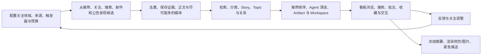

# Cosmos 产品需求文档

> 状态：Draft v0.14
>
> 最后更新：2026-08-09
>
> 原始需求真相源：[`0001-original-requirements.md`](0001-original-requirements.md)
>
> 当前技术方案：[`../architecture/0001-cosmos-foundation.md`](../architecture/0001-cosmos-foundation.md)
>
> 信息领域模型：[`../architecture/0002-information-model.md`](../architecture/0002-information-model.md)
>
> Workflow Runtime Task：[`../tasks/04-workflow-runtime/README.md`](../tasks/04-workflow-runtime/README.md)

## 0. 文档职责

本文把用户原始描述整理成可讨论、可排期、可验收的产品需求。它回答“Cosmos 要解决什么问题、用户能做什么、什么算完成”，不锁定具体数据库表、类名或框架实现。

文档按以下规则演进：

1. 用户的新原话先追加到 `0001-original-requirements.md`，保留原始措辞、数字、示例和不确定性。
2. 本文同步更新当前产品解释、需求编号、优先级、验收条件和待决策项。
3. 架构文档说明“如何实现”；两份文档发生冲突时，先根据原始需求澄清产品行为，再调整架构。
4. 尚未由用户确认的内容标为“当前假设”或“待决定”，不能伪装成最终需求。

## 1. 产品概述

### 1.1 一句话定义

Cosmos 是一个本地优先、可编排的信息聚合与个人情报平台：它代替用户持续浏览多个信息渠道，把关注领域的内容尽可能录入本地信息库，再通过可配置看板、Agent 深入研究、持续 Workspace 和后续推送帮助用户理解与行动。

### 1.2 要解决的问题

用户目前需要分别打开 BiliBili、X、Telegram、群聊、公众号、邮箱、公告网站和搜索页面才能获得信息。这种方式存在四个问题：

- 覆盖不足：人的浏览时间有限，无法持续检查更多来源和更深的关联信息。
- 信息碎片化：同一事件分散在官方公告、社交帖子、评测、教程和讨论中。
- 内容易失：推荐流、群聊和网页内容可能被更新、删除或在断网时无法访问。
- 消化成本高：用户仍要自行去重、判断重要性、阅读长文、做批注和持续跟踪。

### 1.3 产品愿景

Cosmos 最终应成为用户可控制的“信息采集与理解层”：

- 外部平台负责产生信息和提供发现入口。
- Cosmos 负责更广地采集、可靠地保存、建立关系、排序和追踪。
- Agent 负责在授权范围内深读、补充调研并生成可追溯产物。
- 看板和推送负责在合适的时间呈现合适的信息。
- 用户保留对来源、关注范围、数据、排序、Agent 数据范围和外部发送的最终控制。

## 2. 产品目标与成功定义

### 2.1 核心目标

1. 在用户授权和资源预算内，尽可能广地覆盖用户关注领域。
2. 让成功录入的信息在本地离线时仍可查询和阅读。
3. 保留来源身份和原始证据，让摘要、聚类、推荐和 Agent 结论可追溯。
4. 把多个来源组织成事件、长期关注对象和相关内容网络。
5. 通过看板降低用户浏览成本，并允许用户高度自定义内容和布局。
6. 让 Agent 生成报告、批注、课程和可视化页面，同时保存版本和用户交互状态。
7. 在看板闭环稳定后，支持定时摘要与紧急消息推送。
8. 允许用户通过 Source、Trigger、Workflow、Action、Agent 和 Board Block 扩展系统。

### 2.2 产品成功信号

第一条可运行链路完成后建立基线，再为以下指标设置目标值：

- 覆盖度：关注 Topic 在给定时间段内发现的独立来源和有效信息数量。
- 新鲜度：来源发生变化到内容成功录入、可查询和可展示之间的延迟。
- 离线可用率：已录入条目中，本地可阅读正文与已承诺媒体的比例。
- 重复控制：同一来源重复轮询产生的重复 Entry、重复 Job 和重复推送比例。
- 可追溯率：自动摘要、Story、关系、推荐和 Artifact 能定位到依据的比例。
- 展示价值：用户的打开、保存、隐藏、不感兴趣、追踪和完成交互反馈。
- 自动化可靠性：Run 成功率、可恢复失败、终态失败和结果未知的分布。
- 用户节省时间：用户获得同等信息覆盖所需的主动浏览时间变化。

在没有真实使用数据前，不人为编造数值门槛。每个实施阶段必须同时交付测量方法和当期基线。

## 3. 目标用户与使用假设

### 3.1 首要用户

第一阶段面向愿意在个人电脑或私有环境中运行 Cosmos 的重度信息用户，例如开发者、研究者、产品经理、创作者和需要持续跟踪行业动态的人。

这类用户通常：

- 同时关注多个平台、账号、网站、关键词和长期主题。
- 希望拥有本地数据和离线访问能力。
- 愿意配置来源、规则、Agent 和看板。
- 既需要低成本普通信息流，也需要少量高价值深入分析。
- 对私信、群聊和邮件等敏感来源有明确权限与隐私要求。

### 3.2 当前产品假设

- 第一阶段和默认产品合同面向单个本地用户；未来可以在不改变领域 actor/revision 合同的前提下增加协作能力，但本项目当前不建设多人同步和多租户。
- 用户明确授权每个 SourceInstance，并负责其第三方账号和平台使用权限。
- 运行环境可以持续或定时启动 Worker；睡眠或关机后应在恢复时安全补跑。
- LLM 和外部 Agent 能力可能不可用、昂贵或失败；普通录入、搜索和 Feed 不能依赖它们在线工作。
- 本地磁盘不是无限的；媒体、历史版本、缓存和 Agent 成本需要可配置预算。

## 4. 产品原则与边界

### 4.1 产品原则

- 广采集、窄展示：进入信息库和出现在当前看板是两个独立决定。
- 本地优先：已成功保存的内容不依赖原平台在线才能阅读。
- 证据优先：原始来源与派生理解分开保存。
- 无 URL 假设：消息、邮件和群聊内容没有网页链接时仍是完整的一等信息。
- 多来源优先：同一事件保留不同来源，而不是只保留一篇代表文章。
- 非 LLM 基线：常规 Feed、过滤、全文检索和基础去重在 LLM 不可用时工作。
- 用户可控：来源、数据保留、Agent 的数据范围、排序偏好和外部发送均有明确设置；复杂权限系统后置。
- 记忆与配置分层：知识管理者的长期记忆、Cosmos 观察到的行为和未来其它信号可以共同生成程序可读配置；当前不把平台推荐信号单独建模成偏好层。
- 可扩展但有边界：自定义代码和插件通过公开能力合同访问系统。

### 4.2 当前非目标

- 第一阶段不建设互联网级、多租户 SaaS。
- 第一阶段不引入 Kafka、RabbitMQ 或微服务集群。
- 不承诺绕过平台认证、反爬、付费墙、数字版权保护或服务条款。
- 不承诺所有视频、图片、附件和受保护正文都能完整离线保存。
- 不让 LLM 充当原始事实、权限、删除数据或外部发送的唯一裁决者。
- 第一版不建设细粒度 ACL、多人协作权限 UI 或不可信插件沙箱；只保留简单的本地信任边界和未来可迁移的能力合同。
- 不把平台首页推荐直接等同于 Cosmos 的最终推荐结果。
- 本 PRD 不把通用 Workflow Runtime、全部 Connector、完整看板或推送误报为当前已交付能力；当前实现状态以 `PROJECT-STATUS.md` 和对应 Task 为准。

## 5. 产品概念

| 用户表达 | 产品概念 | 用户可感知的含义 |
| --- | --- | --- |
| 信息来源 | Source | 一类外部渠道及用户配置好的具体账号、列表、网站或查询 |
| 手动/定时/自定义触发 | Trigger | 决定何时启动一次自动化 |
| 触发后执行的逻辑 | Workflow + Action | 编排抓取、清洗、入库、Agent、渲染或发送 |
| 原始信息/信息条目 | Observation + Entry | 每次采集证据与稳定可查询的信息条目 |
| 上层规范内容单元 | Story | 每个 Entry 的上层单位，以 kind 区分 event、document、media、thread 等形态 |
| 话题 | Topic | 围绕问题或目标持续组织 Story，不直接收录 Entry |
| 便签 | Annotation | 用户或 Agent 对内容、片段或主题的批注与观点 |
| 分类 | Label / Saved View | 标签和可重复使用的查询视图 |
| 精华 | Workspace + Artifact | 长期精选体验及其报告、网页、图表或附件产物 |
| 热点 | Spotlight | 看板中的高关注展示决定，可指向 Story、Topic、Workspace 或 Artifact |
| 知识管理者 | Knowledge Manager | 用户与系统交互的高权限窗口，可通过 Web/CLI 代替用户执行已授权操作 |
| 时间线 | Timeline View | 按时间展示 Story 或 Topic 更新的视图 |
| 消息流 | Feed | 由查询、候选生成、去重和排序得到的普通内容流 |
| 看板 | Board | 可配置的 Section 与 Block 集合 |
| 摘要 | Publication | 某个时点冻结、可渲染和投递的内容版本 |

内部命名不是最终中文 UI 文案。产品设计阶段可以继续优化用户可见名称，但不能重新混淆事件、长期主题、产物和展示位置。

## 6. 端到端用户体验



产品必须允许每个环节独立演进。例如新增 Telegram Connector 不要求修改看板；新增 Board Block 不要求直接读取 Telegram 数据；升级 Story 归并算法不改写原始采集记录。

### 6.1 初步实现与部署约束

以下是当前阶段的技术与运行形态决策，不构成不可替换的领域合同：

- 第一优先级是服务器部署；产品同时为客户端模式，以及客户端与服务分离模式保留兼容边界。
- 三种模式共用版本化的 Service Endpoint、Command、Query、Event 和流式 Transport 合同。客户端通过该合同访问应用能力，不直接访问 Prisma、SQLite、Data Root 或 Blob/Artifact Root。
- Web 使用 React + Next.js App Router；API 使用 NestJS；固定 Ingest/Probe Job 由独立 Worker 进程运行。通用脚本优先 Workflow Runtime 是后续设计合同，不把 Phase 1 固定 Job 误称为通用 Runtime。
- 开发环境使用 Bun，生产环境使用 Node。共享代码、构建产物和 Worker 运行时保持 Node-compatible，不把 Bun-only API 写入领域层或公共合同。
- 初始持久化使用 Prisma + SQLite；FTS5/BM25、虚拟表、触发器和其它 SQLite 专用能力通过受控 SQL Adapter 使用，以便未来替换存储实现。
- UI 初步使用 Tailwind、shadcn/ui、React Hook Form 和 Zod。shadcn 的组件代码归 Cosmos 源码所有，skill/CLI 只作为开发辅助。
- 服务器交付预留 Docker 镜像与 Compose 运行方式；具体生产编排、认证和公网发布策略后置。
- Desktop Shell 只负责承载 UI、连接本地或远程服务并管理必要的本地生命周期；Tauri、Electron 或其它壳的选择后置，不进入领域模型。
- Phase 1 直接使用 `pi-ai` 满足少量 Agent/LLM 调用。`neuro-agent-harness` 独立演进，稳定后再通过运行时和能力适配合同接入；Harness 的 sidecar 不属于其核心职责。
- Graph、IR 和 Comfy 类可视化表达属于 Workflow 的上层编排格式，可以转换为脚本式 Workflow 语义；不为它们建立第二套执行 Runtime。

## 7. 功能需求

阶段含义：

- `Phase 1`：第一条信息录入、离线查询和最小 Feed 垂直链路。
- `Phase 2`：信息组织与可配置看板。
- `Phase 3`：Agent Artifact 与长期 Workspace。
- `Phase 4`：推荐能力与更多渠道覆盖。
- `Phase 5`：Publication、定时摘要和紧急推送。
- `跨阶段`：从首次实现起持续成立的产品合同。

### 7.1 Source、Trigger、Workflow 与 Action

| ID | 阶段 | 需求 | 验收条件 |
| --- | --- | --- | --- |
| AUT-001 | Phase 1 | 用户可以创建、停用、测试和删除 SourceInstance，并配置来源参数、凭据引用、抓取范围、频率和预算。 | 同一种 SourceDefinition 可创建多个互不混淆的实例；删除凭据、停用来源和删除历史数据是三个独立动作。 |
| AUT-002 | Phase 1 | 同一 Workflow 至少支持用户手动触发和定时触发。 | 两种入口执行同一版本 Workflow，并生成可查询的独立 Run。 |
| AUT-003 | Phase 1 | 系统支持轮询来源并用持久 checkpoint 判断是否有新内容或变化。 | 重启后沿用 checkpoint；没有变化时不执行完整抓取和下游分析。 |
| AUT-004 | Phase 2 | Trigger 可由 Webhook、内部事件、条件变化或上游 Workflow 结果触发。 | 每次触发保存触发原因、输入、时间和对应定义版本。 |
| AUT-005 | Phase 2 | 用户或插件可定义自定义 Trigger 和 Action。 | 扩展通过版本化 SDK 注册配置 schema、能力范围、输入、输出和失败语义，不直接访问核心数据库。 |
| AUT-006 | Phase 1 | Workflow 可以按顺序、条件和批量 fan-out 编排 Action。 | 同一个采集流程能够表达“拉取 → 标准化 → 去重 → 入库”，失败步骤和已完成步骤可区分。 |
| AUT-007 | Phase 3 | Action 可以运行受控自定义代码或 Agent。 | Run 明确记录代码/Agent 版本、配置能力范围、预算、输入、输出、超时和产物。 |
| AUT-008 | 跨阶段 | WorkflowDefinition 和 ActionDefinition 版本化。 | 已执行 Run 始终能定位到当时的定义；修改配置不会改变历史 Run 含义。 |
| AUT-009 | Phase 2 | 用户可以创建可复用的 ConnectionInstance，并让多个 SourceInstance/采集计划引用同一个连接。 | 用户能看到连接状态、授权范围和失效原因；撤销凭证不删除已录入历史；普通配置、Job payload 和日志不包含凭证明文。 |
| AUT-010 | Phase 2 | 一个连接下可以配置多个独立采集计划，每个计划拥有自己的来源操作、范围、频率、预算、checkpoint、发现上下文和失败状态。 | 同一 Bilibili 账号可以独立配置“动态每 30 分钟”和“推荐流每 2 小时”，两者的 Run、错误、重试和游标互不混淆。 |
| AUT-011 | Phase 3 | Agent 或 Action 可以通过持久 Runtime 请求子 Workflow/子 Job，而不是直接创建进程内任务。 | 子任务有父 Run/Step、因果 Event、能力/来源引用、预算和递归深度；重启后可以查询、接管或收口；未来权限策略可以在同一合同上扩展。 |
| AUT-012 | 跨阶段 | Workflow 以脚本式执行语义为底层核心；Graph/IR/Comfy 类表达可以转换为脚本式 Workflow，不形成第二套执行引擎。 | 脚本、Graph 和 Agent 生成的流程都使用同一套 Run、Step、Job、重试、取消、恢复和 Event 合同；任意 Graph 不能绕过 Action/Capability 边界。 |
| AUT-013 | 跨阶段 | Workflow 支持轻量主分类和 tags，例如 `ingest`、`knowledge`、`research`、`maintenance`、`delivery`、`interaction` 和 `custom`。 | 分类用于展示、默认预算/优先级和运维统计，不改变 Runtime，也不为不同分类复制执行引擎。 |
| AUT-014 | 跨阶段 | 脚本式 Workflow 通过稳定 `WorkflowContext` 调用 Action、Query、Child Workflow、等待、Event、checkpoint、取消和预算能力。 | Workflow 不直接访问 Prisma、SQLite、Blob Root、任意 HTTP 或进程 API；新增 Adapter/LLM/来源只需注册 Action/Query，不修改 Runtime 核心。 |
| AUT-015 | 跨阶段 | WorkflowDefinition、ActionDefinition 和 TriggerBinding 必须版本化。 | 已启动的 WorkflowRun 始终引用不可变的定义版本；修改注册项不会改变历史执行含义。 |
| AUT-016 | 跨阶段 | WorkflowRun 必须保存触发原因、定义版本、输入快照、预算快照和父子关系。 | 排队后修改 Source、Connection 或 Workflow 配置不会改变已创建 Run 的输入和解释。 |
| AUT-017 | 跨阶段 | Workflow/Run/Job 的终态收口必须在同一持久一致性边界内完成。 | 旧 Worker 或失效 lease 不能在中途写入事实、推进 checkpoint、覆盖 FTS 或提交新的终态。 |

`ActionDefinition` 是可复用能力的版本化合同，不是某一次执行任务。它声明输入/输出、能力范围、幂等、超时、取消和恢复语义；具体一次调用仍通过 Workflow、Run、Step 和 Job 执行。

当前产品把以下对象都视为同一 Runtime 下的 Workflow：

- `Ingest Workflow`：把外部来源事实编排进入 Cosmos。
- `Knowledge Workflow`：对 Entry 做规则、模型或 Agent 分析，生成 Story/Topic/关系 Proposal。
- `Research Workflow`：查询 Cosmos 信息库并主动访问已配置的外部渠道。
- `Maintenance Workflow`：重建索引、清理、对账和修复。
- `Delivery Workflow`：生成、渲染和发送用户可见结果。

这些是产品用途分类，不是互相独立的技术引擎。

### 7.2 持久运行与恢复

| ID | 阶段 | 需求 | 验收条件 |
| --- | --- | --- | --- |
| RUN-001 | Phase 1 | 每次 Workflow 和 Step 都有持久状态、开始/结束时间、输入摘要、输出引用和错误。 | 应用重启后可以查看历史，并判断哪些工作需恢复、重试或人工处理。 |
| RUN-002 | Phase 1 | 内部任务按至少一次执行设计，并使用业务幂等键阻止无界重复。 | 同一来源游标被重复处理时不产生重复 Entry；旧 Worker 不能覆盖接管者结果。 |
| RUN-003 | Phase 1 | Worker 使用有期限租约、心跳、有界重试和终态失败。 | Worker 中断后任务可接管；超过预算后进入可查询终态，不无限重试。 |
| RUN-004 | Phase 2 | 用户可以取消、重新运行或从安全步骤恢复 Run。 | UI/API 明确说明会重用哪些结果、产生哪些新副作用。 |
| RUN-005 | Phase 5 | 外部发送结果未知时保存 `uncertain`，不能自动伪装为成功或普通失败。 | 渠道支持查询时可对账收敛；不支持时按明确策略或用户确认处理。 |
| RUN-006 | 跨阶段 | 交互、紧急、录入、分析、Artifact 和维护任务使用不同优先级与预算。 | 大批量采集不能长期阻塞用户操作或紧急状态检查。 |
| RUN-007 | Phase 3 | Run、Step 和 Job 可以表达 Action 版本、父子关系、fan-out/fan-in、等待输入和可恢复的子任务。 | 一个 LLM 研究计划拆出的多个平台搜索任务可以独立重试、合并结果，并在父 Run 中显示进度和最终收口原因。 |
| RUN-008 | 跨阶段 | lease fencing 必须覆盖 Job 的所有受保护写入和 checkpoint 收口。 | 旧 Worker lease 失效后，写 Observation/Entry/Revision/Asset/FTS、DomainEvent、checkpoint 或 terminal result 均被拒绝；新 Worker 可以安全接管。 |
| RUN-009 | 跨阶段 | Job 必须保存 priority、lane、budget、waiting reason、lease token、heartbeat 和 retry 状态。 | urgent、interactive、ingestion、analysis 和 maintenance 任务有可观察的调度与恢复边界，不因普通采集长期阻塞紧急研究或用户交互。 |

### 7.3 信息采集与本地保存

| ID | 阶段 | 需求 | 验收条件 |
| --- | --- | --- | --- |
| ING-001 | Phase 1 | 外部信息没有 URL 时仍能完整录入。 | Telegram、邮件或群聊 fixture 可通过结构化来源定位入库、查询和打开；`webUrl` 为空不报错。 |
| ING-002 | Phase 1 | 每次采集到的原始 Observation 不可原地修改。 | 来源编辑、删除或重抓会追加 Observation/Revision，旧证据仍可追溯。 |
| ING-003 | Phase 1 | 系统保存来源时间、采集时间、外部稳定 ID、来源定位、原始 payload 引用和产生它的 Run。 | 任意 Entry 可回到至少一个原始 Observation 和 SourceInstance。 |
| ING-004 | Phase 1 | 系统记录内容为什么被发现。 | 能区分关注账号、首页推荐、搜索词、公告监控、邮箱、手动导入、相关链接和 Agent 调研。 |
| ING-005 | Phase 1 | 同一来源的重复轮询需去重，来源更新需形成修订。 | 重复运行不产生新的稳定 Entry；真实编辑产生新 Revision。 |
| ING-006 | Phase 2 | 跨来源重复、转载和同事件报道要建立关系，不粗暴合并来源身份。 | 官方公告与转载仍是两个 Entry，可以标记重复或归入同一 Story。 |
| ING-007 | Phase 1 | 成功录入的核心文本和元数据可离线访问。 | 断网后能检索、打开正文、查看来源和已保存关系。 |
| ING-008 | Phase 1 | 图片、附件、HTML 快照和其它媒体按策略“尽可能保存”。 | 每个 Asset 明确显示已保存、仅元数据、超预算、需认证、策略跳过或失败等状态。 |
| ING-009 | Phase 2 | 用户可以按 SourceInstance 配置媒体类型、单文件/单次预算、保留期和失败重试。 | 修改策略只影响后续采集或明确的清理任务，不静默删除已有数据。 |
| ING-010 | Phase 4 | Source 可覆盖平台首页推荐、关注用户、搜索结果、公告、AIHOT 类聚合站和邮件。 | 每种接入分别记录认证、速率、游标、平台限制和真实验收结果。 |
| ING-011 | Phase 1 | 第一条端到端实现切片使用 RSS/RSSHub 和本地 fixture，验证采集、信息库、最小 Story projection、搜索/Feed 和离线访问闭环。 | fixture 能覆盖有 URL、无 URL、重复轮询、来源修订和媒体状态；每个已录入 Entry 至少能投影为一个可打开的 Story；真实 Connector 的替换不改变领域合同。跨来源聚类、merge、split 和 Topic 维护后置。 |
| ING-012 | Phase 2 | Connector 可以通过 Cosmos 提供的命名空间化、版本化 StateStore 保存 cursor、ETag、分页 token 和速率状态等非秘密运行状态。 | Adapter 不直接写核心数据库；状态可备份、恢复、迁移并按 Connection/Source/Workflow 范围隔离；Secret 不混入普通状态。 |
| ING-013 | Phase 2 | Entry → Story 的知识处理可以配置为 Workflow；用户和 Agent 可以选择“批量全量 Agent”或“脚本优先、困难/强相关/重要内容升级 Agent”等策略。 | 事实入库不依赖 LLM；处理 Workflow 有版本、输入批次、输出 Proposal、失败状态和可重跑边界；更换策略不覆盖 Observation。 |
| ING-014 | Phase 3 | Research 不与 Ingest 强耦合；知识分析可以产生紧急、需要研究或来源冲突信号，再由 Trigger 启动独立 Research Workflow。 | Research Request/触发原因可追溯；研究结果重新经过 Observation → Entry，不直接写入 Story；研究失败不丢失原始 Entry。 |
| ING-015 | 跨阶段 | 每个 Connector 必须返回外部稳定 external key；没有外部 ID 时必须由完整 `sourceLocator` 和规范化内容生成 fallback key。 | 同标题、同时间但不同来源位置的无 URL 内容不会被错误合并；key 规则版本化且可回放。 |
| ING-016 | 跨阶段 | 每个 Observation 必须保存结构化 `originLocator`、`discoveryContext`、原始 payload 引用、媒体保存状态和产生它的 WorkflowRun。 | 能区分关注账号、推荐流、搜索、公告监控、手动导入、Agent 调研和 Research 发现；旧 Observation 不被覆盖。 |
| ING-017 | Phase 1B | Connector 标准化输出携带发布者、内容形态和互动指标，不把发布者拼进标题或摘要。 | Bilibili Connector 的 `author` 进入 publisher 字段而非 summary；内容形态区分榜单条目与视频条目；互动指标按统一六项（likes/views/reposts/comments/collects/score）归一化，平台特有指标保留在扩展区。`当前假设（2026-08-09 讨论定稿，待实现验证，来源见研究纪要 `2026-08-08-universal-content-model.md`）。` |

### 7.3.1 KnowledgeSignal 与 ResearchRequest

| ID | 阶段 | 需求 | 验收条件 |
| --- | --- | --- | --- |
| KNO-001 | Phase 3 | Knowledge Workflow 可以产生不可覆盖的 `KnowledgeSignal`，表示 `urgent`、`needs_research`、`source_conflict` 或 `high_importance` 等判断。 | Signal 保存 target、target revision、reason、evidence、producer/version、confidence、Run 和时间；新判断追加，不覆盖旧判断。 |
| KNO-002 | Phase 3 | `KnowledgeSignal` 不直接代表执行任务，也不直接写入 Story 真相。 | 系统可以独立记录判断、接受/忽略/转化状态，并保留原始 Entry/Revision 和 Proposal provenance。 |
| RES-001 | Phase 3 | `ResearchRequest` 表示一次独立研究行动，保存 signalIds、goal、scope、priority、idempotencyKey、父 Run/Step、Workflow 引用/版本、状态和结果引用。 | 状态至少支持 `queued`、`running`、`succeeded`、`failed`、`cancelled`、`expired`；重复请求按幂等键合并或返回既有请求。 |
| RES-002 | Phase 3 | Research Request 必须由 Trigger 启动 Research Workflow，且与 Ingest Workflow 解耦。 | 触发原因、输入快照、预算、循环深度、外部 Action 调用和失败恢复可查询；Research 失败不会回滚已保存的 Entry。 |
| RES-003 | Phase 3 | Research Workflow 的外部发现必须通过统一 Ingest Command 重新进入 Observation → Entry。 | 研究结果携带 ResearchRequest、查询目标、发现来源和 Run provenance；不能绕过 Observation 直接把外部结果写入 Story。 |

### 7.4 信息库、分类与检索

| ID | 阶段 | 需求 | 验收条件 |
| --- | --- | --- | --- |
| LIB-001 | Phase 1 | 用户可以按关键词、时间、来源、作者、媒体类型和录入状态查询 Entry。 | 组合过滤行为稳定，查询结果可分页且可定位到原始内容。 |
| LIB-002 | Phase 1 | 本地全文检索使用词法相关性排序；当前将原始需求中的“BM5”按 BM25 理解。 | 精确名称、代码和短语无需 LLM 或外网即可搜索。 |
| LIB-003 | Phase 2 | 用户可以创建 Label、Annotation、Collection 和 Saved View。 | 重新分析、重新索引或刷新 Artifact 后，用户数据不丢失。 |
| LIB-004 | Phase 2 | Annotation 可绑定 Entry、Story、Topic、Artifact 或正文片段。 | 批注能显示作者、时间、目标版本和可选依据。 |
| LIB-005 | Phase 2 | Saved View 可保存分类、时间、来源、状态、未读和 Topic 等查询条件。 | 看板 Feed Block 与搜索页可复用同一 Saved View。 |
| LIB-006 | Phase 4 | 第一版查询组合结构化、BM25、Entity、时间、引用和关系检索；embedding 后置。 | 每类索引可独立重建；结果能说明主要匹配信号，模型不可用时仍工作。 |
| LIB-007 | 跨阶段 | 每个 Entry、Story、Topic、Artifact 和 Workspace 都有稳定内部地址。 | 无外部 URL 的内容也能从看板、搜索或 Artifact 中跳转。 |
| LIB-008 | Phase 2 | 用户可以查看、导出和删除自己拥有的持久数据。 | 删除范围、被引用对象和无法恢复的内容在执行前明确展示。 |

### 7.5 Story、Topic、Entity 与关系

| ID | 阶段 | 需求 | 验收条件 |
| --- | --- | --- | --- |
| ORG-001 | Phase 2 | 每个 Entry 默认拥有一个主 Story；Story 使用稳定核心 kind 和受管理、可扩展 subtype 区分 event、document、media、thread 等规范内容形态。 | 单 Entry Story 合法；event Story 聚合同一现实事件，`media.comic`、`media.anime` 等 subtype 不产生新的核心 kind。 |
| ORG-002 | Phase 2 | Topic 表示长期、目的驱动且允许主观判断的关注范围，只收录 Story，并可绑定来源、查询、告警、Workflow 和 Workspace。 | “为什么 Jeff Dean 离职引起轰动？”可以包含离职、创业和其它背景事件 Story，但不能直接加入 Entry。 |
| ORG-003 | Phase 2 | 系统识别人、组织、产品、项目、模型和地点等 Entity，并保存带依据的关系。 | 自动关系记录 producer、version、confidence 和 evidence；人工修正不会被重分析覆盖。 |
| ORG-004 | Phase 2 | Story 自动归并必须允许人工 merge、split 和成员修正。 | 模糊候选可以暂时分开；修改后保留审计记录并更新相关展示。 |
| ORG-005 | Phase 2 | 相关教程、项目和背景材料使用 document/media 等 Story 表示，不得成为错误的 event Story 成员。 | 热点详情能区分同 event Story 的来源和其它相关 kind Story。 |
| ORG-006 | Phase 2 | Topic 成员保存纳入理由和角色，例如 core、update、background、analysis、counterpoint 或 tutorial。 | 用户能理解内容为何进入 Topic，并能修正、移除或改变角色。 |
| ORG-007 | Phase 3 | Agent 只有在至少两个不同 Story 构成持续问题，或命中用户明确跟踪规则时，才自动创建 Topic。 | Topic 创建后默认启用维护；保存创建理由、seed、范围、actor/revision，并允许用户基于任意 Story 手动创建。 |
| ORG-008 | Phase 2 | Topic、Workspace、Spotlight 和 Feed 等上层体验以 Story 为内容单位，不直接消费 Entry。 | 用户从 Story 展开后仍能查看精确 Entry/Revision 证据。 |
| ORG-009 | 跨阶段 | Topic 不自动过期；人工归档能力后置。 | 长期 Topic 不因静默期被隐藏或删除；未来归档是显式、可审计的人类操作。 |
| ORG-010 | 跨阶段 | 人类、Agent 和系统均作为协作者，每次修改记录 actor、base revision、结果 revision、时间、理由和关联 Run。 | 用户能看到操作者和修改者；历史修改可追溯。 |
| ORG-011 | Phase 2 | 一个 Entry 只有一个主 Story，但可以通过 evidence_for、mentions 或文本片段关联多个其它 Story。 | 一篇讨论多个事件的文章仍属于 document Story，同时可以作为多个 event Story 的证据。 |
| ORG-012 | Phase 2 | Story/Topic merge 使用 canonical ID，并永久保留旧 ID alias/redirect、历史 revision 和引用。 | 旧链接、Artifact provenance 和批注在 merge 后继续有效；merge 本身可审计。 |
| ORG-013 | Phase 2 | Story subtype 必须通过受管理注册表扩展，注册项声明所属核心 kind、版本、展示信息和身份规则。 | 内置和插件 subtype 使用同一合同；未知 subtype 可按核心 kind 降级展示，不会破坏旧客户端的通用 Story 读取。 |
| ORG-014 | Phase 2 | Story split 必须保留旧 Story 的历史壳，并用 `replaced_by[]` 指向全部后继 Story；旧 ID 不得被静默重定向到单一后继。 | 旧 Story 的 revision、成员历史、批注、Artifact provenance 和审计仍可查看；当前成员转移有显式 split mapping。 |
| ORG-015 | Phase 2 | v1 不建立 Topic 父子层级；Topic 之间的联系使用带类型的 Relation、标签或 Workspace/Board 组织。 | 查询和导航不会把 Topic 的展示层级误当成 Topic 语义上的父子关系。 |
| ORG-016 | Phase 2 | 一个 `(Topic, Story)` 组合只有一个当前成员角色，纳入、移除和角色变更通过 revision history 保存。 | 用户能看到当前角色和历史操作者/理由；v1 不产生并列的当前 membership assertions。 |
| ORG-017 | Phase 2 | Story 身份保持稳定；标题、摘要、关键事实和时间范围通过不可变 Story Revision 表达，并由 `current_revision_id` 选择当前表示。 | 新证据只有造成实质变化时才产生 Revision；历史 Artifact、Publication 和批注固定引用原 Revision。 |
| ORG-018 | Phase 3 | Agent 可以直接移除由系统/Agent 自动加入且未被人类确认的 Topic 成员；人类明确加入或确认的成员只能被 Agent 提议移除。 | 所有移除形成可恢复的 membership revision，保留 actor、理由、evidence 和关联 Run。 |
| ORG-019 | Phase 3 | 人类接受的 Story/Workspace 内容字段可以被保护；Agent 自动更新必须先生成候选 Revision，不能静默覆盖受保护字段。 | 用户能区分候选、当前和历史 Revision；未受保护字段可按策略自动提升，受保护字段保留人类版本。 |
| ORG-020 | Phase 2 | Story merge/split 必须定义用户状态和 Topic membership 的迁移语义。 | merge 的当前状态解析到 canonical；split 不自动复制到全部后继，显式迁移记录 actor、理由、依据且可撤销。 |
| ORG-021 | Phase 2 | Entry → Story 的组织允许确定性算法、传统模型和 LLM 协同；同步入库不依赖 LLM，异步分析可以提出分类、聚类、实体、关系、重要性和紧急性建议。 | 每个自动结果保存输入 Revision、producer、版本、置信度、evidence 和关联 Run；LLM 不能直接改写 Observation 或绕过确认策略。 |
| ORG-022 | Phase 2 | Story 支持多 Entry 成员和可审计的成员候选、接受、拒绝、merge、split 与证据关系。 | 多个平台描述同一事件时仍保留各自 Entry/Observation，同时可以在一个 event Story 中展示；相关但不同事件不会被强制合并。 |

### 7.6 采集相关性与推荐

| ID | 阶段 | 需求 | 验收条件 |
| --- | --- | --- | --- |
| REC-001 | Phase 1 | Admission 决定是否录入，Ranking 决定当前是否展示。 | 一条未进入今日 Feed 的已录入信息仍可在信息库搜索。 |
| REC-002 | Phase 4 | Story 候选可来自关注账号、平台推荐、搜索查询、相关链接、Story 更新和 Agent 建议。 | 每个候选保存发现来源，不把平台推荐分数当作 Cosmos 最终分数，也暂不把平台推荐信号建模为独立的用户偏好输入；Feed 以 Story 排序并可展开 Entry。 |
| REC-003 | Phase 4 | 普通 Feed 默认不需要 LLM 在线参与。 | 模型不可用时，分类 Feed、全文检索、基础去重和排序仍能工作。 |
| REC-004 | Phase 4 | 排序可组合关注强度、来源质量、时效、新颖性、Story 更新量、用户反馈和多样性。 | 每次排序保存 policy/version，并能解释主要信号。 |
| REC-005 | Phase 4 | 系统记录 impression、open、save、hide、not interested、follow topic、annotate 和完成交互。 | 未点击但已展示的内容不会被误判为“用户没见过”。 |
| REC-006 | Phase 4 | Feed 支持按娱乐、硬件、开发等用户分类和分区。 | 用户可以创建、调整和复用分类视图，不依赖固定内置目录。 |
| REC-007 | Phase 4 | 推荐结果需要控制同源重复、同事件挤占和主题单一。 | 一个来源或 Story 不能在没有明确配置时占满整个 Feed。 |
| REC-008 | Phase 2 | Story 详情页可以推荐相关但不同事件的背景、后续、教程和观点。 | “Jeff Dean 创立 Discovery Loop”能关联“Jeff Dean 离开 Google”，同时明确二者不是同一 Story。 |
| REC-009 | Phase 4 | 第一版相关推荐使用 BM25、Entity/关系、时间、引用和用户关注等混合信号，不使用 embedding，并输出主要原因。 | UI 能展示共享实体、前后关系、引用或 Topic 等可验证解释，不由 LLM 临场编造唯一理由。 |
| REC-010 | Phase 4 | 热度、趋势、重要性和紧急性分别计算，再由 Spotlight Policy 决定展示。 | 很热但不重要的内容与低热度但紧急的服务故障不会被同一分数掩盖。 |
| REC-011 | Phase 4 | 第一版维护预算使用全局日预算、单次 Run 上限和紧急保留预算。 | 超过运行次数、时间、token 或工具调用上限时降级为确定性规则；复杂对象级继承、公平调度和预算借用后置。 |
| REC-012 | Phase 4 | 系统记录无 embedding 第一版的召回缺口。 | 零结果、人工补关系、Entity alias 漏命中和 Agent 后续发现的遗漏可统计，并用于决定何时重新评估 embedding。 |
| REC-013 | Phase 4 | Feed 的 impression、open、read、hide 和 not interested 默认以 `(用户, Story, surface)` 为粒度；展开具体信源后再记录 Entry 交互。 | 一个多来源 Story 不会因展开多个 Entry 被误算成多次 Feed 曝光；收藏和批注可明确绑定 Story 或 Entry。 |
| REC-014 | Phase 4 | Spotlight 使用分离的趋势、重要性、紧急性和用户兴趣信号，由版本化 policy、迟滞阈值和可续期 TTL 决定进入与保持。 | Placement 保存评分明细、policy/version 和到期时间；人工固定或排除在解除前覆盖自动策略。 |
| REC-015 | Phase 4 | Read State 保存用户在 Story/surface 上最后看过的 `last_seen_revision_id`，新 Revision 派生 `updated_since_last_seen`。 | 新内容能被标记为“有更新”，但不会删除用户过去已读记录或伪造从未阅读。 |
| REC-016 | Phase 4 | Spotlight 人工固定/排除绑定具体 target placement，直到用户解除；不同目标 kind 共用 policy 合同，只配置权重和阈值差异。 | 同一 Story 可以在不同 Board/Section 有不同人工展示决定；自动策略不能绕过未解除的覆盖。 |
| REC-017 | Phase 4 | 推荐采用代码规则、结构化特征和可选 LLM 特征的混合方案；普通 Feed 在 LLM 不可用时仍可工作。 | Admission、Ranking、LLM rerank 和用户反馈分开记录；排序保存 policy/version、主要原因和多样性约束，不把外部平台推荐分数当作 Cosmos 最终分数。 |

### 7.7 Agent、Artifact 与 Workspace

| ID | 阶段 | 需求 | 验收条件 |
| --- | --- | --- | --- |
| AGT-001 | Phase 3 | Agent 作为普通 Action 运行，使用相同的 Run、能力范围、预算、超时、取消和日志合同。 | Agent 失败可诊断，不绕过信息库 Command 或扩展能力检查；第一版不建设细粒度权限系统。 |
| AGT-002 | Phase 3 | Agent 可以读取 Cosmos 运行时提供范围内的 Entry、Story、Topic、Annotation 和 Saved View，并调用已注册的搜索/抓取 Action；当前单用户阶段知识管理者可通过同一合同创建或扩展来源范围。 | Run 记录实际读取范围、外部调用和使用的模型/工具；未来多人、远端或不可信扩展再增加独立权限策略。 |
| AGT-003 | Phase 3 | Agent 可以对技术博客等内容生成批注、观点和深入阅读结果。 | 每个结论引用具体 Entry/Revision 或明确标记为 Agent 推断。 |
| AGT-004 | Phase 3 | Agent 可以发现竞品或重要主题后继续调研并生成报告。 | 报告保存查询、来源、生成时间、模型、Workflow Run 和完整文件清单。 |
| AGT-005 | Phase 3 | Artifact 可以包含 Markdown、HTML、JSON、图片、图表、附件和可视化页面文件夹。 | 每次发布形成不可变 Revision，入口、媒体类型、hash 和 provenance 可校验。 |
| AGT-006 | Phase 3 | Workspace 保存长期体验配置、Story/Topic 范围、视图模板、刷新规则、关联对象和用户交互状态。 | 刷新 Artifact 或更换维护 Agent 后，看板位置、完成进度、答案和批注不丢失；UI 按 kind 显示栏目、专题、学习计划或工作区。 |
| AGT-007 | Phase 3 | 系统支持 timeline、dossier、brief、learning 和 custom 等 Workspace View。 | 台风时间线、Jeff Dean 专题、每天五个单词和每日竞品分析均能组合现有对象表达；UI 按 kind 显示专题、栏目、学习计划或工作区。 |
| AGT-008 | Phase 3 | Agent 生成的可执行网页在隔离环境显示。 | 页面默认不能访问宿主 DOM、文件系统、Secret、数据库或任意网络。 |
| AGT-009 | 跨阶段 | Agent 不能改写原始 Observation，也不能把自身观点伪装成来源原文。 | 用户能在 UI 中区分来源内容、系统派生结果和 Agent 观点。 |
| AGT-010 | 跨阶段 | Agent 与人类使用同一协作修改合同。 | 第一版记录 actor、revision、理由和关联 Run；复杂权限、冲突 UI、ChangeRequest 和撤销策略后置。 |
| AGT-011 | Phase 3 | Workspace 通过多对多 Input Binding 引用 Topic、Story、Saved View、Collection 或 Query，并可设置一个可选主要锚点。 | 一个 Topic 可驱动多个 Workspace，一个 Workspace 可组合多个 Topic；Learning Workspace 等对象可以没有 Topic。 |
| AGT-012 | Phase 3 | 用户可以看到 Workspace 是否正在被 Agent/Workflow 更新、关联 Run、操作者、当前步骤和最近结果；更新运行态与 Workspace 生命周期、Board 可见性及 Interaction State 分离。 | 看板和 Workspace 页面能区分 `queued`、`running`、`waiting`、`failed` 等更新状态，并显示最近结果。 |
| AGT-013 | Phase 3 | Workspace Update 的候选内容必须在成功时原子发布；失败或取消不能替换最近一次成功发布的 Workspace/Artifact Revision。 | Agent 中途失败、取消或重启后，用户仍能打开上一成功版本；成功发布形成新的可追溯 Revision。 |
| AGT-014 | Phase 3 | 当前单用户阶段知识管理者和 Agent 按最大产品权限运行，可以创建或维护 Topic、Workspace、Artifact、Source 和研究任务；所有操作仍通过 Service/Workflow/Capability/Application Command 合同。 | Agent 不直接访问数据库或绕过持久 Runtime；外部副作用仍有独立 Run/Delivery 账本，未来多人、远端或不可信扩展再增加权限策略。 |
| AGT-015 | Phase 3 | 知识管理者是用户与 Cosmos 交互的高权限窗口，可以通过 Web GUI 聊天或 `cosmos cli` 代替用户执行 GUI/Command 操作；当前单用户阶段按最大产品权限运行。 | Web Chat 和 CLI 使用同一 Service/Workflow/Capability 合同；知识管理者不直接访问数据库或绕过持久运行时；未来权限策略不改变该入口合同。 |
| AGT-016 | Phase 3 | 知识管理者可以有多个聊天、ingest、研究或其它专业分身，并共享 `nb-memory` 维护的长期记忆与知识库。 | 分身不各自复制一套长期记忆；不同入口可以读取同一知识边界，并保留各自 Run/操作上下文。 |
| AGT-017 | Phase 3 | ingest、research 和其它 Workflow 可以调用知识管理者进行知识点细究、补充研究或生成 Proposal。 | 需要外部搜索或后续处理时，通过持久子 Run/Step/Job 创建任务；知识管理者不能在进程内私自派发不可恢复任务。 |

当前个性化配置草案为：

```text
Agent 记忆 + Cosmos 观察到的用户行为 + 未来可能的其它信号
    -> 程序可读的配置
```

`nb-memory` 是知识管理者的候选共享长期记忆/知识库；Cosmos 保存行为观察并负责将记忆和行为转换为程序可读配置。当前不要求每个配置字段保存独立的 producer/version/evidence 账本，也不把平台自身推荐信号作为独立偏好模型；Story、关系、推荐特征和 Artifact 等一般派生结果仍需按各自合同保留 provenance。

### 7.8 看板与浏览体验

| ID | 阶段 | 需求 | 验收条件 |
| --- | --- | --- | --- |
| BRD-001 | Phase 1 | 系统提供最小看板和 Feed Block，以 Story 为展示单位。Phase 1 的 Story 先采用保守 projection，不提前实现完整聚类维护。 | 用户无需数据库工具即可从 Feed 打开 Story、查看其当前 Revision 和 Entry/来源；一个 Story 可以暂时只有一个 Entry。跨来源成员聚合与完整 Story 维护在 Phase 2 验证。 |
| BRD-002 | Phase 2 | 看板由可配置 Board、Section 和 Block 构成。 | 用户可以调整顺序、隐藏、复制和配置区块；删除区块不删除内容。 |
| BRD-003 | Phase 2 | 默认看板按热点、精华、普通信息流组织。 | 三个区域可以引用相同 Story、Topic、Workspace 或 Artifact，但使用不同展示策略。 |
| BRD-004 | Phase 2 | Spotlight Block 可由系统或用户设置，展示事件、话题、状态或大会等高关注目标。 | 用户能固定一个 Topic；系统也能根据明确 policy 推荐 Spotlight。 |
| BRD-005 | Phase 3 | Workspace/Artifact Block 支持研究报告、学习任务和交互页面。 | 用户可在看板中打开或完成交互，并在刷新后保留状态。 |
| BRD-006 | Phase 2 | Feed Block 可绑定 Saved View、查询或推荐策略。 | 开发、硬件、娱乐等分区可以拥有不同来源与排序配置。 |
| BRD-007 | Phase 2 | Story/Topic 深入页展示多来源、时间线、差异、相关内容、Agent 产物和用户操作。 | 打开热点后能区分同一事件成员、其它相关事件、背景教程和 Agent 分析。 |
| BRD-008 | Phase 2 | 已保存内容在离线时保持可浏览；未保存媒体明确显示状态。 | UI 不用空白或无限加载掩盖离线缺失。 |
| BRD-009 | Phase 3 | 未来可以支持多个 Board，例如工作、AI 研究、娱乐和晨间摘要。 | Board 配置彼此独立，底层信息和用户真相仍共享。 |

### 7.9 Publication、摘要与推送

| ID | 阶段 | 需求 | 验收条件 |
| --- | --- | --- | --- |
| PUB-001 | Phase 5 | 系统可以在指定时点冻结 Board/Query 内容为 Publication。 | 同一 Publication 的网页、图片和推送正文引用同一批对象 Revision。 |
| PUB-002 | Phase 5 | 用户可以配置每天 08:00 等定时摘要。 | 调度遗漏或机器休眠后按明确补跑策略处理，不无界重复发送。 |
| PUB-003 | Phase 5 | 摘要可以渲染为网页和图片，并附带进入软件看板或对应快照的链接。 | 图片、网页和链接内容一致；访问权限符合用户配置。 |
| PUB-004 | Phase 5 | Channel Adapter 可支持 QQ、Telegram 和 Email，并允许后续扩展。 | 渠道差异只影响适配和能力降级，不改变 Publication 内容真相。 |
| PUB-005 | Phase 5 | 推送用于紧急状态变化、重大 Story 更新、定时摘要和明确订阅的 Workspace。 | 热度、重要性、紧急性和渠道优先级分别记录并可配置。 |
| PUB-006 | Phase 5 | 每次投递保存 Intent、Attempt、receipt、失败和未知结果。 | Worker 重启后不会因为缺少账本盲目重复发送。 |
| PUB-007 | Phase 5 | LLM 可以建议摘要或紧急性，但用户规则拥有最终投递权。 | 没有获得对应渠道权限时，Agent 不能自行发送消息。 |

### 7.10 管理、数据与可观察性

| ID | 阶段 | 需求 | 验收条件 |
| --- | --- | --- | --- |
| OPS-001 | Phase 1 | 用户可以查看 Source 健康、最近运行、checkpoint、录入数量和错误。 | 能区分“无新内容”“认证失败”“平台限流”“解析失败”和“存储失败”。 |
| OPS-002 | Phase 1 | 用户可以查看 Run/Step 状态、重试次数、预算和关联产物。 | 失败报告能定位到具体 Source、Action 和输入，不只显示通用错误。 |
| OPS-003 | Phase 2 | 用户可以查看 Blob、Artifact、缓存和数据库占用。 | 原始数据、用户数据、可重建缓存和可清理旧产物分别统计。 |
| OPS-004 | Phase 2 | 系统提供明确的备份、恢复、导出和清理入口。 | 清理前列出影响范围；备份不依赖源码 checkout。 |
| OPS-005 | 跨阶段 | Secret 与普通配置分离，日志默认脱敏。 | 日志不包含令牌、密码、完整私信/邮件正文或未经允许的原始 payload。 |
| OPS-006 | 跨阶段 | 系统记录自动结果的 producer、version、时间、依据和当前选择。 | 算法升级后可以重建派生结果，同时保留用户修正和历史审计。 |
| OPS-007 | Phase 0 | v1 和默认产品合同面向单个本地用户；未来协作能力不得破坏 actor/revision 审计。 | 第一版不引入多人账户、共享租户、云端同步或复杂协作权限。 |
| OPS-008 | Phase 1 | 服务器、客户端和客户端与服务分离模式共用稳定的 Service Endpoint 与 Transport 合同。 | Web UI 可以连接本地 API 或远端 API；Command/Query/Event/流式更新使用版本化 payload；SSE 断线、恢复、健康检查、版本不兼容和服务不可用都有可识别状态；UI 不直接依赖 Prisma/SQLite。 |
| OPS-009 | 跨阶段 | SecretStore、ConnectorStateStore、Blob/Artifact Root 和普通数据库状态必须有清晰的所有权与生命周期边界。 | 备份、删除、撤销连接、重建索引和清理缓存不会误删其它类别的数据；敏感状态不进入普通日志和事件 payload。 |

### 7.11 扩展与插件

| ID | 阶段 | 需求 | 验收条件 |
| --- | --- | --- | --- |
| EXT-001 | Phase 1 | 公共合同允许新增 Source、Source Operation、Trigger、Action 和 Board Block。 | 新扩展不需要直接修改数据库表或依赖内部 ORM 对象。 |
| EXT-002 | Phase 3 | 插件 manifest 声明 ID、版本、SDK 兼容范围、配置 schema、能力范围、入口和预算。 | 后置实现可以展示插件申请的网络、文件、模型、查询、写入和发送能力。 |
| EXT-003 | Phase 2 | 插件使用版本化 Command、Query 和 Event 合同。 | 合同升级不静默改变旧 payload 含义；不兼容版本会被拒绝并解释原因。 |
| EXT-004 | Phase 3 | 插件信任与隔离等级可分阶段，但第三方代码默认不获得核心进程全部能力。 | 即使先支持受信任扩展，也保持独立进程/RPC 可迁移边界。 |
| EXT-005 | Phase 1 | 第一版只运行用户明确安装的本地可信扩展，不建设细粒度权限 UI 或不可信插件沙箱。 | 自定义代码仍通过 SDK/能力边界访问系统；未来可以提高隔离等级而不改写扩展合同。 |
| EXT-006 | Phase 2 | 插件 manifest 可以声明多个 Source Operation、认证方式、配置/状态 schema、Action、能力、预算和错误/恢复语义。 | Web/API 可以根据声明展示配置和登录状态；增加新 Adapter 不需要修改核心数据库表或 Worker 的专用分支。 |
| EXT-007 | Phase 2 | Adapter manifest 必须声明 Source Operation 的输入/输出、稳定 external key、discovery context、媒体状态、SecretRef、StateStore 命名空间和 Action 能力。 | Adapter 不自行持久化 Secret 或核心领域状态；Cosmos 可以校验能力、版本、预算和恢复语义，并通过同一合同支持多个采集计划。 |

## 8. 主要产品界面

### 8.1 首页看板

- 热点、精华和多个分类 Feed。
- Board/Section/Block 布局编辑。
- 未读、保存、隐藏、不感兴趣、追踪和批注操作。
- 在线、离线、媒体未保存和数据更新时间状态。

### 8.2 信息库与搜索

- 关键词和组合过滤。
- Entry、Story、Topic、Artifact、Workspace、Collection 和 Saved View 结果。
- 来源、采集原因、修订历史和本地媒体状态。
- 批量标签、收藏、导出和受控删除。

### 8.3 Story / Topic 深入页

- 多来源成员、时间线、关键事实和观点差异。
- 相关 Entity、教程、项目、Story 和 Saved View。
- 状态跟踪、告警、Agent 调研、Workspace、Artifact 和用户批注。
- Story merge/split 与人工关系修正。

### 8.4 Workspace / Artifact 页面

- 报告、课程、交互任务或可视化入口。
- 精确来源、生成版本、模型、时间、文件清单和历史 Revision。
- 用户进度、答案和批注。
- 当前 Workspace Update 的排队/更新/等待/失败状态、操作者、关联 Run、当前步骤和最近完成结果。

### 8.5 Source 与自动化中心

- SourceInstance、Trigger、Workflow 和 Action 配置。
- 手动运行、计划、checkpoint、能力范围和预算。
- Run/Step 历史、日志摘要、失败、重试、取消和恢复。

### 8.6 设置与数据管理

- Data Root、Secret、模型、网络、存储和媒体保留策略。
- 标签、关注 Topic、自然语言偏好、程序可读个性化配置和通知渠道。
- Cosmos 行为观察的采集范围与关闭/清理选项；平台自身推荐信号暂不作为独立偏好模型配置。
- 备份、恢复、导出、清理和删除范围。

## 9. 关键用户场景与验收

### UC-01：08:00 晨间摘要

前置条件：用户配置摘要 Board、08:00 定时 Trigger 和至少一个投递渠道。

预期结果：

1. 系统冻结当时的 Story、Topic、Workspace、Feed 和 Artifact Revision。
2. 系统生成内容一致的 HTML 页面和摘要图片。
3. QQ、Telegram 或 Email 收到适配后的正文、图片和链接。
4. 用户点击链接后进入对应快照或当前看板，并能继续打开来源。
5. 每个渠道有独立投递状态；重启后不盲目重复发送。

目标阶段：Phase 5。

### UC-02：查看多来源热点

前置条件：多个来源报道 SeedRealtime 或 Qwen-Image 产品发布。

预期结果：

1. 看板 Spotlight 展示该事件。
2. 打开后看到官方公告、社交帖子、视频评测和媒体报道。
3. 页面展示时间线、来源身份、关键差异和最近更新。
4. “本地部署教程”等相关内容单独显示，不伪装成同一事件报道。
5. 用户可以追踪对应 Topic、保存、批注或启动 Agent 调研。

目标阶段：Phase 2；Agent 深入内容在 Phase 3。

### UC-03：每天五个单词

前置条件：用户启用一个周期学习 Workspace。

预期结果：

1. 定时 Workflow 根据学习 Topic 和历史进度生成当天 Artifact Revision。
2. 看板展示五个单词和交互任务。
3. 用户答案、完成状态和批注保存在 WorkspaceInteractionState。
4. 第二天内容刷新后，历史进度仍可查看。
5. Agent 更新期间页面显示更新状态，同时继续提供最近一次成功发布的学习内容。

目标阶段：Phase 3。

### UC-04：每日竞品分析

前置条件：用户关注 AI 写作类竞品 Topic，并授权相关来源与 Agent。

预期结果：

1. 系统持续录入关注账号、推荐、搜索和公告的新内容。
2. 定时 Agent 查询新增 Entry/Story，并按预算补充调研。
3. Agent 生成版本化报告或可视化 Artifact。
4. 报告区分来源事实、推断和观点，并列出精确依据。
5. Workspace 每日刷新，同时保留旧报告和用户批注。
6. 用户能看到更新由哪个 Agent/Run 执行、当前进度和最近失败；失败不会让上一版报告消失。

目标阶段：Phase 3；广泛推荐/搜索来源在 Phase 4。

### UC-05：普通分类信息流

前置条件：信息库已有开发、硬件、娱乐等内容。

预期结果：

1. 用户创建或调整分类 Saved View。
2. Feed 基于结构化过滤、词法信号、时间、新颖性和反馈排序。
3. 模型不可用时仍能浏览。
4. 系统控制明显重复，并记录 impression 与用户反馈。

目标阶段：最小 Feed 在 Phase 1；完整推荐在 Phase 4。

### UC-06：邮箱变化触发录入

前置条件：用户配置 IMAP SourceInstance、凭据和轮询计划。

预期结果：

1. schedule Trigger 唤醒轻量 poll。
2. poll 根据 UID/ModSeq checkpoint 识别新邮件。
3. 只有发生变化时才启动抓取和入库步骤。
4. 邮件没有网页 URL 仍能保存、搜索和离线阅读。
5. 重启和重复轮询不会重复录入同一邮件。

目标阶段：通用合同在 Phase 1，真实 IMAP Connector 的排期待决定。

### UC-07：区分同一事件与相关事件

前置条件：信息库已有“Jeff Dean 离开 Google”和“Jeff Dean 等人创立 Discovery Loop”等内容。

预期结果：

1. 两条动态分别形成 Story，不因共享 Jeff Dean 而错误合并。
2. 相关推荐通过共享 Entity、时间先后、BM25、引用和关系证据把两个 Story 联系起来。
3. 用户可以创建或关注“Jeff Dean 离职及后续影响”Topic，把两个 Story 与其它背景事件 Story 组织在一起。
4. UI 清楚区分“同一事件成员”“相关事件”“Topic 成员”和“Agent 推断”。
5. 每个自动关系和推荐保存 policy/version、主要原因与依据，并允许用户修正。

目标阶段：Story/Relation 基线在 Phase 2；完整混合召回与个性化排序在 Phase 4。

## 10. 非功能需求

| ID | 类别 | 需求 |
| --- | --- | --- |
| NFR-001 | 离线 | 已成功录入的核心文本、元数据、用户真相和已保存媒体在断网时可查询和阅读。 |
| NFR-002 | 可靠性 | Run、Job、checkpoint 和外部副作用状态跨进程重启持久化；恢复不会无界重复。 |
| NFR-003 | 可追溯 | 所有自动摘要、分类、关系、Story 归并、Topic 成员、推荐和 Artifact 记录 producer、version、time 和 evidence。 |
| NFR-004 | 数据完整性 | 原始 Observation 不可变；用户标签、批注、收藏、Topic 修正、Board 和 Workspace 交互进度不会被派生数据刷新覆盖。 |
| NFR-005 | 隐私 | 私信、群聊和邮件默认按敏感数据处理；读取、Agent、插件和 Artifact 的范围可授权。 |
| NFR-006 | 安全 | Secret 不进入普通配置或日志；外部网页和 Agent 页面按不可信内容隔离。 |
| NFR-007 | 成本控制 | 网络、存储、模型、Agent、并发和媒体下载有可配置预算及可见消耗。 |
| NFR-008 | 性能 | 交互查询优先于批量后台任务；普通搜索和 Feed 不等待 LLM；每阶段建立可复现基准后再确定数值门槛。 |
| NFR-009 | 可扩展 | 扩展只依赖版本化 SDK/Command/Query/Event，不依赖数据库表、文件内部布局或进程内对象。 |
| NFR-010 | 可维护 | 核心领域、应用、存储、运行时、Connector 和用户界面边界可独立测试与替换。 |
| NFR-011 | 可观察 | 用户能看到 Source、Run、存储、索引和投递的健康状态及可行动错误。 |
| NFR-012 | 可迁移 | 源码 checkout、持久 Data Root 和可删除 Cache Root 分离，支持备份、恢复和未来存储迁移。 |
| NFR-013 | 可用性 | 关键状态使用清晰文字说明；离线、失败、未保存、处理中和结果未知不能使用相同视觉状态。 |
| NFR-014 | 可访问 | 核心浏览、搜索、配置和交互流程应支持键盘操作、可读焦点和语义化界面；具体验收在 UI Task 中确定。 |

## 11. 数据保留与所有权要求

| 数据 | 所有权与产品语义 |
| --- | --- |
| Observation、原始 payload、已保存原图 | 原始证据；按明确保留策略删除，不能靠重分析重新创造 |
| Entry 身份、Source 配置、人工 Story/Topic 修正 | 核心持久状态 |
| Label、Annotation、Collection、Board、Workspace 交互进度 | 用户真相；升级和刷新必须迁移 |
| 摘要、自动关系、推荐分数和未来 embedding | 派生数据；可重建，但需保留版本与当前选择 |
| Artifact Revision | 版本化工作产物；被引用版本不能静默替换 |
| 缩略图、转码、临时候选、查询缓存 | 可重建缓存；可按预算清理 |
| DeliveryIntent、Attempt、receipt | 外部副作用审计账本；不能仅从日志推断 |

当前建议默认策略是：文本和元数据长期保存；图片按预算保存；视频默认保存元数据、封面和用户明确收藏的本体。该策略仍需用户最终确认。

## 12. 实施范围与阶段验收

### Phase 0：需求与架构基线

范围：

- 原始需求、PRD、项目介绍、总体架构、Task、ADR 和研究材料体系。
- 核心术语、数据所有权、扩展边界和恢复语义。

验收：

- 用户原话与产品解释分开保存。
- 每个当前需求能定位到 PRD 章节和架构边界。
- 未决定事项明确列出，不被实现假设掩盖。

### Phase 1：信息录入与离线查询

> Phase 1 最小垂直切片完成 ≠ Phase 1 全部产品需求完成。当前已验证的是 fixture/RSS 为主的最小服务器闭环；Source 删除、完整 Step/Run 控制、Docker、真实 RSS/RSSHub、长时间恢复和全部媒体/搜索字段仍需分别验收或实现。

范围：

- manual + schedule Trigger、脚本优先的最小 Workflow/Action Runtime；Phase 1 只实现固定 Ingest Workflow，不交付通用用户自定义编辑器。
- RSS/RSSHub 真实 Connector 和一个 fixture Connector，先验证通用合同，再扩展到其它平台。
- Next.js App Router Web、NestJS API 和独立 Worker 的最小宿主边界。
- Prisma + SQLite、受控 SQLite SQL Adapter、Blob Store 和 FTS5/BM25。
- Observation、EntryRevision、Asset，以及“一个 Entry → 一个最小 Story projection”的查询/展示投影。
- 版本化 Service Endpoint/Command/Query/Event/Transport；最小 SSE 更新与健康检查。
- 最小搜索页、Story-based Feed Block 和 Source/Run 状态。

验收：

- 定时录入真实内容，重复运行和重启不产生重复 Entry。
- 来源编辑形成 Revision。
- 无 URL fixture 可完整录入。
- 断网后可搜索正文并查看已保存图片。
- Feed 以 Story 为入口，能够打开 Story → Entry → Source/Revision；Phase 1 不要求跨来源聚类、Story merge/split 或 Topic 维护。
- 失败能定位到 Source、Run 和 Action。
- 同一 Web/Transport 合同可以在本地服务和远端服务之间复用；SSE 断线后能进入可解释的恢复或服务不可用状态。
- Bun 开发命令与 Node 生产启动路径都通过最小兼容性检查；Docker 镜像/Compose 验证若环境未提供 Docker，明确记录为未运行。

当前不应从上述最小闭环推断已完成：通用 Workflow Runtime、Connection/Secret/State、多采集计划、Source 删除、Step API、完整 Run 取消/重试/恢复、真实 RSS/RSSHub、Docker Compose、长时间 Worker 接管和真实平台验收。

### Phase 2：组织与可配置看板

范围：

- Label、Annotation、Collection、Saved View。
- Story、Topic、Entity 与关系。
- Board/Section/Block、Spotlight 和多分区 Feed。

验收：

- 用户能按来源、分类、时间、全文和 Topic 浏览。
- 能打开一个多来源 Story，查看时间线和相关内容。
- 用户可调整看板；删除 Block 不删除底层信息。
- 重分析不覆盖用户批注和人工关系修正。

### Phase 3：Agent Artifact 与 Workspace

范围：

- `agent.run` Action、能力范围和预算。
- Knowledge Manager 的 Web Chat、`cosmos cli` 和共享 `nb-memory` 记忆 Adapter。
- Knowledge Workflow、Research Workflow 以及 Ingest/Research 之间的事件和 Request 边界。
- Artifact Workspace、Revision、provenance 和安全渲染。
- Timeline/Dossier/Brief/Learning/Custom Workspace 与 Interaction State。

验收：

- Agent 从信息库生成可追溯报告或页面。
- 用户能区分来源事实和 Agent 观点。
- Artifact 刷新后保留旧版本和用户进度。
- Agent 页面不能越权访问宿主能力。

### Phase 4：推荐与渠道广度

范围：

- Admission、候选生成、Ranking、Impression 和 Feedback。
- 推荐页、关注账号、搜索查询和相关链接来源。
- 结构化、BM25、Entity、时间、引用和关系混合检索；第一版不使用 embedding。

验收：

- 普通 Feed 在 LLM 离线时工作。
- 推荐能解释主要排序信号并控制明显重复。
- 用户反馈影响后续展示，但不改变历史记录含义。
- 每个新增平台完成真实登录、速率、变化检测和媒体验收。

### Phase 5：Publication 与推送

范围：

- Board/Query snapshot、HTML/图片渲染。
- Telegram、Email、QQ 等 Channel Adapter。
- Outbox、receipt、`uncertain` 与恢复。
- 定时摘要和紧急 Topic/Story 路由。

验收：

- 08:00 摘要的网页、图片和推送内容一致。
- 用户可以追溯摘要中的每条内容和 Agent 结论。
- Worker 重启后不会盲目重复发送。
- 结果未知有明确恢复路径。

## 13. 待决定事项

以下问题不会阻塞 Phase 0，但会影响后续范围或顺序：

1. 文本、图片、视频、私信和历史修订的默认保留预算及清理策略。
2. BiliBili、X、Telegram、公众号、QQ群和 AIHOT 的合法、稳定接入方式。
3. Board 是否在 Phase 2 就支持多个实例，还是先只提供一个默认 Board。
4. 摘要链接只在本机/局域网访问，还是提供受鉴权的公网发布。
5. 首批推送渠道的优先级，以及 QQ 采用的具体适配方式。
6. 远端 Git 托管、发布方式和跨平台目标。
7. 同一 Workspace 的并发更新、重复触发合并和取消/接管语义。
8. Agent 候选 Revision 的接受/拒绝界面，以及字段保护的最小实现。
9. `updated_since_last_seen` 在不同 surface、Story split 和 Story merge 后的投影规则。
10. 显式 state migration command 的批量操作、撤销和用户确认边界。
11. Bun 开发与 Node 生产在 Next、Nest、Prisma、Worker 和 Harness Adapter 上的完整兼容矩阵及发布检查。
12. Prisma/SQLite 的 FTS5 migration、触发器、Raw SQL Repository 和未来存储替换边界。
13. 三种部署模式的认证、Service Endpoint、SSE 恢复、Blob/Artifact 访问与版本协商合同。
14. Desktop Shell 的具体实现、Node sidecar 生命周期以及安装、升级和卸载行为。
15. `pi-ai` 直接接入到 Harness `ModelRuntime` 的迁移门槛，以及 NeuroBook Harness 与独立 Harness 的行为差异。
16. SecretStore 的第一版后端是操作系统凭据库、加密文件还是其它本地实现；无论实现如何，公共合同均只暴露 SecretRef/能力受限租约。
17. Adapter 的 Source 操作是由多个 SourceDefinition、一个带 operation 的 SourceDefinition，还是用户可见的“采集计划”聚合表达。
18. 脚本优先的 Workflow Runtime 如何表达 fan-out/fan-in、等待、子 Workflow、取消/接管和可恢复 journal；Graph/IR 转换为脚本语义的具体 API。
19. Entry → Story 的 Proposal 在什么置信度、来源类型和用户设置下可以自动接受，哪些字段必须人工确认。
20. 推荐系统的第一版 Feed surface、用户反馈权重、LLM 异步特征和 Top-N rerank 的预算边界。
21. `nb-memory` Adapter/Port 的具体 API、存储根目录、Node 生产兼容性以及 Cosmos Observation/Behavior 到 memory 的映射。
22. 知识管理者 Web Chat、`cosmos cli`、ingest 参与方式和高权限操作的最小 Capability/运行合同；当前不建设审批 UI。
23. Agent 记忆与行为观察生成程序可读个性化配置的 schema、更新频率和人工覆盖边界。
24. Workflow Context、Action 调用、Child Workflow、Research Request、Workflow kind/tags 和用户/Agent 配置绑定的公共 API。

## 14. 原始需求追踪

| 原始需求 | 本文覆盖 |
| --- | --- |
| Source 可手动、定时、自定义触发，执行自定义代码或 Agent | AUT-001 至 AUT-008、RUN-001 至 RUN-006、AGT-001 至 AGT-002 |
| `RawObservation.url` 不适用于 Telegram、公众号和群聊 | ING-001、ING-003、LIB-007 |
| 尽可能广地收集、离线访问、保存图片、灵活查询、分类、便签、BM5 | ING-004 至 ING-010、LIB-001 至 LIB-008、REC-001、NFR-001 |
| BiliBili/X 推荐、关注账号、公告、AIHOT、邮件 | ING-010、REC-002、UC-06 |
| 看板包含热点、Agent 精华和普通推荐流 | BRD-001 至 BRD-009、AGT-003 至 AGT-008 |
| 推送考虑 Telegram、邮箱，当前先看板 | PUB-001 至 PUB-007；阶段顺序为看板 Phase 2、推送 Phase 5 |
| 原始信息、话题、精华、热点等实体需要重新命名 | 第 5 节、ORG、AGT、BRD |
| 08:00 向 QQ、Telegram、Email 发送图片摘要和网页链接 | UC-01、PUB-001 至 PUB-006 |
| 热点展示多来源并关联教程 | UC-02、ORG-001、ORG-005、BRD-007 |
| 每日单词、渐进课程、每日竞品分析等扩展精华 | UC-03、UC-04、AGT-006 至 AGT-007 |
| 精华下方按娱乐、硬件、开发浏览推荐信息流 | UC-05、REC-003、REC-006、BRD-006 |
| 信息条目聚类成同一信息，并推荐 Jeff Dean 等相关事件 | ORG-001、ORG-004 至 ORG-006、REC-008 至 REC-009、UC-07 |
| Feature 可长期更新、由 Agent 维护并支持 timeline/topic/custom；每天背单词与精华也可复用 | AGT-006 至 AGT-007、BRD-003 至 BRD-005、UC-03、UC-04；当前将 Feature 重构为 Workspace |
| 接受 Subject → Topic、Feature → Workspace；Story 默认由事件型 Entry 创建；Topic 只收录 Story；Agent Topic 默认激活；先不上 embedding；维护预算可配置 | ORG-001 至 ORG-002、ORG-007 至 ORG-008、REC-009 至 REC-011、AGT-006 |
| Grilling Round 1：Story 扩展为统一内容单元；Topic 创建门槛；Topic 不自动过期；人类与 Agent 协作审计；分层预算；召回缺口度量；Workspace 按 kind 显示名称 | ORG-001、ORG-007、ORG-009 至 ORG-010、REC-011 至 REC-012、AGT-007、AGT-010 |
| Grilling Round 2：kind/subtype 可扩展；Entry 单一主 Story；Topic/Placement/Subscription 解耦；Spotlight 自动 TTL；第一版简化权限与预算；canonical merge | ORG-001、ORG-009 至 ORG-012、REC-011、AGT-010、BRD-003 至 BRD-005 |
| Grilling Round 3：受管理 subtype 注册表；Story split 历史壳与 `replaced_by[]`；v1 不建立 Topic 层级；一个当前 Topic 成员角色加历史 revision | ORG-013 至 ORG-016 |
| Grilling Round 4：不可变 Story Revision；Story/surface 反馈粒度；Agent 移除保护；Workspace 多对多输入；Spotlight 迟滞和人工覆盖 | ORG-017 至 ORG-018、REC-013 至 REC-014、AGT-011 |
| Workspace 更新状态：Agent 更新 Workspace 时应显示运行状态、操作者、进度和最近结果 | AGT-012、UC-03、UC-04 |
| Grilling Round 5：Workspace Update 状态机与原子发布；人类字段保护；Revision 后有更新；merge/split 状态迁移；Spotlight Placement 覆盖 | ORG-019 至 ORG-020、REC-015 至 REC-016、AGT-012 至 AGT-013 |
| Grilling Round 6：个人本地优先；Agent 内部自主维护与外部副作用显式授权；第一版后置复杂权限；RSS/RSSHub + fixture 首条切片 | OPS-007、ING-011、AGT-014、EXT-005 |
| React + Next.js、Tailwind、shadcn/ui、Prisma、SQLite、Docker、React Hook Form 和 Zod 的初步技术选择 | 6.1、OPS-008、Phase 1 |
| Bun 开发、Node 生产，以及服务器、客户端、客户端与服务分离三种运行模式 | 6.1、OPS-008、NFR-010、NFR-012、待决定事项 11 至 14 |
| Phase 1 先使用 `pi-ai`；`neuro-agent-harness` 去领域化、持续演进并后续通过适配合同接入；sidecar 移出 Harness Core | 6.1、待决定事项 15 |
| Run、Step、Job、Domain 和 DomainEvent 的职责区分，以及数据库状态、持久事件和可重建 Projection 的边界 | AUT-009 至 AUT-011、RUN-007、OPS-006、OPS-009 |
| Workflow 作为主动行为核心、脚本优先执行、Graph/IR 转换、Workflow Context 和轻量 kind 分类 | AUT-012 至 AUT-014、RUN-001 至 RUN-007、待决定事项 18、24 |
| Adapter/Connector 可扩展、Connection/Secret/State 统一管理，以及一个连接下多个独立采集计划 | AUT-009 至 AUT-010、ING-010、ING-012、EXT-006、待决定事项 16 至 17 |
| Ingest Workflow、可配置 Entry → Story Knowledge Workflow、Research Workflow 和研究结果重新入库 | AUT-006、ING-001 至 ING-005、ING-011、ING-013 至 ING-014、ORG-021 至 ORG-022、待决定事项 19、24 |
| 代码与 LLM 结合的 Admission/Ranking 推荐系统，以及平台推荐与 Cosmos 推荐的边界 | REC-001 至 REC-004、REC-017、待决定事项 20 |
| 知识管理者的 Web/CLI 入口、共享 `nb-memory` 记忆、多个分身和 ingest/research 参与方式 | AGT-015 至 AGT-017、待决定事项 21 至 23 |
| Agent 记忆、Cosmos 行为观察和未来信号生成程序可读配置；暂不建模平台推荐偏好信号 | 4.1、AGT-015 至 AGT-017、REC-002 |

## 15. 当前解释与勘误候选

- 原始需求中的“BM5”当前按全文检索算法 “BM25” 理解，原始拼写继续保留；若用户指的是其它能力，需要追加勘误。
- 原始需求中的“便签”当前按可附着到内容或片段的 Annotation 理解，同时另设 Label 表示分类标签。
- Story 是统一规范内容单元，通过稳定核心 kind 和受管理、可扩展 subtype 区分身份规则；event Story 才表示多来源同一事件。
- “热点”当前拆为可重算的热度/趋势/重要性/紧急性信号，以及最终 Spotlight 展示决定。
- “精华”是看板策展角色；需要长期刷新和交互时使用 Workspace，只是一份固定报告或文件时使用 Artifact。
- `Feature` 已改名为 `Workspace`；UI 按 kind 使用栏目、专题、学习计划或工作区。
- “话题”使用 Topic，且只包含 Story。
- 每个 Entry 默认拥有一个主 Story，允许一个 Story 只有一个 Entry；上层体验不直接使用 Entry。
- Entry 可以通过 evidence_for、mentions 或文本片段关联多个其它 Story。
- Agent 只有在至少两个不同 Story 构成持续问题，或命中用户明确跟踪规则时，才自动创建 Topic。
- Topic 不自动过期；人工归档后置。
- 人类、Agent 和系统按协作者记录 actor、revision、理由与关联 Run；第一版保持简单能力边界。
- `active`、Board 可见性、Spotlight 和订阅已拆成独立 Binding/Placement/Subscription。
- 自动 Spotlight 使用可续期 TTL，人工固定可以不设 TTL；Topic 不自动过期。
- 第一版预算使用全局日预算、单次 Run 上限和紧急保留预算。
- Story/Topic merge 使用 canonical ID，并保留旧 alias/redirect、历史 revision 和所有引用。
- 第一版聚类和相关推荐不使用 embedding。
- `Timeline` 是 Story/Topic 的视图，原需求中的 `topic` 模板改名 `dossier`，避免与 Topic 实体同名。
- Story subtype 通过受管理注册表扩展；核心 kind 合同稳定，未知 subtype 可按核心 kind 降级展示。
- Story split 保留旧 Story 历史壳，并以 `replaced_by[]` 指向全部后继；旧 ID 不静默选择一个后继。
- v1 不建立 Topic 父子层级，Topic Relation、标签和 Workspace/Board 负责跨 Topic 组织。
- `(Topic, Story)` 只有一个当前成员角色，历史角色与修改过程进入 revision history。
- Story 当前标题、摘要、关键事实和时间范围使用不可变 Story Revision，并由 `current_revision_id` 选择当前表示。
- Feed 的 impression/open/read/hide/not interested 以 Story/surface 为主要粒度；Entry 交互在展开具体信源后记录。
- Agent 不会静默移除人类明确加入或确认的 Topic 成员。
- Workspace 输入采用多对多 binding 和可选主要锚点，不要求一个 Workspace 只对应一个 Topic。
- Spotlight 使用分离信号、版本化 policy、迟滞和 TTL；人工固定或排除覆盖自动策略。
- Workspace 的 Agent 更新状态与生命周期、Board 可见性和 Interaction State 分开；并发、重复触发和接管语义仍待确认。
- Workspace Update 使用 `queued`、`running`、`waiting`、`succeeded`、`failed`、`cancelled`；失败/取消保留上一成功内容，成功时原子发布。
- 人类接受的 Story/Workspace 字段可以保护，Agent 先生成候选 Revision，不能静默覆盖受保护字段。
- Story Read State 保存 `last_seen_revision_id`，新 Revision 派生 `updated_since_last_seen`。
- merge 当前用户状态解析到 canonical；split 不自动将收藏、隐藏、反馈或 Topic membership 扇出到全部后继。
- Spotlight 人工覆盖绑定具体 Placement，直到用户解除；不同目标 kind 共用 policy 合同。
- v1 和默认产品合同面向单个本地用户；未来协作能力保留 actor/revision 扩展位，不实现多人同步和多租户。
- 当前单用户阶段按最大产品权限运行，不建设审批 UI 或细粒度权限模型；未来多人、远端或不可信扩展再把外部 Source、数据范围、Secret 和外部发送纳入独立权限策略。
- 第一版不建设细粒度权限 UI 或不可信插件沙箱，只运行用户明确安装的本地可信扩展。
- Phase 1 首条真实 Connector 采用 RSS/RSSHub，并配套 fixture Connector。
- Phase 1 的 Story 只实现最小 projection；完整跨来源聚类、merge、split、Topic 维护和推荐排序不被提前假设为已完成。
- 服务器部署优先，但三种运行模式共用 Service Endpoint/Transport；Desktop Shell 和 Harness 接入细节保持后置。
- 数据库是事实、状态、历史和用户真相的持久中心，但插件和 Agent 不直接依赖 Prisma 表；DomainEvent 是持久事实日志，不代替领域状态。
- `Run` 表示一次完整 Workflow，`Step` 表示其中一个阶段，`Job` 表示 Worker 可领取的任务单；未来 LLM 子任务必须复用同一持久 Runtime。
- 凭证建议由 Cosmos SecretStore 统一管理，Adapter 负责认证协议；非秘密 cursor、ETag、分页 token 和限流状态通过命名空间化 StateStore 保存。
- 用户可在同一 Connection 下配置多个独立采集计划，例如 Bilibili 动态每 30 分钟、推荐流每 2 小时；计划分别拥有 Trigger、Workflow、checkpoint、预算和错误边界。
- Ingest 本身是一种 Workflow；Entry → Story 采用“同步确定性事实入库 + 异步可配置 Knowledge Workflow”两条路径，LLM 不能改写 Observation 或绕过 Runtime/Capability/预算合同。
- 推荐系统区分外部候选、Admission 和 Cosmos Ranking；代码负责硬约束和降级，LLM 提供可追溯的异步特征或受限 rerank。
- 运行控制采用 `Job + Workflow` 组合；脚本式 Workflow 是底层执行形态，Graph/IR/Comfy 类表达转换为脚本语义并落到同一持久 Runtime。
- Research 不直接耦合到 Ingest；分析信号产生 Research Request，由 Trigger 启动独立 Research Workflow，研究结果重新经过 Observation → Entry。
- Workflow 使用 `kind + tags` 做轻量分类，不为 Ingest、Knowledge、Research、Maintenance、Delivery 和 Interaction 复制不同 Runtime。
- 知识管理者是共享 `nb-memory` 之上的高权限系统角色，可以通过 Web Chat、`cosmos cli` 和 ingest/research Workflow 参与系统操作；它不是单一 Session。
- 个性化配置由 Agent 记忆、Cosmos 观察到的用户行为和未来其它信号共同生成；当前不要求逐字段 provenance，也不独立建模平台推荐偏好信号。
- Connector 标准化输出的通用信息模型（发布者 Publisher、内容形态 ContentKind、互动指标 ContentMetrics）来自多平台抓取调研的架构推导（ING-017），不是用户原始需求原话；以研究纪要 `2026-08-08-universal-content-model.md` 为讨论真相源，当前按“当前假设”处理，待路径 C 实现验证。
- 时间字段处理采用证据层优先：Connector 优先获取证据层精准时间戳（ISO/RFC2822/unix），拿不到才解析展示文本（相对时间、隐藏年份等），二者都没有则不设时间；列表层解析的低精度值在拿到证据层精确值后原地更新，不产生新 Revision。
