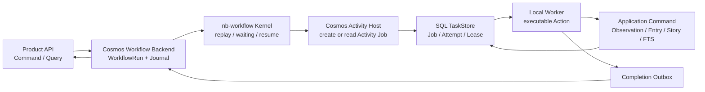

# Task 07：Deferred Workflow、Cosmos Host 与本地 Worker 收敛
> 状态：Cosmos Host PR A 本地实现已完成并通过 focused 门禁；Activity Host、固定 Ingest parity 和后续 Product/Worker Admin 阶段尚未开始。
>
> 日期：2026-08-13
>
> 本 Task 是实现阶段的总指挥文档。后续由一个 leader agent 按本文件协调多个
> 子代理；子代理不能自行扩大范围、改变架构决定或直接合并彼此的工作。

总体架构：[`../../architecture/0001-cosmos-foundation.md`](../../architecture/0001-cosmos-foundation.md)

Kernel/Host 决定：[`../../adr/0002-nb-workflow-kernel-cosmos-host.md`](../../adr/0002-nb-workflow-kernel-cosmos-host.md)

API 边界：[`../../adr/0003-service-worker-api-boundaries.md`](../../adr/0003-service-worker-api-boundaries.md)

API/DTO 草案：[`../../api/README.md`](../../api/README.md)

前序 Spike：[`../04-workflow-runtime/README.md`](../04-workflow-runtime/README.md)

设计前置 Task：[`../06-nb-workflow-kernel-convergence/README.md`](../06-nb-workflow-kernel-convergence/README.md)

Walkthrough：[`walkthrough.md`](walkthrough.md)

项目状态：[`../../../PROJECT-STATUS.md`](../../../PROJECT-STATUS.md)

## 1. User Request / Topic

Cosmos 已有固定 Ingest Worker 和一个未合并的 Workflow Runtime Spike。下一阶段不
直接把 Spike 整体合并，而是先建立一个受 leader agent 约束的实现 Task：先稳定
`nb-workflow` 的 Deferred Activity 能力，再用它实现 Cosmos 的 Activity Job、
Durable Host、固定 Ingest parity 和 Worker Admin API。

本 Task 的目的不是让多个代理自由探索，而是把以下内容变成共同执行合同：

- 谁负责哪一层；
- 哪些决定已经确认；
- 哪些 API 仍然只能作为候选；
- 哪些文件和仓库不能触碰；
- 何时可以从 `nb-workflow` 进入 Cosmos；
- 何时可以删除旧的平行 Runtime；
- 人工和自动化分别验收什么。

## 2. 当前状态

### 2.1 Cosmos

当前共享基线为：

```text
master = origin/master = 61ed21e
```

`master` 已经有：

- Next.js Web、NestJS API 和一个固定 Ingest Worker 进程；
- Prisma + SQLite、Source、Run、Job、RSS/fixture Connector；
- Observation、Entry、Revision、Asset、最小 Story、FTS5/BM25；
- Feed、Search、Story/Entry/Revision 查询、SSE 和运行日志。

当前 Worker 的准确定位是：

> 已有固定 Ingest Worker 进程，但还没有实现文档中 Draft 的 Worker Admin HTTP API。

当前没有：

- 基于已发布 `nb-workflow` 的 Cosmos Durable Host；
- Activity 级 Job 与 Deferred Activity 恢复；
- Worker Admin `/healthz`、`/readyz`、status、capability、drain API；
- manifest-only Product API；
- Worker Gateway 或远程 Worker。

### 2.2 开放 PR

当前 GitHub 有两个开放 PR：

- PR #5：ActionDefinition、ActionRegistry、Connector Action Adapter；
- PR #6：OpenCLI 执行器抽成独立插件。

两者目前显示无冲突，但没有 CI 检查记录。它们在干净集成 worktree 中重新通过
本地门禁前，不视为已验收。

### 2.3 Cosmos Spike

以下 worktree 属于历史或未合并工作，不得被 leader 或子代理清理、重置或覆盖：

- `feat/t04-ingest-workflow-convergence`，HEAD `dc78f05`；
- `chore/t04-workflow-runtime-spike`，HEAD `9fe84f2`；
- `feat/t05-normalized-content-contract`，继续保留其既有边界。

T04 Spike 的定位是行为证据和回归参考。它已经提供过以下有价值的证据：

- Workflow Run、Action Job、lease、retry 和 Worker 接管；
- Source execution snapshot、checkpoint CAS；
- Observation/Revision/Asset/Story/FTS 事务；
- DomainEvent、Outbox、receipt 和部分 unknown/recovery；
- Node、浏览器和固定 Ingest 端到端链路。

Spike 不作为生产源码整体搬运。尤其不整体复制：

- Cosmos 自有的 `packages/workflow-runtime` Kernel；
- Spike 的全部 migration；
- 大量 catalog、projection、Gateway 和远程执行代码；
- 未经当前基线验证的 Worker bootstrap。

### 2.4 nb-workflow

nb-workflow 实施基线：

```text
origin/master = af162ea
本地 dirty master = cf34d15（保护区，不能作为实现起点）
Task 03 Deferred Activity 发布合并提交 = af162ea114c2fddddf3e1cde2c654d357b217fb2
Registry package = @notnotype/nb-workflow@0.2.0
```

`@notnotype/nb-workflow@0.2.0` 已包含 Deferred Activity 公开符号。Task 03 已通过真实 Registry Node/Bun runtime 与 TypeScript declaration consumer；但这些证据仍不等同 Cosmos durable host、跨进程 waiting 恢复或生产集成。

### Phase 1 门禁结果（2026-08-13）

| 证据层 | 当前结果 | 边界 |
| --- | --- | --- |
| 行为合同 | focused：9 pass / 0 fail / 24 expect；conformance：21 pass / 0 fail / 2 expect；full：118 pass / 0 fail / 306 expect；typecheck/build passed | 使用 deterministic Memory fixture，不等同 durable Backend 或多进程恢复 |
| 真实 tarball | `bun run verify:package` 输出 `NODE_PACKAGE_SMOKE_OK`、`TARBALL_DECLARATION_CONSUMER_OK`、`ISOLATED_PACKAGE_SMOKE_OK` | 验证 Node/TypeScript 包边界和 Deferred 行为，不验证 Cosmos |
| npm Registry consumer | `@notnotype/nb-workflow@0.2.0` 已可安装；`REGISTRY_CONSUMER_OK version=0.2.0 exports=6`、`BUN_REGISTRY_IMPORT_OK function function`、TypeScript tsc passed | 证明公开包可被 Node/Bun/TypeScript consumer 使用，不证明 durable host |

因此，Phase 1 的本地行为、package 和 Registry consumer 门禁已通过；进入 Cosmos Phase 2 仍缺真实 Durable Host consumer 与已授权的 Cosmos 实施。

当前公开的 `ActivityExecutor` 是等待结果的宿主端口，尚未完整表达：

```text
Activity 创建外部 Job
→ Workflow 进入 waiting
→ Job 由另一个 Worker 执行
→ Job 完成后恢复同一个 Activity
```

因此本 Task 先在 `nb-workflow` 独立任务中增加并验证 Deferred Activity 语义，再开始 Cosmos Host 实现。Deferred Activity 的具体 symbol 名称和最终 payload 形状不在本文件提前冻结。

`nb-workflow` 主工作区当前存在用户未提交修改，至少涉及 `src/index.ts`、`src/ports.ts`、`src/runner.ts`、`src/types.ts` 和测试文件。正式实施前必须重新审计；本 Task 不授权任何代理直接修改其 dirty `master`。

## 3. Goal

交付一条由规范 Kernel 驱动的本地 Durable Workflow 垂直链路：

```text
Next Web
  → Nest Product API
  → Cosmos WorkflowRun
  → nb-workflow Kernel
  → Activity Job
  → Worker Attempt / Lease
  → Connector 或 Application Command
  → Observation / Entry / Revision / Story / FTS
  → Completion Outbox
  → Workflow resume
```

首条真实流程固定为：

```text
cosmos.ingest@1
  → source.fetch@1
  → library.ingest@1[]
  → source.checkpoint@1
```

用户现有的 Source → Run → Feed/Search/Story 行为必须保持不变；改变的是执行
内核、恢复方式和 Worker 边界。

## 4. 已确认的决定

### 4.1 Job 采用 Activity 级粒度

固定 Ingest 中每次 Action 调用可以对应一个独立 Cosmos Job：

```text
Activity
  → Job
  → Attempt + Lease
  → Worker
  → Activity result
  → Journal / Workflow resume
```

不把整个 Workflow Run 长时间包成一个无法拆分的 Worker Job。

### 4.2 Deferred Activity 进入 nb-workflow

Cosmos 不在外部偷偷复制一套 Runner 语义。`nb-workflow` 负责：

- Activity identity；
- fingerprint；
- Journal replay；
- pending activity；
- waiting/resume；
- cancel、late completion 和冲突语义。

Cosmos 负责：

- Prisma Workflow Backend；
- TaskStore；
- Job、Attempt、Lease、Retry；
- ValueStore、Outbox 和领域事务；
- Worker 装配和外部 Action/Connector。

### 4.3 Workflow 作者使用透明调用

目标写法保持自然：

```ts
const page = await wf.callAction("source.fetch@1", input);
```

Action 未完成时由 Kernel 自动保存 pending Activity 并进入 waiting；Job 完成后
恢复时同一个调用得到结果。Workflow 作者不直接管理 Cosmos Job 句柄。

这是目标语义，不等于已经冻结具体的 `nb-workflow` public API。必须先通过
`nb-workflow` conformance，再由 leader 记录最终合同。

### 4.4 Spike 采用“证据移植”，不采用“源码搬运”

每个要吸收的 Spike 行为必须按以下顺序处理：

```text
识别行为证据
→ 转成当前基线的失败/成功测试
→ 设计新的 Host/Store 接缝
→ 实现最小必要代码
→ 通过测试
→ 才考虑旧路径的兼容读取或删除
```

不允许把 Spike 的大文件、平行 Kernel 或全部 migration 直接复制到新分支。

### 4.5 Worker Admin 放在本 Task 后半段

Worker Admin 与 Kernel/固定 Ingest 同属本 Task，但必须在本地 Worker 的执行、
恢复和 fencing 稳定后实现。它不提供同步 Job execute，也不拥有 Job 终态。

## 5. 非目标

本 Task 不实现：

- Redis/BullMQ 作为任务权威；
- PostgreSQL、S3/MinIO 或真正多主机部署；
- Worker Gateway、远程 Worker 或公网 Transport；
- Secret Broker、认证、多用户权限和插件沙箱；
- `neuro-agent-harness`、`nb-memory`、Agent/Knowledge/Research Workflow；
- 推荐系统、Graph/Comfy UI、Desktop Shell；
- 完整 Connection、Secret、CollectionPlan 产品 UI；
- 所有平台 Adapter；
- 直接清理或重写现有 dirty worktree；
- 在 Cosmos 内长期保留第二套 Replay Kernel。

## 6. 目标边界



所有任务状态和租约由 SQL TaskStore 裁决。未来 WakeupBus/Redis 只能减少轮询
延迟，不能拥有 Job 终态、Activity 结果或 checkpoint。

## 7. 实施阶段

### Phase 0：干净基线和 PR 集成

由 leader 在独立 Cosmos worktree 中完成：

1. 从最新 `origin/master` 建立实现分支；
2. 重新审查 PR #5/#6 的依赖关系和变更边界；
3. 在干净 worktree 中合并或重建两个 PR；
4. 运行 focused/full tests、typecheck、build 和 `git diff --check`；
5. 保存 master、PR、Spike 和 dirty worktree 的 hash 基线。

本阶段不修改任何 T04 Spike worktree，也不开始 Kernel convergence。

### Phase 1：nb-workflow Deferred Activity

在 `nb-workflow` 独立 Task、分支和 worktree 中完成：

- Activity deferred/pending 状态；
- transparent `await wf.callAction(...)` 恢复语义；
- 外部 completion 的 idempotency 和 identity 验证；
- cancel、timeout、late completion 和 failure 传播；
- Backend conformance、跨进程 load/replay、Node package smoke；
- 发布一个包含 Deferred Activity 合同的版本，版本号由 nb-workflow Task 在
  conformance 后决定，计划上的 `0.2.0` 只是候选，不是本 Task 的硬冻结。

进入 Phase 2 的门禁：Kernel 能在不依赖 Cosmos/Prisma/domain 类型的情况下表达
Activity pending、resume、cancel 和 duplicate completion。

### Phase 2：Cosmos Workflow Backend / ValueStore

在 Cosmos 中实现最小宿主适配：

- `WorkflowBackend` 的 Prisma/SQLite 实现；
- Workflow state snapshot 的 revision CAS；
- Journal 和 pending Activity 的持久读写；
- ValueStore 与 Blob Store 的 ValueRef 映射；
- Definition/manifest hash 校验；
- EventSink 到 DomainEvent/Outbox 的映射。

不新增第二套 replay、fingerprint、map/all、wait 或 child 语义。

持久化策略必须 forward-only：

- 不删除 master 已有 migration；
- 不复制 Spike 的未合并 migration；
- fresh DB、master DB upgrade、已有 Workflow 数据读取分别验证；
- 旧固定 Run/Job 数据需要兼容读取时，增加明确 adapter，不隐式重写历史。

### Phase 3：Activity Job、Attempt、Lease 和 Completion

实现两个逻辑 lane，但使用同一个 SQL TaskStore：

```text
Run Lane
  claim queued WorkflowRun
  execute/resume Kernel
  waiting 时释放 continuation lease

Activity Lane
  claim Activity Job
  execute Action/Connector
  保存结果或错误
  发 Completion Outbox
```

Activity Job 创建必须以 Workflow Run、Activity identity、fingerprint 和 Action
reference 幂等。Action 已成功时重放只读结果；Job 仍在 queued/leased/retry_wait
时，Host 返回 deferred/pending；Job 失败则返回明确可分类错误。

领域写入 Action 必须在同一事务内验证：

- 当前 Job Attempt lease；
- Workflow Run 当前 pending Activity；
- Workflow state revision；
- Run 未取消或已终止。

旧 Worker、过期 lease 和迟到 completion 不能写：

- Observation、Entry、Revision、Asset、FTS；
- DomainEvent、Outbox；
- checkpoint；
- Workflow terminal state。

### Phase 4：固定 Ingest parity

以现有 `cosmos.ingest@1` 为唯一产品切片：

```text
source.fetch@1
→ library.ingest@1[]
→ source.checkpoint@1
```

必须保留 Source execution snapshot、trigger、correlation、idempotency、
Observation 不可变、Entry/Revision/Asset/Story/FTS、checkpoint CAS、Outbox、
retry 和接管语义。

API/Web 用户行为保持：

```text
创建 Source
→ 手动触发 Run
→ Worker 执行
→ Feed / Search / Story / Entry 查看
```

### Phase 5：Product API 收敛

固定 Ingest parity 通过后：

- API 通过 Application Command/Query 创建和查询 WorkflowRun；
- Source Probe 由 Worker Job 执行；
- API 不加载 Connector/Action executable；
- Product DTO 使用白名单 schema；
- 不返回 lease token、Secret、绝对路径、storageKey 或无界结果；
- 增加 `/healthz`、`/readyz` 与产品诊断健康检查的清晰边界；
- Worker 不可用时，已保存 Feed/Search/Story 仍可读取。

本阶段不实现 Gateway、远程认证或分布式存储。

### Phase 6：Worker Admin API

在本地 Worker 执行和恢复稳定后，同一 Task 后半段实现独立内部 HTTP 面：

```text
GET  /healthz
GET  /readyz
GET  /admin/v1/status
GET  /admin/v1/capabilities
GET  /admin/v1/drains
POST /admin/v1/drains
GET  /admin/v1/drains/{id}
GET  /metrics
```

默认 loopback；不提供 `POST /jobs/{id}/execute`。Drain 先停止新 claim，再等待
当前 Attempt；重复 `Idempotency-Key` 必须幂等；超时不能伪装成功。

### Phase 7：完整验收和删除旧默认路径

只有 Kernel/Host/Activity/Ingest/Browser/Node/Docker 门禁都通过后，才：

- 停止默认装配旧 `IngestionWorker` 路径；
- 删除或隔离 Cosmos 重复 Kernel；
- 清理只剩兼容读取的旧 projection；
- 更新 PROJECT-STATUS、Task 04 和 Task 06 的状态链接；
- 提交、push、PR 和合并。

如果任何 parity 或恢复门禁失败，保留旧路径作为回滚基线，不让两套 Kernel
长期同时成为权威。

## 8. Leader 与子代理治理

### 8.1 Leader 的唯一职责

leader agent 是本 Task 的执行协调者，负责：

- 读取本 Task、Task 06、ADR、API Draft 和当前状态；
- 为每轮工作分派明确子任务；
- 控制阶段门禁和依赖顺序；
- 审查子代理的 diff、测试和 walkthrough；
- 决定是否允许进入下一阶段；
- 记录偏差、阻塞和重新决策；
- 不把子代理“看起来完成”当作门禁通过。

leader 不能：

- 擅自修改已确认架构；
- 把 Spike 整体复制到 Cosmos；
- 直接触碰用户 dirty worktree；
- 在 Kernel conformance 未通过前实现 Cosmos Host；
- 在 parity 未通过前删除旧 Runtime；
- 把未运行的浏览器、Docker、真实来源验收写成已完成。

### 8.2 推荐子代理工作包

子代理可以并行做只读审查，但写代码必须遵守阶段依赖：

| 工作包 | 责任 | 允许修改的仓库 |
| --- | --- | --- |
| A：Kernel contract | Deferred Activity、Runner、conformance、package smoke | `nb-workflow` 独立 worktree |
| B：Cosmos storage design | schema、migration、WorkflowBackend/ValueStore 设计与测试 | Cosmos 实现 worktree |
| C：Task/lease/fencing | Activity Job、Attempt、completion、Outbox、CAS 测试与实现 | Cosmos 实现 worktree |
| D：Ingest parity | Source snapshot、Connector、Application Command、领域事务 | Cosmos 实现 worktree |
| E：API/Worker Admin | Product DTO、health/readiness、Admin status/drain | Cosmos 实现 worktree，必须在 Phase 4 后 |
| F：QA/audit | 只读审查、链路走查、人工验收脚本、门禁报告 | 由 leader 指定的审查 worktree |

同一文件不得由多个写入子代理并行修改。公共合同由 leader 先冻结一版候选，
再允许实现代理开始；审查代理可以随时指出问题，但不能直接覆盖其他代理的改动。

### 8.3 子代理交付格式

每个子代理每轮必须报告：

```text
目标：本轮要证明什么
范围：修改/不修改哪些路径
实际修改：逐文件列出
证据：完整命令、通过/失败、关键输出
偏差：与 Task 或计划不同的地方
风险：尚未证明的行为
下一步：需要 leader 做的决定或门禁
```

子代理不得报告“完成”而不区分：

- focused test；
- full test；
- typecheck/build；
- Node production；
- browser；
- Docker；
- real provider/source。

### 8.4 Worktree 与 Git 规则

- 每个写入子代理使用独立分支和 worktree；
- 先 `git fetch origin`，再从 leader 指定的基线创建 worktree；
- 不使用 `reset --hard`、`checkout --`、`clean` 或 stash 清理用户改动；
- 不使用 `git add -A`；
- 未经 leader 明确授权不提交、push、建 PR 或合并；
- 合并前必须重新检查源 worktree 的 dirty hash；
- `nb-workflow` dirty master 和现有外部 worktree 一律视为保护区。

## 9. 候选 Deferred Activity 合同

以下是实现输入，不是已经发布的 `nb-workflow` API 名称。最终合同必须由
`nb-workflow` 子任务通过行为测试和 conformance 后确认。

### 9.1 作者视图

Workflow 作者只写：

```ts
await wf.callAction("source.fetch@1", input);
```

不暴露 Job ID、lease token 或 Worker ID。

### 9.2 Kernel 语义

当 Host 发现 Action 尚未完成：

```text
记录 pending Activity identity
→ 保存外部 completion reference
→ Run 进入 waiting
→ 释放当前 continuation lease
```

当 Job 完成：

```text
校验 run/activity/reference
→ 以 Activity identity 幂等写入 Journal result/error
→ Run 进入 queued
→ 下一次 Runner 恢复并重放
```

必须支持：

- duplicate completion 幂等；
- identity/reference mismatch 冲突；
- cancelled/terminal Run 拒绝迟到结果；
- Job failed 的明确错误传播；
- completion 过程崩溃后的再次投递；
- process restart 后 waiting Run 恢复；
- Activity input fingerprint 不变时不重复执行。

### 9.3 不提前冻结的部分

以下名称和具体线形不在 Cosmos Task 中硬编码：

- Deferred error 的 symbol 名称；
- completion API 是 `resolveActivity`、`resumeActivity` 还是其它名称；
- pending reference 是字符串、结构化 receipt 还是 ValueRef；
- 失败结果是直接进入 Journal，还是由下一次 Host Action read 抛出错误；
- 是否需要显式 `queued` Runner control API。

只要最终行为满足本节 conformance，具体 public API 可以由 nb-workflow Task 决定。

## 10. 验收矩阵

### 10.1 nb-workflow

- Deferred Activity 首次调用进入 waiting；
- 同一 Workflow 脚本恢复后透明得到结果；
- duplicate completion 不重复 Journal；
- completion identity 错误被拒绝；
- cancel 后迟到结果不能覆盖 cancelled；
- waiting Run 可跨进程 load/replay；
- Backend conformance、typecheck、build、package smoke 通过。

### 10.2 Cosmos Host/Storage

- Prisma WorkflowBackend 通过 Kernel Backend conformance；
- Workflow state revision CAS 生效；
- ValueRef/Blob round-trip；
- Activity Job 幂等创建；
- 两个 Worker 只有一个有效 lease；
- lease takeover 后旧 Worker 拒绝 completion；
- completion Outbox 可重试且不丢唤醒；
- cancelled/terminal Run 拒绝迟到 Activity result；
- migration forward-only、fresh/upgrade/old-data 三路通过。

### 10.3 Ingest parity

- URL 与无 URL fixture；
- 重复轮询不新增 Entry；
- 同一外部条目修订产生新 Revision；
- Observation 永不覆盖；
- 多媒体保存状态保持；
- partial write + abort + takeover；
- checkpoint CAS 不回退；
- Source snapshot 在排队后固定；
- Feed/Search/Story/Entry/Revision 用户链路不回归。

### 10.4 API 与 Worker Admin

- API 不加载 executable；
- Worker 加载 executable 并报告 manifest evidence；
- `/healthz` 不访问 DB；
- `/readyz` 的非 ready 返回非 2xx；
- Worker Admin 不返回 token、Secret、绝对路径或完整 payload；
- drain 幂等、可观察、超时不伪装成功；
- Worker 不在线时 Product Query 仍可用；
- 不提供同步 Job execute。

### 10.5 生产与人工验收

分别报告：

- Bun development；
- Node API/Worker/Web production；
- migration/migrator；
- Docker Compose；
- browser；
- Worker interruption/takeover；
- real RSS、Bilibili、OpenCLI；
- long-running、多主机、Gateway、Redis。

未运行的验收必须明确写为“未验证”，不能由 focused test 代替。

## 11. 人工验收场景

### A：用户正常采集

```text
启动 Migrator、API、Worker、Web
→ 创建 fixture Source
→ 检查来源
→ 手动触发 Run
→ 查看 queued/running/waiting/queued/succeeded
→ Feed → Search → Story → Entry → Source/Revision
```

预期：用户能阅读保存内容；等待是正常执行状态，不显示成失败；页面不暴露
Job/lease 内部字段。

### B：重复与修订

相同 fixture 重复执行不增加重复 Entry；修改同一外部条目后生成新 Revision；
旧 Observation/Revision 仍可追溯。

### C：Worker 中断

Worker A 执行带延迟的 Activity 时停止；lease 过期后 Worker B 接管；Workflow
继续完成或进入明确终态；A 的迟到结果被拒绝。

### D：Worker 不可用

停止 Worker，保持 API/Web 运行：已保存 Feed/Search/Story 仍可打开；新 Run
进入 queued 或显示明确服务状态；Worker 恢复后可以继续。

### E：Worker Admin

检查 liveness、readiness、status、capability 和 drain；重复 drain 使用相同
Idempotency-Key 得到同一结果；deadline 超时不报告虚假的 clean success。

### F：离线阅读

断开外网或停止上游后，已保存正文、Story、Search 和无 URL 内容仍可读取；新
采集失败状态清晰。

## 12. 停止条件

出现以下任一情况必须停在当前阶段，由 leader 记录最小复现和决策请求：

- Deferred Activity 需要把 Cosmos/Prisma/domain 类型引入 nb-workflow Core；
- Kernel 无法表达 pending、resume、cancel 或 duplicate completion；
- Prisma Backend 无法提供 revision CAS；
- Activity Job completion 与 Outbox 无法至少一次恢复；
- 旧 Activity Worker 可以越过 lease 写领域状态；
- 两个 Worker 可以同时提交同一 Activity 的终态；
- migration 必须删除或改写 master 历史；
- Feed/Search/Story 用户链路回归；
- 需要在 Cosmos 中重新实现 replay/fingerprint/map/wait Kernel；
- 任何代理试图清理用户 dirty worktree 或把未验证能力写成已完成。

停止时保留当前旧 Ingest 路径和 Spike 证据，不让半完成的新 Host 替换可用基线。

## 13. 完成定义

Task 07 只有在以下条件全部满足时才可标记完成：

```text
nb-workflow Deferred Activity conformance 通过
→ Cosmos Prisma Backend/ValueStore 接入
→ Activity Job/Attempt/Lease/Outbox 恢复通过
→ cosmos.ingest@1 parity 通过
→ Product API 边界收敛
→ Worker Admin API 实现并验收
→ Node / browser / Docker / migration 分开验收
→ 旧 Cosmos 平行 Kernel 不再作为默认或权威执行路径
```

以下不能作为完成替代：

- 只通过 TypeScript 编译；
- 只通过 focused tests；
- 只通过 Spike 历史证据；
- 只通过 Worker 进程启动；
- 只通过 API 文档存在；
- 只通过“GitHub 可合并”。

## 14. 下一步

Task 07 创建后，下一动作不是写 Cosmos Runtime，而是由用户指定 leader agent，
让 leader 完成：

1. 先在独立 Cosmos implementation worktree 完成 PR A：Prisma/SQLite `WorkflowBackend`、Blob `ValueStore`、forward-only `WorkflowRun` migration 和 Kernel conformance。
2. PR A 仅在本地完成 `2ba4341`；push、PR、review、merge 仍按仓库规则单独授权。
3. PR A 之后才进入 Activity Job、Attempt、Lease、staged activation、completion dispatcher、cancel 和 durable recovery。
4. 固定 `cosmos.ingest@1` parity、Product API manifest-only、Worker Admin、默认路径切换和旧 Runtime 删除仍后置。

本 Task 不把 PR A focused/full/package 证据写成 Cosmos Host 完成；未通过后续阶段门禁前保留旧 Ingest 路径。
